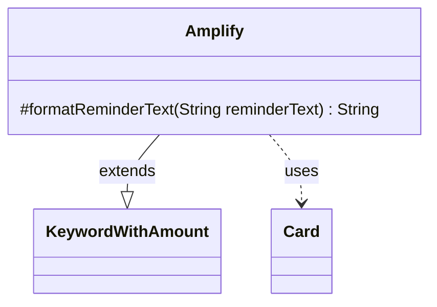

---
aliases:
  - Amplify
tags:
  - java/class
  - module/forge-game
  - pkg/forge/game/keyword
fqn: forge.game.keyword.Amplify
package: forge.game.keyword
module: forge-game
kind: Class
---

# Amplify

**Package:** `forge.game.keyword`   **Module:** `forge-game`   **Kind:** Class



## Relationships
**Extends:**
- [[forge.game.keyword.KeywordWithAmount|KeywordWithAmount]]
**Uses:**
- [[forge.game.card.Card|Card]]

## Design Description

Amplify is a concrete keyword implementation in Forge's `forge.game.keyword` package, modeling Magic: The Gathering's Amplify ability, which lets a creature enter the battlefield with additional +1/+1 counters revealed from the player's hand. It extends `KeywordWithAmount`, inheriting the numeric `amount` that quantifies the effect, and specializes only the reminder-text formatting. Its sole override, `formatReminderText`, collaborates with `Card` to resolve the host card's creature types—falling back to the generic "creature" when no host is set—and uses `Lang` to build a localized, grammatically correct type description before interpolating both the amount and type into the reminder string. The design keeps shared keyword-amount logic in the supertype while isolating Amplify's only distinctive behavior: presenting accurate, card-specific reminder text.

## Source
`forge-game/src/main/java/forge/game/keyword/Amplify.java`

```java
package forge.game.keyword;

import forge.game.card.Card;
import forge.util.Lang;

public class Amplify extends KeywordWithAmount {

    @Override
    protected String formatReminderText(String reminderText) {
        Card card = getHostCard();
        String type = "creature";
        if (card != null) {
            type = Lang.getInstance().buildValidDesc(card.getType().getCreatureTypes(), true);
        }
        return String.format(reminderText, amount, type);
    }
}
```

## Python
`forge/game/keyword/Amplify.py`

```python
from forge.game.keyword.KeywordWithAmount import KeywordWithAmount
from forge.game.card.Card import Card
from forge.util.Lang import Lang


class Amplify(KeywordWithAmount):

    def formatReminderText(self, reminderText: str) -> str:
        card = self.getHostCard()
        type = "creature"
        if card is not None:
            type = Lang.getInstance().buildValidDesc(card.getType().getCreatureTypes(), True)
        return reminderText % (self.amount, type)
```
