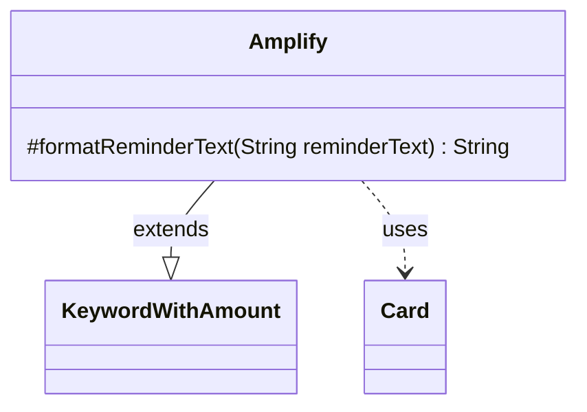

---
aliases:
  - Amplify
tags:
  - java/class
  - module/forge-game
  - pkg/forge/game/keyword
fqn: forge.game.keyword.Amplify
package: forge.game.keyword
module: forge-game
kind: Class
---

# Amplify

**Package:** `forge.game.keyword` &nbsp; **Module:** `forge-game` &nbsp; **Kind:** Class



## Relationships
**Extends:**
- [[forge.game.keyword.KeywordWithAmount|KeywordWithAmount]]
**Uses:**
- [[forge.game.card.Card|Card]]

## Source
`forge-game/src/main/java/forge/game/keyword/Amplify.java`

```java
package forge.game.keyword;

import forge.game.card.Card;
import forge.util.Lang;

public class Amplify extends KeywordWithAmount {

    @Override
    protected String formatReminderText(String reminderText) {
        Card card = getHostCard();
        String type = "creature";
        if (card != null) {
            type = Lang.getInstance().buildValidDesc(card.getType().getCreatureTypes(), true);
        }
        return String.format(reminderText, amount, type);
    }
}
```
