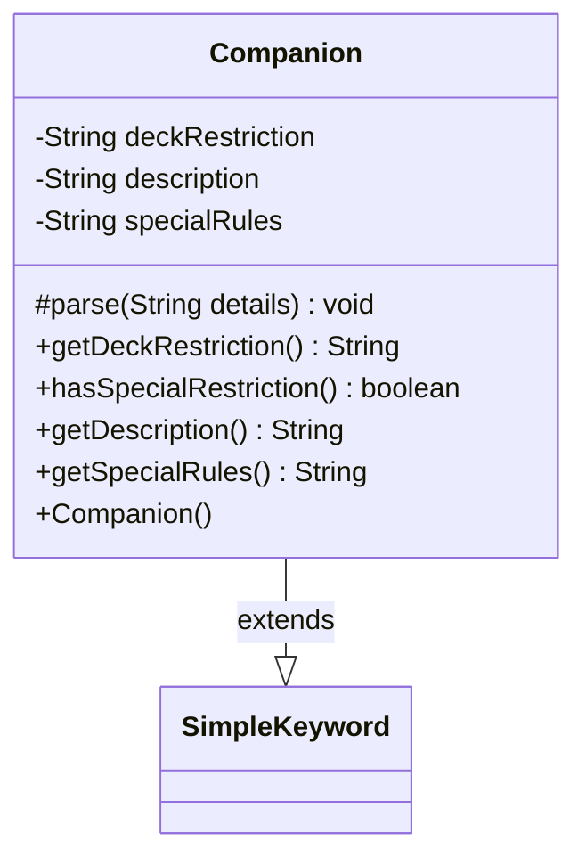

---
aliases:
  - Companion
tags:
  - java/class
  - module/forge-game
  - pkg/forge/game/keyword
fqn: forge.game.keyword.Companion
package: forge.game.keyword
module: forge-game
kind: Class
---

# Companion

**Package:** `forge.game.keyword` &nbsp; **Module:** `forge-game` &nbsp; **Kind:** Class



## Relationships
**Extends:**
- [[forge.game.keyword.SimpleKeyword|SimpleKeyword]]

## Design Description

Companion is a concrete keyword implementation that models Magic: The Gathering's Companion mechanic, extending SimpleKeyword to participate in the engine's keyword framework. Its core responsibility is overriding the protected `parse` method to decompose a colon-delimited details string into three components: a deck-building restriction, an optional special-rules clause, and a human-readable description. It exposes these through simple accessors, plus `hasSpecialRestriction` to flag the "Special" deck-restriction case where bespoke rules text applies.

The design keeps Companion a lightweight data holder: it inherits the keyword lifecycle and parsing dispatch from SimpleKeyword, contributing only the field layout and parse logic specific to this keyword. The defensive length check (with a console warning rather than an exception) reflects an intent to fail soft on malformed input, and treating the last split segment as the description tolerates variable-length detail strings.

## Source
`forge-game/src/main/java/forge/game/keyword/Companion.java`

```java
package forge.game.keyword;

public class Companion extends SimpleKeyword {

    private String deckRestriction = null;
    private String description = null;
    private String specialRules = null;

    public Companion() { }

    @Override
    protected void parse(String details) {
        String[] splitString = details.split(":");
        int descriptionIndex = splitString.length - 1;

        if (splitString.length < 2) {
            System.out.println("Did not parse a long enough value for Companion.");
            return;
        }

        deckRestriction = splitString[0];

        if (deckRestriction.equals("Special")) {
            specialRules = splitString[1];
        }
        description = splitString[descriptionIndex];
    }

    public String getDeckRestriction() {
        return deckRestriction;
    }

    public boolean hasSpecialRestriction() {
        return specialRules != null;
    }

    public String getDescription() {
        return description;
    }

    public String getSpecialRules() {
        return specialRules;
    }
}
```

## Python
`forge/game/keyword/Companion.py`

```python
from forge.game.keyword.SimpleKeyword import SimpleKeyword


class Companion(SimpleKeyword):

    def __init__(self):
        super().__init__()
        self.deckRestriction = None
        self.description = None
        self.specialRules = None

    def parse(self, details):
        splitString = details.split(":")
        descriptionIndex = len(splitString) - 1

        if len(splitString) < 2:
            print("Did not parse a long enough value for Companion.")
            return

        self.deckRestriction = splitString[0]

        if self.deckRestriction == "Special":
            self.specialRules = splitString[1]
        self.description = splitString[descriptionIndex]

    def getDeckRestriction(self):
        return self.deckRestriction

    def hasSpecialRestriction(self):
        return self.specialRules is not None

    def getDescription(self):
        return self.description

    def getSpecialRules(self):
        return self.specialRules
```
