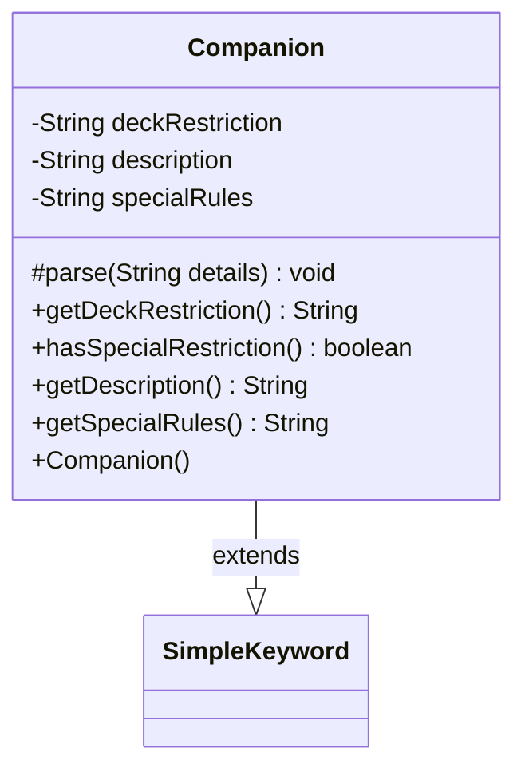

---
aliases:
  - Companion
tags:
  - java/class
  - module/forge-game
  - pkg/forge/game/keyword
fqn: forge.game.keyword.Companion
package: forge.game.keyword
module: forge-game
kind: Class
---

# Companion

**Package:** `forge.game.keyword` &nbsp; **Module:** `forge-game` &nbsp; **Kind:** Class



## Relationships
**Extends:**
- [[forge.game.keyword.SimpleKeyword|SimpleKeyword]]

## Source
`forge-game/src/main/java/forge/game/keyword/Companion.java`

```java
package forge.game.keyword;

public class Companion extends SimpleKeyword {

    private String deckRestriction = null;
    private String description = null;
    private String specialRules = null;

    public Companion() { }

    @Override
    protected void parse(String details) {
        String[] splitString = details.split(":");
        int descriptionIndex = splitString.length - 1;

        if (splitString.length < 2) {
            System.out.println("Did not parse a long enough value for Companion.");
            return;
        }

        deckRestriction = splitString[0];

        if (deckRestriction.equals("Special")) {
            specialRules = splitString[1];
        }
        description = splitString[descriptionIndex];
    }

    public String getDeckRestriction() {
        return deckRestriction;
    }

    public boolean hasSpecialRestriction() {
        return specialRules != null;
    }

    public String getDescription() {
        return description;
    }

    public String getSpecialRules() {
        return specialRules;
    }
}
```
