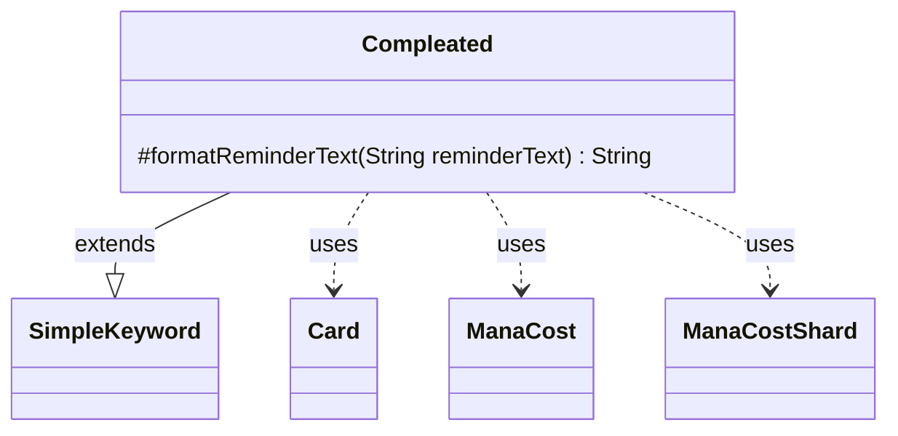

---
aliases:
  - Compleated
tags:
  - java/class
  - module/forge-game
  - pkg/forge/game/keyword
fqn: forge.game.keyword.Compleated
package: forge.game.keyword
module: forge-game
kind: Class
---

# Compleated

**Package:** `forge.game.keyword` &nbsp; **Module:** `forge-game` &nbsp; **Kind:** Class



## Relationships
**Extends:**
- [[forge.game.keyword.SimpleKeyword|SimpleKeyword]]
**Uses:**
- [[forge.card.mana.ManaCost|ManaCost]]
- [[forge.card.mana.ManaCostShard|ManaCostShard]]
- [[forge.game.card.Card|Card]]

## Design Description

Compleated is a concrete keyword in Forge's `forge.game.keyword` package that models Magic's Phyrexian "compleated" mechanic for planeswalkers. Extending SimpleKeyword, it overrides only `formatReminderText` to generate context-sensitive reminder text rather than relying on a static template.

The class collaborates with its host Card to inspect the card's ManaCost, filtering for Phyrexian ManaCostShard pips. From the first such shard it builds reminder text describing the alternative payment options (colored mana, hybrid colors, or 2 life) and the resulting loyalty penalty, pluralizing the wording based on the Phyrexian pip count. Its design intent is defensive and presentational: it guards against a null host card and absent Phyrexian costs by falling back to the unmodified reminder text, keeping all logic confined to display formatting while delegating keyword behavior to the SimpleKeyword base.

## Source
`forge-game/src/main/java/forge/game/keyword/Compleated.java`

```java
package forge.game.keyword;

import java.util.List;
import java.util.stream.Collectors;

import forge.card.mana.ManaCost;
import forge.card.mana.ManaCostShard;
import forge.game.card.Card;
import forge.util.StreamUtil;

public class Compleated extends SimpleKeyword {

    @Override
    protected String formatReminderText(String reminderText) {
        Card card = this.getHostCard();
        if (card == null) {
            return reminderText;
        }
        ManaCost mc = card.getManaCost();
        if (!mc.hasPhyrexian()) {
            return reminderText;
        }
        List<ManaCostShard> shards = StreamUtil.stream(mc).filter(ManaCostShard::isPhyrexian).collect(Collectors.toList());
        if (shards.isEmpty()) {
            return reminderText;
        }
        ManaCostShard pip = shards.get(0);
        String[] parts = pip.toShortString().split("/");
        final StringBuilder rem = new StringBuilder();
        rem.append(pip).append(" can be paid with {").append(parts[0]).append("}");
        if (parts.length > 2) {
            rem.append(", {").append(parts[1]).append("},");
        }
        rem.append(" or 2 life. ");
        if (mc.getPhyrexianCount() > 1) {
            rem.append("For each ").append(pip).append(" paid with life,");
        } else {
            rem.append("If life was paid,");
        }
        rem.append(" this planeswalker enters with two fewer loyalty counters.");
        return rem.toString();
    }
}
```

## Python
`forge/game/keyword/Compleated.py`

```python
from forge.card.mana.ManaCost import ManaCost
from forge.card.mana.ManaCostShard import ManaCostShard
from forge.game.card.Card import Card
from forge.game.keyword.SimpleKeyword import SimpleKeyword
from forge.util.StreamUtil import StreamUtil


class Compleated(SimpleKeyword):

    def formatReminderText(self, reminderText: str) -> str:
        card = self.getHostCard()
        if card is None:
            return reminderText
        mc = card.getManaCost()
        if not mc.hasPhyrexian():
            return reminderText
        shards = [s for s in StreamUtil.stream(mc) if s.isPhyrexian()]
        if not shards:
            return reminderText
        pip = shards[0]
        parts = pip.toShortString().split("/")
        rem = []
        rem.append(str(pip))
        rem.append(" can be paid with {")
        rem.append(parts[0])
        rem.append("}")
        if len(parts) > 2:
            rem.append(", {")
            rem.append(parts[1])
            rem.append("},")
        rem.append(" or 2 life. ")
        if mc.getPhyrexianCount() > 1:
            rem.append("For each ")
            rem.append(str(pip))
            rem.append(" paid with life,")
        else:
            rem.append("If life was paid,")
        rem.append(" this planeswalker enters with two fewer loyalty counters.")
        return "".join(rem)
```
