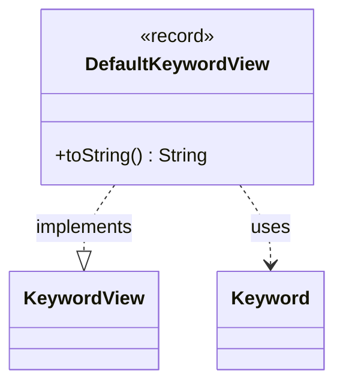

---
aliases:
  - DefaultKeywordView
tags:
  - java/record
  - module/forge-game
  - pkg/forge/game/keyword
fqn: forge.game.keyword.DefaultKeywordView
package: forge.game.keyword
module: forge-game
kind: Record
---

# DefaultKeywordView

**Package:** `forge.game.keyword` &nbsp; **Module:** `forge-game` &nbsp; **Kind:** Record



## Relationships
**Implements:**
- [[forge.game.keyword.KeywordView|KeywordView]]
**Uses:**
- [[forge.game.keyword.Keyword|Keyword]]

## Source
`forge-game/src/main/java/forge/game/keyword/DefaultKeywordView.java`

```java
package forge.game.keyword;

public record DefaultKeywordView(String original, Keyword keyword, String title, String reminderText) implements KeywordView {

    @Override
    public String toString() { return title + " (" + reminderText + ")"; }
}
```
