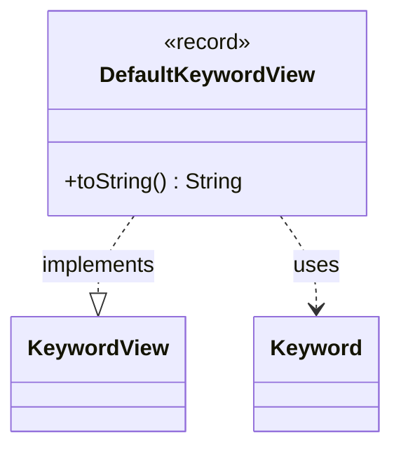

---
aliases:
  - DefaultKeywordView
tags:
  - java/record
  - module/forge-game
  - pkg/forge/game/keyword
fqn: forge.game.keyword.DefaultKeywordView
package: forge.game.keyword
module: forge-game
kind: Record
---

# DefaultKeywordView

**Package:** `forge.game.keyword` &nbsp; **Module:** `forge-game` &nbsp; **Kind:** Record



## Relationships
**Implements:**
- [[forge.game.keyword.KeywordView|KeywordView]]
**Uses:**
- [[forge.game.keyword.Keyword|Keyword]]

## Design Description

Forge's DefaultKeywordView is the standard immutable implementation of the KeywordView interface, modeling a single keyword's display data as a Java record. It bundles the original keyword string, the associated Keyword instance, a human-readable title, and reminder text, exposing each through the record's auto-generated accessors that satisfy the interface contract. Its sole behavioral addition overrides toString() to render the keyword as "title (reminderText)", the conventional Magic presentation format. The record kind signals deliberate design intent: this is a lightweight, value-based carrier with no mutable state, delegating identity and structure to the language while collaborating with Keyword to tie the view back to its underlying game concept.

## Source
`forge-game/src/main/java/forge/game/keyword/DefaultKeywordView.java`

```java
package forge.game.keyword;

public record DefaultKeywordView(String original, Keyword keyword, String title, String reminderText) implements KeywordView {

    @Override
    public String toString() { return title + " (" + reminderText + ")"; }
}
```

## Python
`forge/game/keyword/DefaultKeywordView.py`

```python
from forge.game.keyword.KeywordView import KeywordView
from forge.game.keyword.Keyword import Keyword


class DefaultKeywordView(KeywordView):
    def __init__(self, original: str, keyword: Keyword, title: str, reminderText: str):
        self.original = original
        self.keyword = keyword
        self.title = title
        self.reminderText = reminderText

    def __str__(self) -> str:
        return self.title + " (" + self.reminderText + ")"

うんとほ
```
