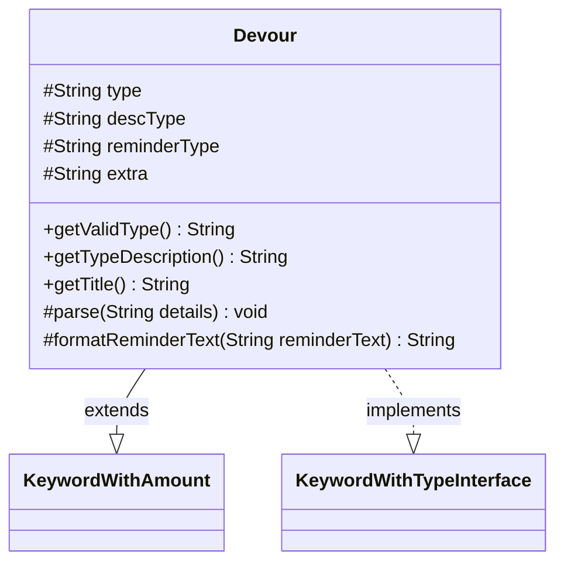

---
aliases:
  - Devour
tags:
  - java/class
  - module/forge-game
  - pkg/forge/game/keyword
fqn: forge.game.keyword.Devour
package: forge.game.keyword
module: forge-game
kind: Class
---

# Devour

**Package:** `forge.game.keyword` &nbsp; **Module:** `forge-game` &nbsp; **Kind:** Class



## Relationships
**Extends:**
- [[forge.game.keyword.KeywordWithAmount|KeywordWithAmount]]
**Implements:**
- [[forge.game.keyword.KeywordWithTypeInterface|KeywordWithTypeInterface]]

## Source
`forge-game/src/main/java/forge/game/keyword/Devour.java`

```java
package forge.game.keyword;

import java.util.Locale;

import forge.card.CardType;

public class Devour extends KeywordWithAmount implements KeywordWithTypeInterface {
    protected String type = null;
    protected String descType = null;
    protected String reminderType = null;
    protected String extra = null;

    @Override
    public String getValidType() { return type == null ? "Creature" : type; }
    @Override
    public String getTypeDescription() { return descType; }

    public String getTitle() {
        StringBuilder sb = new StringBuilder();
        sb.append(getKeyword());
        if (type != null) {
            sb.append(" ").append(getTypeDescription());
        }
        sb.append(" ").append(getAmountString());
        if (extra != null) {
            sb.append(extra);
        }
        return sb.toString();
    }

    @Override
    protected void parse(String details) {
        String[] d = details.split(":");
        if (details.startsWith("X")) {
            withX = true;
        } else {
            amount = Integer.parseInt(d[0]);
        }
        descType = "Creature";
        reminderType = "creatures";
        if (d.length > 1 && !d[1].isEmpty()) {
            descType = type = d[1];
            reminderType = CardType.getPluralType(type);
        }
        if (CardType.isACardType(descType)) {
            descType = descType.toLowerCase(Locale.ENGLISH);
        }
        if (d.length > 2) {
            extra = d[2];
        }
    }

    @Override
    protected String formatReminderText(String reminderText) {
        if (withX) {
            return String.format(reminderText.replaceAll("\\%(\\d+\\$)?d", "%$1s"), "X", reminderType);
        }
        return String.format(reminderText, amount, reminderType);
    }
}
```
