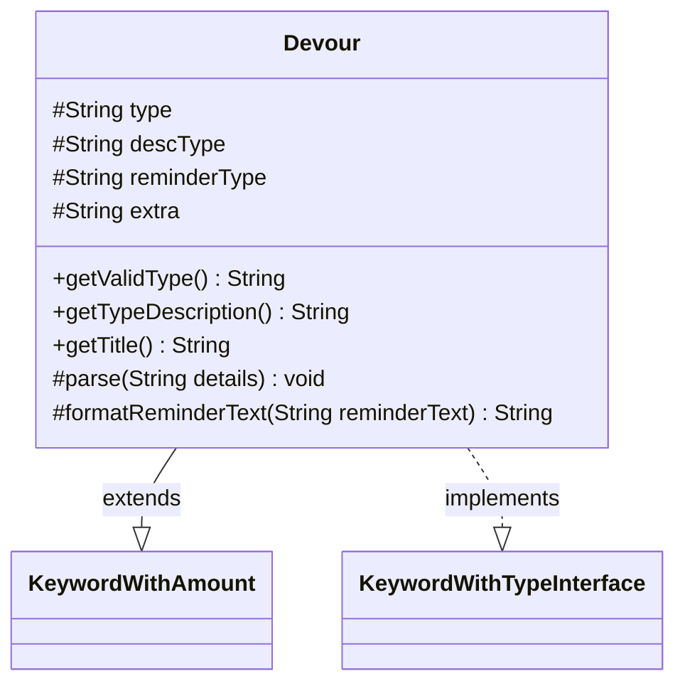

---
aliases:
  - Devour
tags:
  - java/class
  - module/forge-game
  - pkg/forge/game/keyword
fqn: forge.game.keyword.Devour
package: forge.game.keyword
module: forge-game
kind: Class
---

# Devour

**Package:** `forge.game.keyword` &nbsp; **Module:** `forge-game` &nbsp; **Kind:** Class



## Relationships
**Extends:**
- [[forge.game.keyword.KeywordWithAmount|KeywordWithAmount]]
**Implements:**
- [[forge.game.keyword.KeywordWithTypeInterface|KeywordWithTypeInterface]]

## Design Description

Devour represents Magic: The Gathering's "Devour" keyword ability in Forge's keyword model. It extends KeywordWithAmount to inherit the numeric magnitude handling (including the variable "X" form) and implements KeywordWithTypeInterface to expose a constrained creature/card type via getValidType() and getTypeDescription(), defaulting to "Creature" when unspecified. Its parse() method decodes a colon-delimited definition string into amount, type, and optional extra text, deriving singular description and plural reminder forms through CardType lookups. getTitle() assembles the human-readable keyword label, while formatReminderText() interpolates the amount (or "X") and pluralized type into reminder text. The design centralizes Devour's textual and numeric variation in one place, delegating shared amount and type behavior to its supertype and interface so the keyword framework can render and apply it uniformly.

## Source
`forge-game/src/main/java/forge/game/keyword/Devour.java`

```java
package forge.game.keyword;

import java.util.Locale;

import forge.card.CardType;

public class Devour extends KeywordWithAmount implements KeywordWithTypeInterface {
    protected String type = null;
    protected String descType = null;
    protected String reminderType = null;
    protected String extra = null;

    @Override
    public String getValidType() { return type == null ? "Creature" : type; }
    @Override
    public String getTypeDescription() { return descType; }

    public String getTitle() {
        StringBuilder sb = new StringBuilder();
        sb.append(getKeyword());
        if (type != null) {
            sb.append(" ").append(getTypeDescription());
        }
        sb.append(" ").append(getAmountString());
        if (extra != null) {
            sb.append(extra);
        }
        return sb.toString();
    }

    @Override
    protected void parse(String details) {
        String[] d = details.split(":");
        if (details.startsWith("X")) {
            withX = true;
        } else {
            amount = Integer.parseInt(d[0]);
        }
        descType = "Creature";
        reminderType = "creatures";
        if (d.length > 1 && !d[1].isEmpty()) {
            descType = type = d[1];
            reminderType = CardType.getPluralType(type);
        }
        if (CardType.isACardType(descType)) {
            descType = descType.toLowerCase(Locale.ENGLISH);
        }
        if (d.length > 2) {
            extra = d[2];
        }
    }

    @Override
    protected String formatReminderText(String reminderText) {
        if (withX) {
            return String.format(reminderText.replaceAll("\\%(\\d+\\$)?d", "%$1s"), "X", reminderType);
        }
        return String.format(reminderText, amount, reminderType);
    }
}
```

## Python
`forge/game/keyword/Devour.py`

```python
import locale

from forge.card.CardType import CardType
from forge.game.keyword.KeywordWithAmount import KeywordWithAmount
from forge.game.keyword.KeywordWithTypeInterface import KeywordWithTypeInterface


class Devour(KeywordWithAmount, KeywordWithTypeInterface):
    def __init__(self):
        super().__init__()
        self.type = None
        self.descType = None
        self.reminderType = None
        self.extra = None

    def getValidType(self) -> str:
        return "Creature" if self.type is None else self.type

    def getTypeDescription(self) -> str:
        return self.descType

    def getTitle(self) -> str:
        sb = []
        sb.append(self.getKeyword())
        if self.type is not None:
            sb.append(" ")
            sb.append(self.getTypeDescription())
        sb.append(" ")
        sb.append(self.getAmountString())
        if self.extra is not None:
            sb.append(self.extra)
        return "".join(sb)

    def parse(self, details: str) -> None:
        d = details.split(":")
        if details.startswith("X"):
            self.withX = True
        else:
            self.amount = int(d[0])
        self.descType = "Creature"
        self.reminderType = "creatures"
        if len(d) > 1 and d[1]:
            self.descType = self.type = d[1]
            self.reminderType = CardType.getPluralType(self.type)
        if CardType.isACardType(self.descType):
            self.descType = self.descType.lower(locale.LC_ALL)
        if len(d) > 2:
            self.extra = d[2]

    def formatReminderText(self, reminderText: str) -> str:
        import re
        if self.withX:
            return re.sub(r"\%(\d+\$)?d", r"%\1s", reminderText) % ("X", self.reminderType)
        return reminderText % (self.amount, self.reminderType)
```
