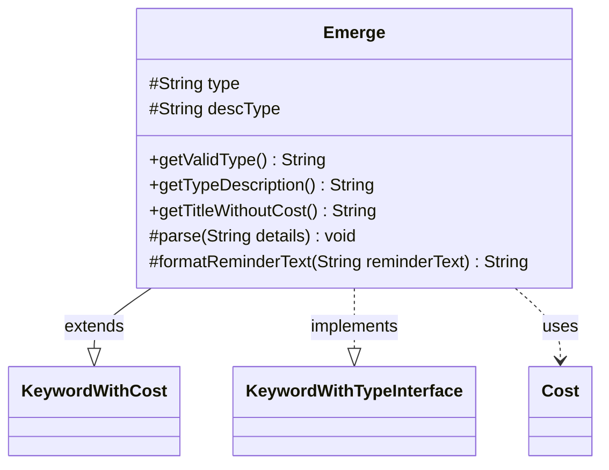

---
aliases:
  - Emerge
tags:
  - java/class
  - module/forge-game
  - pkg/forge/game/keyword
fqn: forge.game.keyword.Emerge
package: forge.game.keyword
module: forge-game
kind: Class
---

# Emerge

**Package:** `forge.game.keyword` &nbsp; **Module:** `forge-game` &nbsp; **Kind:** Class



## Relationships
**Extends:**
- [[forge.game.keyword.KeywordWithCost|KeywordWithCost]]
**Implements:**
- [[forge.game.keyword.KeywordWithTypeInterface|KeywordWithTypeInterface]]
**Uses:**
- [[forge.game.cost.Cost|Cost]]

## Source
`forge-game/src/main/java/forge/game/keyword/Emerge.java`

```java
package forge.game.keyword;

import java.util.Locale;

import forge.card.CardType;
import forge.game.cost.Cost;

public class Emerge extends KeywordWithCost implements KeywordWithTypeInterface {
    protected String type = null;
    protected String descType = null;

    @Override
    public String getValidType() { return type == null ? "Creature" : type; }
    @Override
    public String getTypeDescription() { return descType; }

    @Override
    public String getTitleWithoutCost() {
        StringBuilder sb = new StringBuilder();
        sb.append(getKeyword());
        if (type != null) {
            sb.append(" from ").append(getTypeDescription());
        }
        return sb.toString();
    }

    @Override
    protected void parse(String details) {
        final String[] k = details.split(":");
        cost = new Cost(k[0], false);
        descType = "creature";
        if (k.length >= 2) {
            descType = type = k[1];
            if (CardType.isACardType(descType)) {
                descType = descType.toLowerCase(Locale.ENGLISH);
            }
        }
    }

    @Override
    protected String formatReminderText(String reminderText) {
        return String.format(reminderText, cost.toSimpleString(), descType);
    }
}
```
