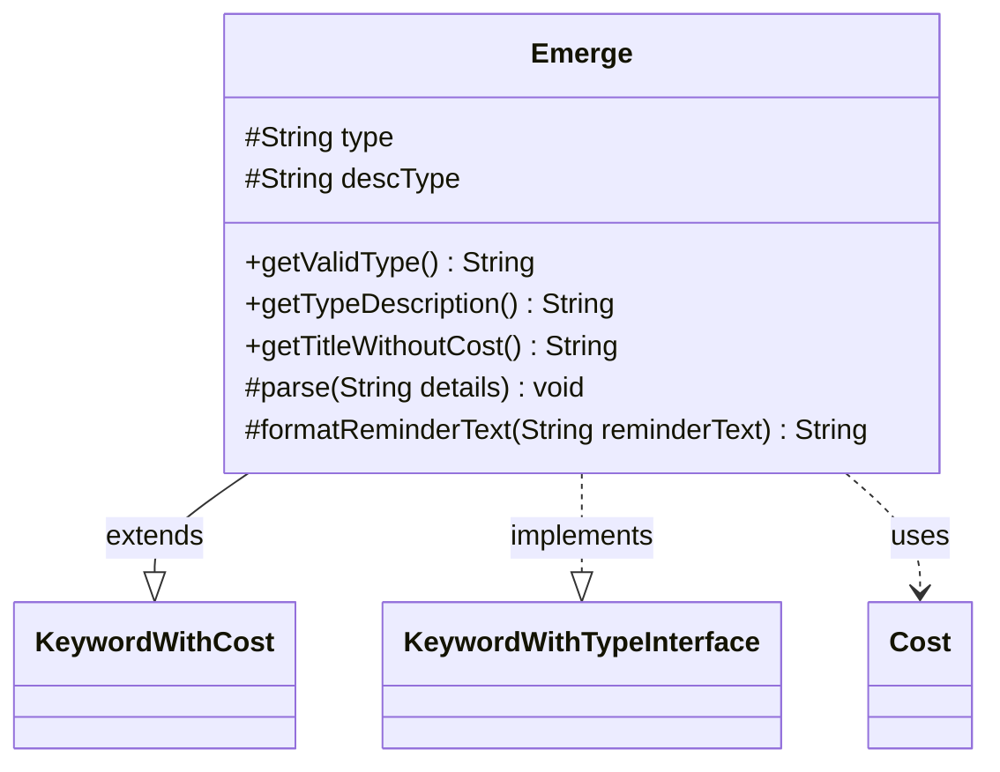

---
aliases:
  - Emerge
tags:
  - java/class
  - module/forge-game
  - pkg/forge/game/keyword
fqn: forge.game.keyword.Emerge
package: forge.game.keyword
module: forge-game
kind: Class
---

# Emerge

**Package:** `forge.game.keyword` &nbsp; **Module:** `forge-game` &nbsp; **Kind:** Class



## Relationships
**Extends:**
- [[forge.game.keyword.KeywordWithCost|KeywordWithCost]]
**Implements:**
- [[forge.game.keyword.KeywordWithTypeInterface|KeywordWithTypeInterface]]
**Uses:**
- [[forge.game.cost.Cost|Cost]]

## Design Description

Emerge is a concrete keyword implementation in Forge's MTG engine representing the Magic ability of the same name, which lets a creature be cast for an alternative cost reduced by sacrificing another creature. It extends `KeywordWithCost` to inherit cost-bearing keyword behavior and implements `KeywordWithTypeInterface`, exposing a sacrificeable creature type via `getValidType()` (defaulting to "Creature") and `getTypeDescription()`. Its `parse` method splits the keyword details into a mana `Cost` and an optional type constraint, normalizing recognized card types to lowercase for display while retaining the raw type for matching. `getTitleWithoutCost()` and `formatReminderText()` assemble human-readable presentation, the latter injecting the simplified cost and description type into the reminder template. The design cleanly separates the structural type contract from the cost mechanics inherited from its supertype.

## Source
`forge-game/src/main/java/forge/game/keyword/Emerge.java`

```java
package forge.game.keyword;

import java.util.Locale;

import forge.card.CardType;
import forge.game.cost.Cost;

public class Emerge extends KeywordWithCost implements KeywordWithTypeInterface {
    protected String type = null;
    protected String descType = null;

    @Override
    public String getValidType() { return type == null ? "Creature" : type; }
    @Override
    public String getTypeDescription() { return descType; }

    @Override
    public String getTitleWithoutCost() {
        StringBuilder sb = new StringBuilder();
        sb.append(getKeyword());
        if (type != null) {
            sb.append(" from ").append(getTypeDescription());
        }
        return sb.toString();
    }

    @Override
    protected void parse(String details) {
        final String[] k = details.split(":");
        cost = new Cost(k[0], false);
        descType = "creature";
        if (k.length >= 2) {
            descType = type = k[1];
            if (CardType.isACardType(descType)) {
                descType = descType.toLowerCase(Locale.ENGLISH);
            }
        }
    }

    @Override
    protected String formatReminderText(String reminderText) {
        return String.format(reminderText, cost.toSimpleString(), descType);
    }
}
```

## Python
`forge/game/keyword/Emerge.py`

```python
from forge.game.keyword.KeywordWithCost import KeywordWithCost
from forge.game.keyword.KeywordWithTypeInterface import KeywordWithTypeInterface
from forge.game.cost.Cost import Cost
from forge.card.CardType import CardType


class Emerge(KeywordWithCost, KeywordWithTypeInterface):
    def __init__(self):
        super().__init__()
        self.type = None
        self.descType = None

    def getValidType(self) -> str:
        return "Creature" if self.type is None else self.type

    def getTypeDescription(self) -> str:
        return self.descType

    def getTitleWithoutCost(self) -> str:
        sb = []
        sb.append(self.getKeyword())
        if self.type is not None:
            sb.append(" from ")
            sb.append(self.getTypeDescription())
        return "".join(sb)

    def parse(self, details: str) -> None:
        k = details.split(":")
        self.cost = Cost(k[0], False)
        self.descType = "creature"
        if len(k) >= 2:
            self.descType = self.type = k[1]
            if CardType.isACardType(self.descType):
                self.descType = self.descType.lower()

    def formatReminderText(self, reminderText: str) -> str:
        return reminderText % (self.cost.toSimpleString(), self.descType)
```
