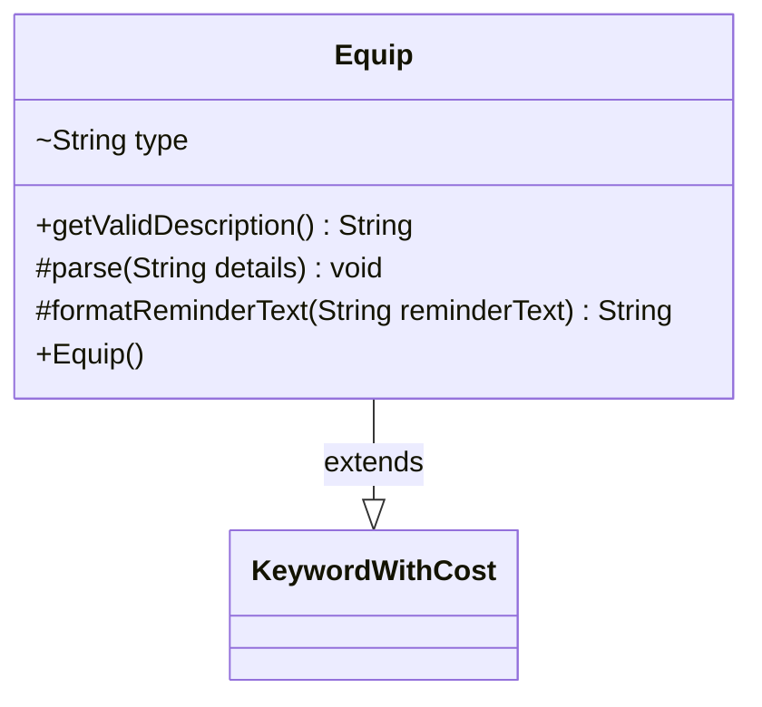

---
aliases:
  - Equip
tags:
  - java/class
  - module/forge-game
  - pkg/forge/game/keyword
fqn: forge.game.keyword.Equip
package: forge.game.keyword
module: forge-game
kind: Class
---

# Equip

**Package:** `forge.game.keyword` &nbsp; **Module:** `forge-game` &nbsp; **Kind:** Class



## Relationships
**Extends:**
- [[forge.game.keyword.KeywordWithCost|KeywordWithCost]]

## Source
`forge-game/src/main/java/forge/game/keyword/Equip.java`

```java
package forge.game.keyword;

public class Equip extends KeywordWithCost {

    String type = "creature";

    public Equip() {
    }

    public String getValidDescription() { return type; }

    @Override
    protected void parse(String details) {
        String[] k = details.split(":");
        super.parse(k[0]);
        if (k.length > 2) {
            type = k[2];
        }
    }

    @Override
    protected String formatReminderText(String reminderText) {
        return String.format(reminderText, cost.toSimpleString(), type);
    }
}
```
