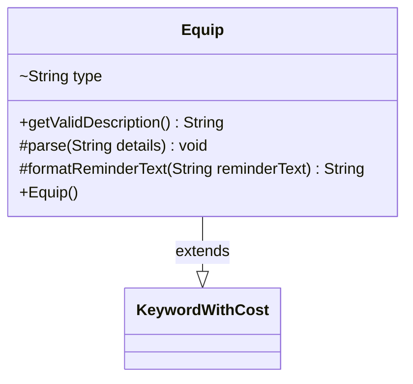

---
aliases:
  - Equip
tags:
  - java/class
  - module/forge-game
  - pkg/forge/game/keyword
fqn: forge.game.keyword.Equip
package: forge.game.keyword
module: forge-game
kind: Class
---

# Equip

**Package:** `forge.game.keyword` &nbsp; **Module:** `forge-game` &nbsp; **Kind:** Class



## Relationships
**Extends:**
- [[forge.game.keyword.KeywordWithCost|KeywordWithCost]]

## Design Description

Equip is a keyword implementation that models Magic's Equip ability, attaching an Equipment permanent to a valid target for a specified cost. It extends KeywordWithCost, inheriting the cost-parsing and cost-storage machinery and supplying only the behavior unique to equipping. Its parse method splits the keyword details, delegating the cost portion to the superclass while extracting an optional valid-target type (defaulting to "creature"). The getValidDescription accessor exposes that constraint, and formatReminderText overrides the inherited reminder-text formatting to interpolate both the simplified cost and the target type. The design keeps the class minimal, relying on its supertype for shared cost handling and customizing only the target-type concern that distinguishes Equip from other costed keywords.

## Source
`forge-game/src/main/java/forge/game/keyword/Equip.java`

```java
package forge.game.keyword;

public class Equip extends KeywordWithCost {

    String type = "creature";

    public Equip() {
    }

    public String getValidDescription() { return type; }

    @Override
    protected void parse(String details) {
        String[] k = details.split(":");
        super.parse(k[0]);
        if (k.length > 2) {
            type = k[2];
        }
    }

    @Override
    protected String formatReminderText(String reminderText) {
        return String.format(reminderText, cost.toSimpleString(), type);
    }
}
```

## Python
`forge/game/keyword/Equip.py`

```python
This task is a Java→Python port with no LLM/Claude API involvement, so the claude-api skill doesn't apply. Here's the port:

from forge.game.keyword.KeywordWithCost import KeywordWithCost


class Equip(KeywordWithCost):

    type = "creature"

    def __init__(self):
        pass

    def getValidDescription(self) -> str:
        return self.type

    def parse(self, details: str) -> None:
        k = details.split(":")
        super().parse(k[0])
        if len(k) > 2:
            self.type = k[2]

    def formatReminderText(self, reminderText: str) -> str:
        return reminderText % (self.cost.toSimpleString(), self.type)
```
