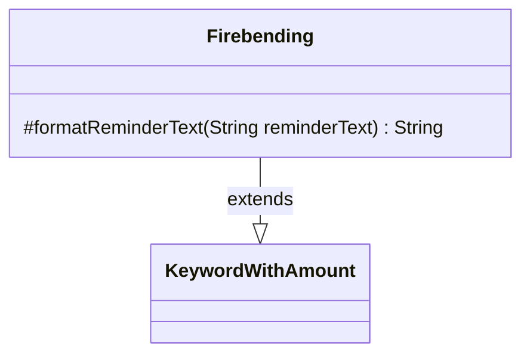

---
aliases:
  - Firebending
tags:
  - java/class
  - module/forge-game
  - pkg/forge/game/keyword
fqn: forge.game.keyword.Firebending
package: forge.game.keyword
module: forge-game
kind: Class
---

# Firebending

**Package:** `forge.game.keyword`   **Module:** `forge-game`   **Kind:** Class



## Relationships
**Extends:**
- [[forge.game.keyword.KeywordWithAmount|KeywordWithAmount]]

## Design Description

Firebending is a concrete Magic: The Gathering keyword-ability class that models the Firebending mechanic, whose reminder text references a variable amount of red mana. As a subclass of `KeywordWithAmount`, it inherits the parsed numeric `amount` and the `withX` flag, supplying only the keyword-specific rendering by overriding the protected `formatReminderText` hook. That override builds the red-mana cost string—either `X {R}` when the ability scales with X, or `amount` repetitions of `{R}`—and substitutes it into the reminder-text template. The design follows a template-method pattern: the shared parsing and lifecycle logic lives in the supertype, while each keyword subclass like Firebending contributes its small, focused formatting variation, keeping the keyword hierarchy uniform and minimizing duplication.

## Source
`forge-game/src/main/java/forge/game/keyword/Firebending.java`

```java
package forge.game.keyword;

public class Firebending extends KeywordWithAmount {

    @Override
    protected String formatReminderText(String reminderText) {
        String fire;
        if (withX) {
            fire = "X {R}";
        } else {
            fire = "{R}".repeat(amount);
        }
        return String.format(reminderText, fire);
    }
}
```

## Python
`forge/game/keyword/Firebending.py`

```python
from forge.game.keyword.KeywordWithAmount import KeywordWithAmount


class Firebending(KeywordWithAmount):

    def formatReminderText(self, reminderText: str) -> str:
        if self.withX:
            fire = "X {R}"
        else:
            fire = "{R}" * self.amount
        return reminderText % fire
```
