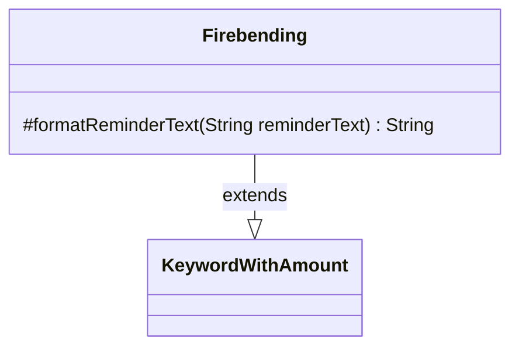

---
aliases:
  - Firebending
tags:
  - java/class
  - module/forge-game
  - pkg/forge/game/keyword
fqn: forge.game.keyword.Firebending
package: forge.game.keyword
module: forge-game
kind: Class
---

# Firebending

**Package:** `forge.game.keyword` &nbsp; **Module:** `forge-game` &nbsp; **Kind:** Class



## Relationships
**Extends:**
- [[forge.game.keyword.KeywordWithAmount|KeywordWithAmount]]

## Source
`forge-game/src/main/java/forge/game/keyword/Firebending.java`

```java
package forge.game.keyword;

public class Firebending extends KeywordWithAmount {

    @Override
    protected String formatReminderText(String reminderText) {
        String fire;
        if (withX) {
            fire = "X {R}";
        } else {
            fire = "{R}".repeat(amount);
        }
        return String.format(reminderText, fire);
    }
}
```
