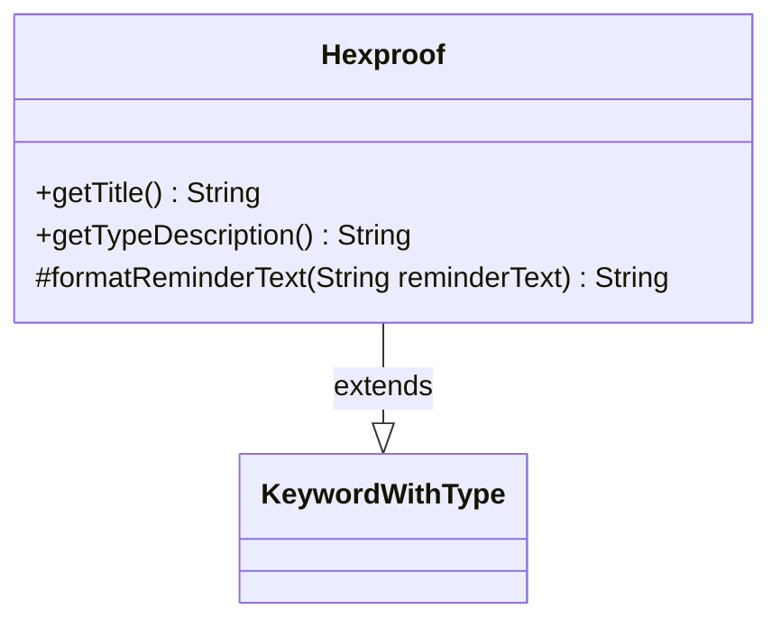

---
aliases:
  - Hexproof
tags:
  - java/class
  - module/forge-game
  - pkg/forge/game/keyword
fqn: forge.game.keyword.Hexproof
package: forge.game.keyword
module: forge-game
kind: Class
---

# Hexproof

**Package:** `forge.game.keyword`   **Module:** `forge-game`   **Kind:** Class



## Relationships
**Extends:**
- [[forge.game.keyword.KeywordWithType|KeywordWithType]]

## Design Description

Hexproof is a concrete keyword implementation representing Magic: The Gathering's hexproof ability, optionally qualified by a card type (e.g., "Hexproof from Creatures"). Extending KeywordWithType, it inherits the parameterized `type`/`descType` state and overrides three hooks to specialize presentation: `getTitle()` and `getTypeDescription()` produce display text that pluralizes recognized card types via `CardType`, while `formatReminderText()` supplies the rules-text explanation. The design follows a template-method pattern—the supertype drives parsing and lifecycle, and each subclass like Hexproof customizes only its title, type description, and reminder text—keeping the common keyword-with-type machinery centralized while allowing the empty-type case to fall back to the plain, unqualified ability.

## Source
`forge-game/src/main/java/forge/game/keyword/Hexproof.java`

```java
package forge.game.keyword;

import forge.card.CardType;

public class Hexproof extends KeywordWithType {

    @Override
    public String getTitle() {
        if (type.isEmpty()) {
            return "Hexproof";
        }
        return "Hexproof from " + this.getTypeDescription();
    }

    @Override
    public String getTypeDescription() {
        if (CardType.isACardType(type)) {
            return CardType.getPluralType(type);
        }
        return super.getTypeDescription();
    }

    @Override
    protected String formatReminderText(String reminderText) {
        if (type.isEmpty()) {
            return "This can't be the target of spells or abilities your opponents control.";
        }
        return String.format(reminderText, descType);
    }
}
```

## Python
`forge/game/keyword/Hexproof.py`

```python
from forge.card.CardType import CardType
from forge.game.keyword.KeywordWithType import KeywordWithType


class Hexproof(KeywordWithType):

    def getTitle(self) -> str:
        if not self.type:
            return "Hexproof"
        return "Hexproof from " + self.getTypeDescription()

    def getTypeDescription(self) -> str:
        if CardType.isACardType(self.type):
            return CardType.getPluralType(self.type)
        return super().getTypeDescription()

    def formatReminderText(self, reminderText: str) -> str:
        if not self.type:
            return "This can't be the target of spells or abilities your opponents control."
        return reminderText % self.descType
```
