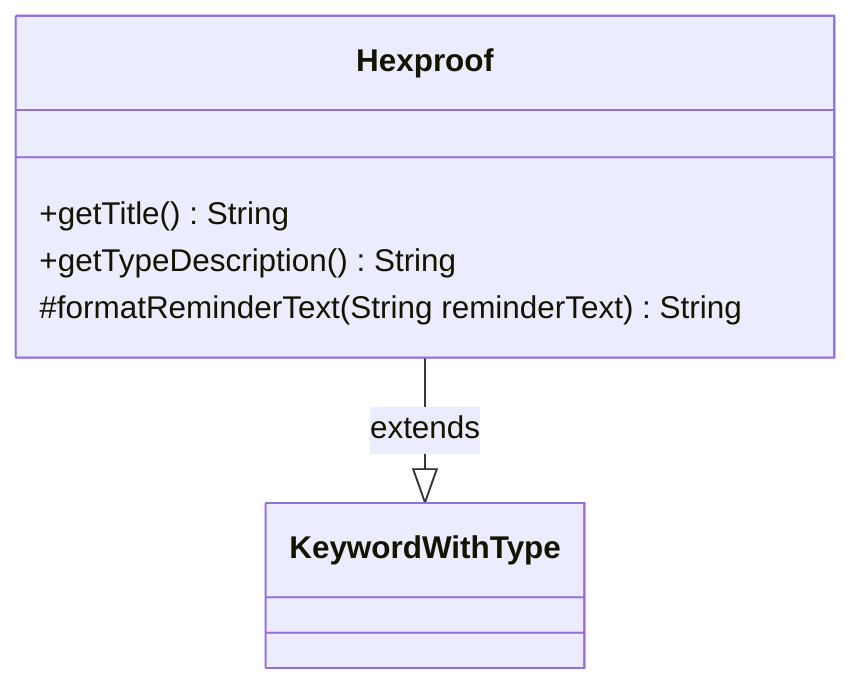

---
aliases:
  - Hexproof
tags:
  - java/class
  - module/forge-game
  - pkg/forge/game/keyword
fqn: forge.game.keyword.Hexproof
package: forge.game.keyword
module: forge-game
kind: Class
---

# Hexproof

**Package:** `forge.game.keyword` &nbsp; **Module:** `forge-game` &nbsp; **Kind:** Class



## Relationships
**Extends:**
- [[forge.game.keyword.KeywordWithType|KeywordWithType]]

## Source
`forge-game/src/main/java/forge/game/keyword/Hexproof.java`

```java
package forge.game.keyword;

import forge.card.CardType;

public class Hexproof extends KeywordWithType {

    @Override
    public String getTitle() {
        if (type.isEmpty()) {
            return "Hexproof";
        }
        return "Hexproof from " + this.getTypeDescription();
    }

    @Override
    public String getTypeDescription() {
        if (CardType.isACardType(type)) {
            return CardType.getPluralType(type);
        }
        return super.getTypeDescription();
    }

    @Override
    protected String formatReminderText(String reminderText) {
        if (type.isEmpty()) {
            return "This can't be the target of spells or abilities your opponents control.";
        }
        return String.format(reminderText, descType);
    }
}
```
