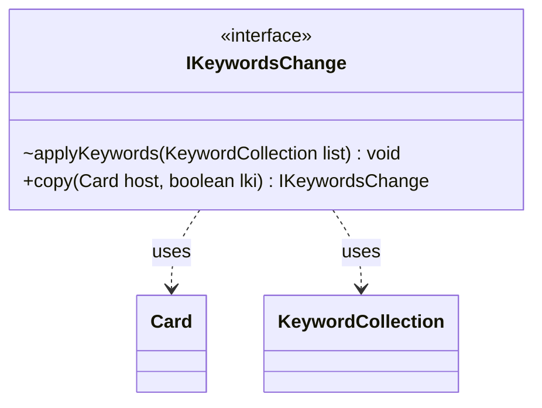

---
aliases:
  - IKeywordsChange
tags:
  - java/interface
  - module/forge-game
  - pkg/forge/game/keyword
fqn: forge.game.keyword.IKeywordsChange
package: forge.game.keyword
module: forge-game
kind: Interface
---

# IKeywordsChange

**Package:** `forge.game.keyword` &nbsp; **Module:** `forge-game` &nbsp; **Kind:** Interface



## Relationships
**Uses:**
- [[forge.game.card.Card|Card]]
- [[forge.game.keyword.KeywordCollection|KeywordCollection]]

## Design Description

IKeywordsChange defines the contract for a discrete, reversible modification to a card's keyword set within Forge's game engine. Implementations encapsulate logic that adds or removes keywords, applying their effect to a mutable KeywordCollection via `applyKeywords`, allowing multiple changes to be layered onto a single card's keyword state.

As an interface it decouples the keyword system from concrete change sources, letting effects, abilities, and static modifiers each supply their own implementation while the collection remains agnostic to their origin. The `copy` method, parameterized by a host Card and a last-known-information flag, signals integration with Forge's snapshot and effect-copying machinery, ensuring keyword changes can be faithfully reproduced when game state is duplicated for last-known-information lookups.

## Source
`forge-game/src/main/java/forge/game/keyword/IKeywordsChange.java`

```java
package forge.game.keyword;

import forge.game.card.Card;

public interface IKeywordsChange {
    void applyKeywords(KeywordCollection list);
    public IKeywordsChange copy(final Card host, final boolean lki);
}
```

## Python
`forge/game/keyword/IKeywordsChange.py`

```python
from abc import ABC, abstractmethod

from forge.game.card.Card import Card
from forge.game.keyword.KeywordCollection import KeywordCollection


class IKeywordsChange(ABC):
    @abstractmethod
    def applyKeywords(self, list: KeywordCollection) -> None:
        ...

    @abstractmethod
    def copy(self, host: Card, lki: bool) -> "IKeywordsChange":
        ...
```
