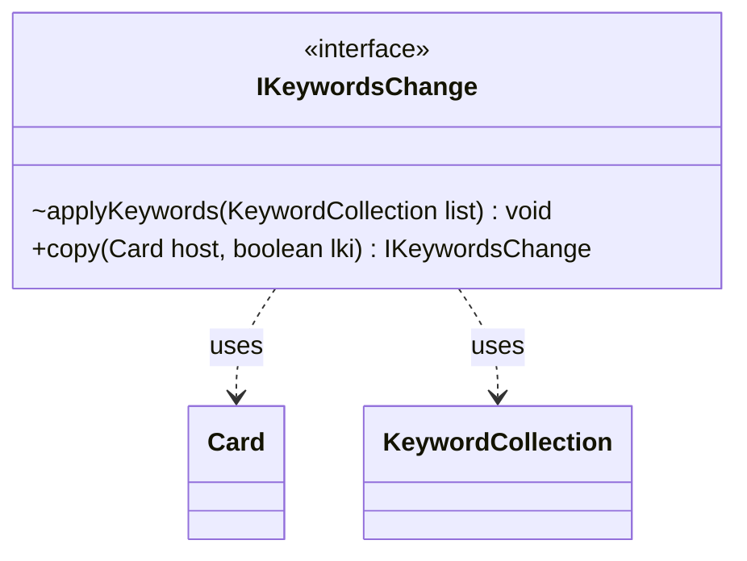

---
aliases:
  - IKeywordsChange
tags:
  - java/interface
  - module/forge-game
  - pkg/forge/game/keyword
fqn: forge.game.keyword.IKeywordsChange
package: forge.game.keyword
module: forge-game
kind: Interface
---

# IKeywordsChange

**Package:** `forge.game.keyword` &nbsp; **Module:** `forge-game` &nbsp; **Kind:** Interface



## Relationships
**Uses:**
- [[forge.game.card.Card|Card]]
- [[forge.game.keyword.KeywordCollection|KeywordCollection]]

## Source
`forge-game/src/main/java/forge/game/keyword/IKeywordsChange.java`

```java
package forge.game.keyword;

import forge.game.card.Card;

public interface IKeywordsChange {
    void applyKeywords(KeywordCollection list);
    public IKeywordsChange copy(final Card host, final boolean lki);
}
```
