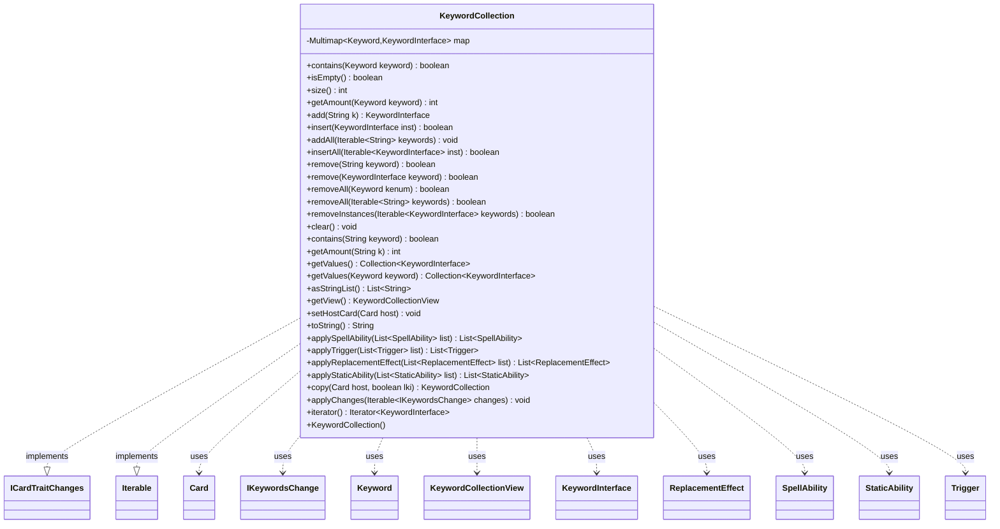

---
aliases:
  - KeywordCollection
tags:
  - java/class
  - module/forge-game
  - pkg/forge/game/keyword
fqn: forge.game.keyword.KeywordCollection
package: forge.game.keyword
module: forge-game
kind: Class
---

# KeywordCollection

**Package:** `forge.game.keyword` &nbsp; **Module:** `forge-game` &nbsp; **Kind:** Class



## Relationships
**Implements:**
- [[forge.game.card.ICardTraitChanges|ICardTraitChanges]]
**Uses:**
- [[forge.game.card.Card|Card]]
- [[forge.game.keyword.IKeywordsChange|IKeywordsChange]]
- [[forge.game.keyword.Keyword|Keyword]]
- [[forge.game.keyword.KeywordCollectionView|KeywordCollectionView]]
- [[forge.game.keyword.KeywordInterface|KeywordInterface]]
- [[forge.game.replacement.ReplacementEffect|ReplacementEffect]]
- [[forge.game.spellability.SpellAbility|SpellAbility]]
- [[forge.game.staticability.StaticAbility|StaticAbility]]
- [[forge.game.trigger.Trigger|Trigger]]

## Design Description

KeywordCollection is a mutable container that manages the keyword abilities attached to a Magic card, storing them as `KeywordInterface` instances in a Guava `Multimap` keyed by `Keyword` (deliberately hash-keyed rather than enum-keyed to avoid a noted performance penalty, with linked-hash-set values to preserve insertion order and deduplicate). It exposes a broad add/insert/remove/query API that accepts both raw keyword strings and resolved instances, guarding insertion against redundant keywords.

As an implementation of `ICardTraitChanges`, it delegates the `applySpellAbility`, `applyTrigger`, `applyReplacementEffect`, and `applyStaticAbility` passes to each contained `KeywordInterface`, letting keywords contribute traits to a card. Implementing `Iterable<KeywordInterface>` allows direct iteration over its values, and it supports host-card binding, deep copying (with last-known-information support), read-only views via `KeywordCollectionView`, and bulk mutation through `IKeywordsChange` objects.

## Source
`forge-game/src/main/java/forge/game/keyword/KeywordCollection.java`

```java
package forge.game.keyword;

import java.util.Collection;
import java.util.Iterator;
import java.util.List;
import java.util.stream.Collectors;

import com.google.common.collect.Lists;
import com.google.common.collect.Multimap;
import com.google.common.collect.MultimapBuilder;

import forge.game.card.Card;
import forge.game.card.ICardTraitChanges;
import forge.game.replacement.ReplacementEffect;
import forge.game.spellability.SpellAbility;
import forge.game.staticability.StaticAbility;
import forge.game.trigger.Trigger;

public class KeywordCollection implements ICardTraitChanges, Iterable<KeywordInterface> {
    // don't use enumKeys it causes a slow down
    private final Multimap<Keyword, KeywordInterface> map = MultimapBuilder.hashKeys()
            .linkedHashSetValues().build();

    public KeywordCollection() {
        super();
    }

    public boolean contains(Keyword keyword) {
        return map.containsKey(keyword);
    }

    public boolean isEmpty() {
        return map.isEmpty();
    }

    public int size() {
        return map.values().size();
    }

    public int getAmount(Keyword keyword) {
        int amount = 0;
        for (KeywordInterface inst : map.get(keyword)) {
            amount += inst.getAmount();
        }
        return amount;
    }

    public KeywordInterface add(String k) {
        KeywordInterface inst = Keyword.getInstance(k);
        if (insert(inst)) {
            return inst;
        }
        return null;
    }
    public boolean insert(KeywordInterface inst) {
        Keyword keyword = inst.getKeyword();
        Collection<KeywordInterface> list = map.get(keyword);
        if (list.isEmpty() || !inst.redundant(list)) {
            list.add(inst);
            return true;
        }
        return false;
    }

    public void addAll(Iterable<String> keywords) {
        for (String k : keywords) {
            add(k);
        }
    }

    public boolean insertAll(Iterable<KeywordInterface> inst) {
        boolean result = false;
        for (KeywordInterface k : inst) {
            if (insert(k)) {
                result = true;
            }
        }
        return result;
    }

    public boolean remove(String keyword) {
        Iterator<KeywordInterface> it = map.values().iterator();

        boolean result = false;
        while (it.hasNext()) {
            KeywordInterface k = it.next();
            if (k.getOriginal().startsWith(keyword)) {
                it.remove();
                result = true;
            }
        }

        return result;
    }

    public boolean remove(KeywordInterface keyword) {
        return map.remove(keyword.getKeyword(), keyword);
    }

    public boolean removeAll(Keyword kenum) {
        return !map.removeAll(kenum).isEmpty();
    }

    public boolean removeAll(Iterable<String> keywords) {
        boolean result = false;
        for (String k : keywords) {
            if (remove(k)) {
                result = true;
            }
        }
        return result;
    }

    public boolean removeInstances(Iterable<KeywordInterface> keywords) {
        boolean result = false;
        for (KeywordInterface k : keywords) {
            if (map.remove(k.getKeyword(), k)) {
                result = true;
            }
        }
        return result;
    }

    public void clear() {
        map.clear();
    }

    public boolean contains(String keyword) {
        for (KeywordInterface inst : map.values()) {
            if (keyword.equals(inst.getOriginal())) {
                return true;
            }
        }
        return false;
    }

    public int getAmount(String k) {
        int amount = 0;
        for (KeywordInterface inst : map.values()) {
            if (k.equals(inst.getOriginal())) {
                amount++;
            }
        }
        return amount;
    }

    public Collection<KeywordInterface> getValues() {
        return map.values();
    }

    public Collection<KeywordInterface> getValues(final Keyword keyword) {
        return map.get(keyword);
    }

    public List<String> asStringList() {
        List<String> result = Lists.newArrayList();
        for (KeywordInterface kw : getValues()) {
            result.add(kw.getOriginal());
        }
        return result;
    }

    public KeywordCollectionView getView() {
        return new KeywordCollectionView(getValues().stream().map(KeywordInterface::getView).collect(Collectors.toList()));
    }

    public void setHostCard(final Card host) {
        for (KeywordInterface k : map.values()) {
            k.setHostCard(host);
        }
    }

    /* (non-Javadoc)
     * @see java.lang.Object#toString()
     */
    @Override
    public String toString() {
        StringBuilder sb  = new StringBuilder();

        sb.append(map.values());
        return sb.toString();
    }

    @Override
    public List<SpellAbility> applySpellAbility(List<SpellAbility> list) {
        for (KeywordInterface k : getValues()) {
            k.applySpellAbility(list);
        }
        return list;
    }
    @Override
    public List<Trigger> applyTrigger(List<Trigger> list) {
        for (KeywordInterface k : getValues()) {
            k.applyTrigger(list);
        }
        return list;
    }
    @Override
    public List<ReplacementEffect> applyReplacementEffect(List<ReplacementEffect> list) {
        for (KeywordInterface k : getValues()) {
            k.applyReplacementEffect(list);
        }
        return list;
    }
    @Override
    public List<StaticAbility> applyStaticAbility(List<StaticAbility> list) {
        for (KeywordInterface k : getValues()) {
            k.applyStaticAbility(list);
        }
        return list;
    }
    @Override
    public KeywordCollection copy(Card host, boolean lki) {
        KeywordCollection result = new KeywordCollection();
        for (KeywordInterface ki : getValues()) {
            result.insert(ki.copy(host, lki));
        }
        return result;
    }

    public void applyChanges(Iterable<IKeywordsChange> changes) {
        for (final IKeywordsChange ck : changes) {
            ck.applyKeywords(this);
        }
    }

    @Override
    public Iterator<KeywordInterface> iterator() {
        return this.map.values().iterator();
    }
}
```

## Python
`forge/game/keyword/KeywordCollection.py`

```python
from forge.game.card.Card import Card
from forge.game.card.ICardTraitChanges import ICardTraitChanges
from forge.game.keyword.IKeywordsChange import IKeywordsChange
from forge.game.keyword.Keyword import Keyword
from forge.game.keyword.KeywordCollectionView import KeywordCollectionView
from forge.game.keyword.KeywordInterface import KeywordInterface
from forge.game.replacement.ReplacementEffect import ReplacementEffect
from forge.game.spellability.SpellAbility import SpellAbility
from forge.game.staticability.StaticAbility import StaticAbility
from forge.game.trigger.Trigger import Trigger

from collections import OrderedDict
from typing import Collection, Iterable, Iterator, List


class KeywordCollection(ICardTraitChanges, Iterable):
    # don't use enumKeys it causes a slow down
    def __init__(self):
        super().__init__()
        # Multimap<Keyword, KeywordInterface> with hash keys and linked-hash-set values
        # (preserve insertion order and deduplicate)
        self.map: dict[Keyword, "OrderedDict[KeywordInterface, None]"] = {}

    def _get(self, keyword: Keyword) -> "OrderedDict[KeywordInterface, None]":
        return self.map.get(keyword, OrderedDict())

    def _values(self) -> List[KeywordInterface]:
        result = []
        for coll in self.map.values():
            result.extend(coll.keys())
        return result

    def contains(self, keyword: Keyword) -> bool:
        return keyword in self.map and len(self.map[keyword]) > 0

    def isEmpty(self) -> bool:
        return len(self._values()) == 0

    def size(self) -> int:
        return len(self._values())

    def getAmount(self, keyword: Keyword) -> int:
        amount = 0
        for inst in self._get(keyword).keys():
            amount += inst.getAmount()
        return amount

    def add(self, k: str) -> KeywordInterface:
        inst = Keyword.getInstance(k)
        if self.insert(inst):
            return inst
        return None

    def insert(self, inst: KeywordInterface) -> bool:
        keyword = inst.getKeyword()
        coll = self.map.setdefault(keyword, OrderedDict())
        if len(coll) == 0 or not inst.redundant(list(coll.keys())):
            coll[inst] = None
            return True
        return False

    def addAll(self, keywords: Iterable[str]) -> None:
        for k in keywords:
            self.add(k)

    def insertAll(self, inst: Iterable[KeywordInterface]) -> bool:
        result = False
        for k in inst:
            if self.insert(k):
                result = True
        return result

    def remove(self, keyword) -> bool:
        if isinstance(keyword, KeywordInterface):
            return self._remove_instance(keyword)

        result = False
        for coll in self.map.values():
            to_remove = []
            for k in coll.keys():
                if k.getOriginal().startswith(keyword):
                    to_remove.append(k)
                    result = True
            for k in to_remove:
                del coll[k]

        return result

    def _remove_instance(self, keyword: KeywordInterface) -> bool:
        coll = self.map.get(keyword.getKeyword())
        if coll is not None and keyword in coll:
            del coll[keyword]
            return True
        return False

    def removeAll(self, kenum) -> bool:
        if isinstance(kenum, Keyword):
            coll = self.map.pop(kenum, None)
            return coll is not None and len(coll) > 0

        # Iterable<String>
        result = False
        for k in kenum:
            if self.remove(k):
                result = True
        return result

    def removeInstances(self, keywords: Iterable[KeywordInterface]) -> bool:
        result = False
        for k in keywords:
            if self._remove_instance(k):
                result = True
        return result

    def clear(self) -> None:
        self.map.clear()

    def contains(self, keyword: str) -> bool:
        for inst in self._values():
            if keyword == inst.getOriginal():
                return True
        return False

    def getAmount(self, k: str) -> int:
        amount = 0
        for inst in self._values():
            if k == inst.getOriginal():
                amount += 1
        return amount

    def getValues(self, keyword: Keyword = None) -> Collection[KeywordInterface]:
        if keyword is None:
            return self._values()
        return list(self._get(keyword).keys())

    def asStringList(self) -> List[str]:
        result = []
        for kw in self.getValues():
            result.append(kw.getOriginal())
        return result

    def getView(self) -> KeywordCollectionView:
        return KeywordCollectionView([k.getView() for k in self.getValues()])

    def setHostCard(self, host: Card) -> None:
        for k in self._values():
            k.setHostCard(host)

    # (non-Javadoc)
    # @see java.lang.Object#toString()
    def toString(self) -> str:
        sb = []
        sb.append(str(self._values()))
        return "".join(sb)

    def __str__(self) -> str:
        return self.toString()

    def applySpellAbility(self, list: List[SpellAbility]) -> List[SpellAbility]:
        for k in self.getValues():
            k.applySpellAbility(list)
        return list

    def applyTrigger(self, list: List[Trigger]) -> List[Trigger]:
        for k in self.getValues():
            k.applyTrigger(list)
        return list

    def applyReplacementEffect(self, list: List[ReplacementEffect]) -> List[ReplacementEffect]:
        for k in self.getValues():
            k.applyReplacementEffect(list)
        return list

    def applyStaticAbility(self, list: List[StaticAbility]) -> List[StaticAbility]:
        for k in self.getValues():
            k.applyStaticAbility(list)
        return list

    def copy(self, host: Card, lki: bool) -> "KeywordCollection":
        result = KeywordCollection()
        for ki in self.getValues():
            result.insert(ki.copy(host, lki))
        return result

    def applyChanges(self, changes: Iterable[IKeywordsChange]) -> None:
        for ck in changes:
            ck.applyKeywords(self)

    def __iter__(self) -> Iterator[KeywordInterface]:
        return iter(self._values())
```
