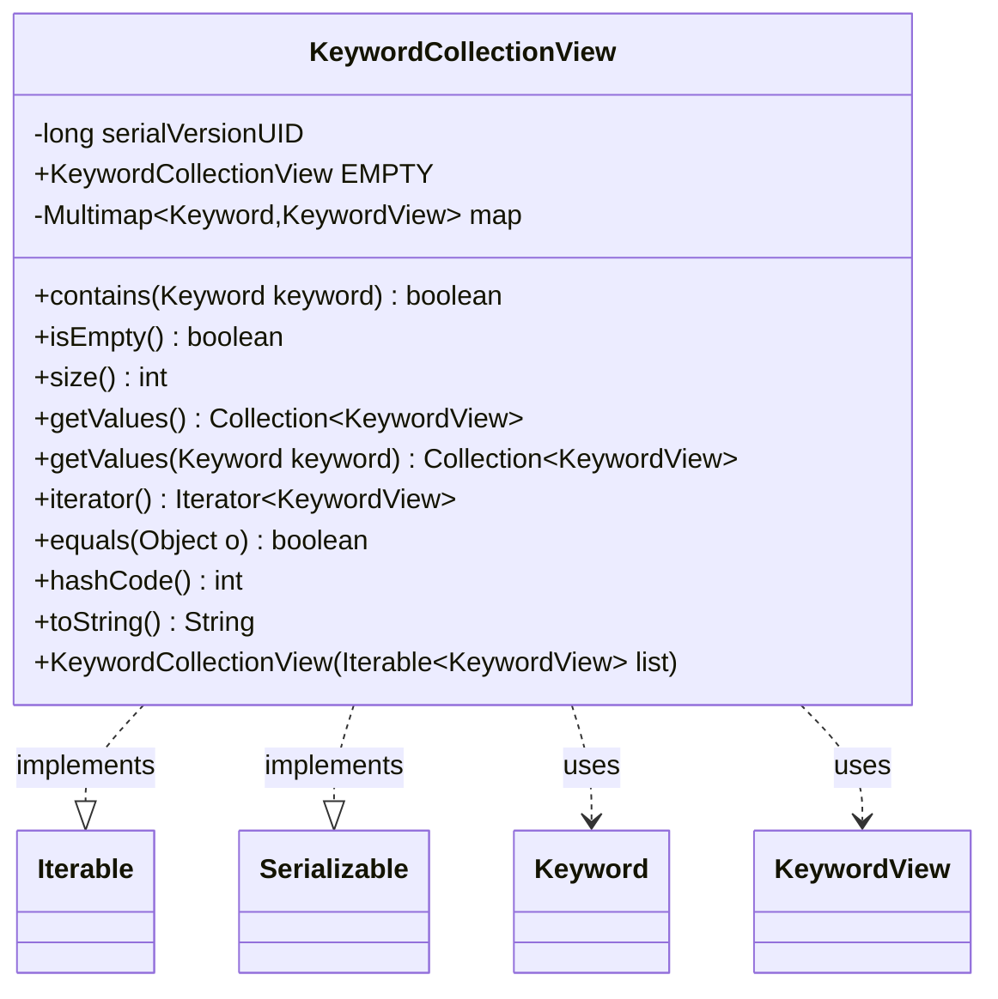

---
aliases:
  - KeywordCollectionView
tags:
  - java/class
  - module/forge-game
  - pkg/forge/game/keyword
fqn: forge.game.keyword.KeywordCollectionView
package: forge.game.keyword
module: forge-game
kind: Class
---

# KeywordCollectionView

**Package:** `forge.game.keyword` &nbsp; **Module:** `forge-game` &nbsp; **Kind:** Class



## Relationships
**Uses:**
- [[forge.game.keyword.Keyword|Keyword]]
- [[forge.game.keyword.KeywordView|KeywordView]]

## Design Description

Implements an immutable, read-only view over a card's keywords, exposing lookup and iteration without permitting external mutation. It indexes each KeywordView by its associated Keyword in a Guava Multimap (hash keys with linked-hash-set values), preserving insertion order while grouping multiple views under the same Keyword, and supports containment checks, sized iteration, and per-keyword retrieval.

As an `Iterable<KeywordView>`, it lets callers traverse all views directly, and its `Serializable` contract allows the collection to travel across the game-state boundary to clients. It collaborates with Keyword as the indexing key and KeywordView as the stored value, deriving equality and hashing from the underlying map so views compare by content. A shared `EMPTY` constant and a deliberate avoidance of enum-keyed maps (noted in-code as a performance concern) reflect intent to keep this lightweight view cheap to allocate and fast to query.

## Source
`forge-game/src/main/java/forge/game/keyword/KeywordCollectionView.java`

```java
package forge.game.keyword;

import java.io.Serializable;
import java.util.Collection;
import java.util.Iterator;
import java.util.List;

import com.google.common.collect.Multimap;
import com.google.common.collect.MultimapBuilder;

public class KeywordCollectionView implements Iterable<KeywordView>, Serializable {
    private static final long serialVersionUID = 1L;
    public static KeywordCollectionView EMPTY = new KeywordCollectionView(List.of());
    // don't use enumKeys it causes a slow down
    private final Multimap<Keyword, KeywordView> map = MultimapBuilder.hashKeys()
            .linkedHashSetValues().build();

    public KeywordCollectionView(Iterable<KeywordView> list) {
        for (KeywordView k : list) {
            map.put(k.keyword(), k);
        }
    }

    public boolean contains(Keyword keyword) {
        return map.containsKey(keyword);
    }

    public boolean isEmpty() {
        return map.isEmpty();
    }

    public int size() {
        return map.values().size();
    }

    public Collection<KeywordView> getValues() {
        return map.values();
    }

    public Collection<KeywordView> getValues(final Keyword keyword) {
        return map.get(keyword);
    }

    @Override
    public Iterator<KeywordView> iterator() {
        return this.map.values().iterator();
    }

    @Override 
    public boolean equals(Object o) {
        if (this == o) return true;
        return o instanceof KeywordCollectionView other && map.equals(other.map);
    }
    @Override
    public int hashCode() { return map.hashCode(); }

    @Override
    public String toString() { return getValues().toString(); }
}
```

## Python
`forge/game/keyword/KeywordCollectionView.py`

```python
from forge.game.keyword.Keyword import Keyword
from forge.game.keyword.KeywordView import KeywordView

import typing
from collections import OrderedDict


class KeywordCollectionView:
    serialVersionUID = 1

    EMPTY: "KeywordCollectionView" = None

    # don't use enumKeys it causes a slow down
    def __init__(self, list: typing.Iterable["KeywordView"]):
        # Multimap with hashKeys and linkedHashSetValues: preserve insertion
        # order of keys and of values within a key, with set semantics (no dups).
        self.map: dict[Keyword, "OrderedDict[KeywordView, None]"] = OrderedDict()
        for k in list:
            self.map.setdefault(k.keyword(), OrderedDict())[k] = None

    def contains(self, keyword: Keyword) -> bool:
        return keyword in self.map and len(self.map[keyword]) > 0

    def isEmpty(self) -> bool:
        return len(self.map) == 0

    def size(self) -> int:
        return sum(len(values) for values in self.map.values())

    def getValues(self) -> typing.Collection["KeywordView"]:
        result: list["KeywordView"] = []
        for values in self.map.values():
            result.extend(values.keys())
        return result

    def getValues(self, keyword: Keyword) -> typing.Collection["KeywordView"]:
        if keyword in self.map:
            return list(self.map[keyword].keys())
        return []

    def __iter__(self) -> typing.Iterator["KeywordView"]:
        return iter(self.getValues())

    def __eq__(self, o: object) -> bool:
        if self is o:
            return True
        return isinstance(o, KeywordCollectionView) and self.map == o.map

    def __hash__(self) -> int:
        return hash(tuple((k, tuple(v.keys())) for k, v in self.map.items()))

    def __str__(self) -> str:
        return str(self.getValues())


KeywordCollectionView.EMPTY = KeywordCollectionView([])
```
