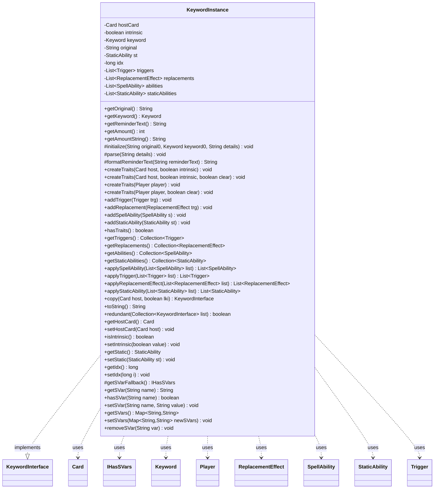

---
aliases:
  - KeywordInstance
tags:
  - java/class
  - module/forge-game
  - pkg/forge/game/keyword
fqn: forge.game.keyword.KeywordInstance
package: forge.game.keyword
module: forge-game
kind: Class
---

# KeywordInstance

**Package:** `forge.game.keyword`   **Module:** `forge-game`   **Kind:** Class



## Relationships
**Implements:**
- [[forge.game.keyword.KeywordInterface|KeywordInterface]]
**Uses:**
- [[forge.game.IHasSVars|IHasSVars]]
- [[forge.game.card.Card|Card]]
- [[forge.game.keyword.Keyword|Keyword]]
- [[forge.game.player.Player|Player]]
- [[forge.game.replacement.ReplacementEffect|ReplacementEffect]]
- [[forge.game.spellability.SpellAbility|SpellAbility]]
- [[forge.game.staticability.StaticAbility|StaticAbility]]
- [[forge.game.trigger.Trigger|Trigger]]

## Design Description

KeywordInstance is an abstract base class that realizes the `KeywordInterface` contract, modeling a single occurrence of a Magic keyword attached to a host `Card` (or `Player`). It holds the parsed keyword identity (`Keyword`, original text, amount) and owns the four families of game traits a keyword expands into—`Trigger`s, `ReplacementEffect`s, `SpellAbility`s, and `StaticAbility`s. Through `createTraits`, it delegates to `CardFactoryUtil`/`PlayerFactoryUtil` to lazily synthesize and register those traits, wrapping the work in Sentry breadcrumbs for diagnostics, while leaving parsing and reminder-text formatting to subclasses via abstract hooks.

The design favors composition and uniform propagation: setting the host card or intrinsic flag, copying, or applying traits all fan out across the four trait collections, keeping each owned trait back-linked to its keyword. Generic self-typing (`T extends KeywordInstance<?>`) supports clone-based copying, and SVar lookups are delegated to a fallback (`StaticAbility` or host card) rather than stored locally, with the mutating SVar methods deliberately left as no-ops.

## Source
`forge-game/src/main/java/forge/game/keyword/KeywordInstance.java`

```java
package forge.game.keyword;

import java.util.Collection;
import java.util.List;
import java.util.Map;
import java.util.regex.Matcher;
import java.util.regex.Pattern;

import com.google.common.collect.Lists;

import forge.game.IHasSVars;
import forge.game.card.Card;
import forge.game.card.CardFactoryUtil;
import forge.game.player.Player;
import forge.game.player.PlayerFactoryUtil;
import forge.game.replacement.ReplacementEffect;
import forge.game.spellability.SpellAbility;
import forge.game.staticability.StaticAbility;
import forge.game.trigger.Trigger;
import forge.util.Lang;
import io.sentry.Breadcrumb;
import io.sentry.Sentry;

public abstract class KeywordInstance<T extends KeywordInstance<?>> implements KeywordInterface {
    private Card hostCard = null;
    private boolean intrinsic = false;

    private Keyword keyword;
    private String original;
    private StaticAbility st = null;
    private long idx = -1;

    private List<Trigger> triggers = Lists.newArrayList();
    private List<ReplacementEffect> replacements = Lists.newArrayList();
    private List<SpellAbility> abilities = Lists.newArrayList();
    private List<StaticAbility> staticAbilities = Lists.newArrayList();

    @Override
    public String getOriginal() {
        return original;
    }
    @Override
    public Keyword getKeyword() {
        return keyword;
    }
    @Override
    public String getReminderText() {
        String result = formatReminderText(keyword.reminderText);
        Matcher m = Pattern.compile("\\{(\\w+):(.+?)\\}").matcher(result);

        StringBuffer sb = new StringBuffer();
        while (m.find()) {
            m.appendReplacement(sb, Lang.nounWithNumeralExceptOne(m.group(1), m.group(2)));
        }
        m.appendTail(sb);
        return sb.toString();
    }
    @Override
    public int getAmount() {
        return 1;
    }
    @Override
    public String getAmountString() {
        return String.valueOf(getAmount());
    }
    protected void initialize(String original0, Keyword keyword0, String details) {
        original = original0;
        keyword = keyword0;
        parse(details);
    }
    protected abstract void parse(String details);
    protected abstract String formatReminderText(String reminderText);

    /*
     * (non-Javadoc)
     * @see forge.game.keyword.KeywordInterface#createTraits(forge.game.card.Card, boolean)
     */
    public final void createTraits(final Card host, final boolean intrinsic) {
        createTraits(host, intrinsic, false);
    }

    /*
     * (non-Javadoc)
     * @see forge.game.keyword.KeywordInterface#createTraits(forge.game.card.Card, boolean, boolean)
     */
    public final void createTraits(final Card host, final boolean intrinsic, final boolean clear) {
        this.hostCard = host;
        this.intrinsic = intrinsic;
        if (clear) {
            triggers.clear();
            replacements.clear();
            abilities.clear();
            staticAbilities.clear();
        }

        try {
            String msg = "KeywordInstance:createTraits: make Traits for Keyword";

            Breadcrumb bread = new Breadcrumb(msg);
            bread.setData("Card", host.getName());
            bread.setData("Keyword", this.original);
            Sentry.addBreadcrumb(bread);

            // add Extra for debugging
            Sentry.setExtra("Card", host.getName());
            Sentry.setExtra("Keyword", this.original);

            CardFactoryUtil.addTriggerAbility(this, host, intrinsic);
            CardFactoryUtil.addReplacementEffect(this, host.getCurrentState(), intrinsic);
            CardFactoryUtil.addSpellAbility(this, host.getCurrentState(), intrinsic);
            CardFactoryUtil.addStaticAbility(this, host.getCurrentState(), intrinsic);
        } catch (Exception e) {
            String msg = "KeywordInstance:createTraits: failed Traits for Keyword";

            Breadcrumb bread = new Breadcrumb(msg);
            bread.setData("Card", host.getName());
            bread.setData("Keyword", this.original);
            Sentry.addBreadcrumb(bread);

            //rethrow
            throw new RuntimeException("Error in Keyword " + this.original + " for card " + host.getName(), e);
        } finally {
            // remove added extra
            Sentry.removeExtra("Card");
            Sentry.removeExtra("Keyword");
        }
    }

    /* (non-Javadoc)
     * @see forge.game.keyword.KeywordInterface#createTraits(forge.game.player.Player)
     */
    @Override
    public void createTraits(Player player) {
        createTraits(player, false);
    }
    /* (non-Javadoc)
     * @see forge.game.keyword.KeywordInterface#createTraits(forge.game.player.Player, boolean)
     */
    @Override
    public void createTraits(Player player, boolean clear) {
        if (clear) {
            triggers.clear();
            replacements.clear();
            abilities.clear();
            staticAbilities.clear();
        }
        try {
            String msg = "KeywordInstance:createTraits: make Traits for Keyword";

            Breadcrumb bread = new Breadcrumb(msg);
            bread.setData("Player", player.getName());
            bread.setData("Keyword", this.original);
            Sentry.addBreadcrumb(bread);

            // add Extra for debugging
            Sentry.setExtra("Player", player.getName());
            Sentry.setExtra("Keyword", this.original);

            PlayerFactoryUtil.addTriggerAbility(this, player);
            PlayerFactoryUtil.addReplacementEffect(this, player);
            PlayerFactoryUtil.addSpellAbility(this, player);
            PlayerFactoryUtil.addStaticAbility(this, player);
        } catch (Exception e) {
            String msg = "KeywordInstance:createTraits: failed Traits for Keyword";

            Breadcrumb bread = new Breadcrumb(msg);
            bread.setData("Player", player.getName());
            bread.setData("Keyword", this.original);
            Sentry.addBreadcrumb(bread);

            //rethrow
            throw new RuntimeException("Error in Keyword " + this.original + " for player " + player.getName(), e);
        } finally {
            // remove added extra
            Sentry.removeExtra("Player");
            Sentry.removeExtra("Keyword");
        }
    }
    /*
     * (non-Javadoc)
     * @see forge.game.keyword.KeywordInterface#addTrigger(forge.game.trigger.Trigger)
     */
    public final void addTrigger(final Trigger trg) {
        trg.setKeyword(this);
        triggers.add(trg);
    }

    /*
     * (non-Javadoc)
     * @see forge.game.keyword.KeywordInterface#addReplacement(forge.game.replacement.ReplacementEffect)
     */
    public final void addReplacement(final ReplacementEffect trg) {
        trg.setKeyword(this);
        replacements.add(trg);
    }

    /*
     * (non-Javadoc)
     * @see forge.game.keyword.KeywordInterface#addSpellAbility(forge.game.spellability.SpellAbility)
     */
    public final void addSpellAbility(final SpellAbility s) {
        s.setKeyword(this);
        abilities.add(s);
    }

    /*
     * (non-Javadoc)
     * @see forge.game.keyword.KeywordInterface#addStaticAbility(forge.game.staticability.StaticAbility)
     */
    public final void addStaticAbility(final StaticAbility st) {
        st.setKeyword(this);
        staticAbilities.add(st);
    }

    public boolean hasTraits() {
        if (!getAbilities().isEmpty())
            return true;
        if (!getTriggers().isEmpty())
            return true;
        if (!getReplacements().isEmpty())
            return true;
        if (!getStaticAbilities().isEmpty())
            return true;
        return false;
    }

    /*
     * (non-Javadoc)
     * @see forge.game.keyword.KeywordInterface#getTriggers()
     */
    public Collection<Trigger> getTriggers() {
        return triggers;
    }
    /*
     * (non-Javadoc)
     * @see forge.game.keyword.KeywordInterface#getReplacements()
     */
    public Collection<ReplacementEffect> getReplacements() {
        return replacements;
    }
    /*
     * (non-Javadoc)
     * @see forge.game.keyword.KeywordInterface#getAbilities()
     */
    public Collection<SpellAbility> getAbilities() {
        return abilities;
    }
    /*
     * (non-Javadoc)
     * @see forge.game.keyword.KeywordInterface#getStaticAbilities()
     */
    public Collection<StaticAbility> getStaticAbilities() {
        return staticAbilities;
    }


    public List<SpellAbility> applySpellAbility(List<SpellAbility> list) {
        list.addAll(getAbilities());
        return list;
    }
    public List<Trigger> applyTrigger(List<Trigger> list) {
        list.addAll(getTriggers());
        return list;
    }
    public List<ReplacementEffect> applyReplacementEffect(List<ReplacementEffect> list) {
        list.addAll(getReplacements());
        return list;
    }
    public List<StaticAbility> applyStaticAbility(List<StaticAbility> list) {
        list.addAll(getStaticAbilities());
        return list;
    }

    /*
     * (non-Javadoc)
     * @see forge.game.keyword.KeywordInterface#copy()
     */
    public KeywordInterface copy(final Card host, final boolean lki) {
        try {
            KeywordInstance<?> result = (KeywordInstance<?>) super.clone();
            result.hostCard = host;
            result.abilities = Lists.newArrayList();
            for (SpellAbility sa : this.abilities) {
                SpellAbility copy = sa.copy(host, lki);
                copy.setKeyword(result);
                result.abilities.add(copy);
            }

            result.triggers = Lists.newArrayList();
            for (Trigger tr : this.triggers) {
                Trigger copy = tr.copy(host, lki);
                copy.setKeyword(result);
                result.triggers.add(copy);
            }

            result.replacements = Lists.newArrayList();
            for (ReplacementEffect re : this.replacements) {
                ReplacementEffect copy = re.copy(host, lki);
                copy.setKeyword(result);
                result.replacements.add(copy);
            }

            result.staticAbilities = Lists.newArrayList();
            for (StaticAbility sa : this.staticAbilities) {
                StaticAbility copy = sa.copy(host, lki);
                copy.setKeyword(result);
                result.staticAbilities.add(copy);
            }

            return result;
        } catch (final Exception ex) {
            throw new RuntimeException("KeywordInstance : clone() error", ex);
        }
    }

    /* (non-Javadoc)
     * @see java.lang.Object#toString()
     */
    @Override
    public String toString() {
        return this.getOriginal();
    }

    /* (non-Javadoc)
     * @see forge.game.keyword.KeywordInterface#redundant(java.util.Collection)
     */
    @Override
    public boolean redundant(Collection<KeywordInterface> list) {
        if (!keyword.isMultipleRedundant) {
            return false;
        }
        for (KeywordInterface i : list) {
            if (i.getOriginal().equals(getOriginal())) {
                return true;
            }
        }
        return false;
    }

    @Override
    public Card getHostCard() {
        return hostCard;
    }

    /* (non-Javadoc)
     * @see forge.game.keyword.KeywordInterface#setHostCard(forge.game.card.Card)
     */
    @Override
    public void setHostCard(Card host) {
        this.hostCard = host;
        for (SpellAbility sa : this.abilities) {
            sa.setHostCard(host);
        }

        for (Trigger tr : this.triggers) {
            tr.setHostCard(host);
        }

        for (ReplacementEffect re : this.replacements) {
            re.setHostCard(host);
        }

        for (StaticAbility sa : this.staticAbilities) {
            sa.setHostCard(host);
        }
    }

    @Override
    public boolean isIntrinsic() {
        return intrinsic;
    }

    @Override
    public void setIntrinsic(final boolean value) {
        this.intrinsic = value;
        for (SpellAbility sa : this.abilities) {
            sa.setIntrinsic(value);
        }

        for (Trigger tr : this.triggers) {
            tr.setIntrinsic(value);
        }

        for (ReplacementEffect re : this.replacements) {
            re.setIntrinsic(value);
        }

        for (StaticAbility sa : this.staticAbilities) {
            sa.setIntrinsic(value);
        }
    }

    public StaticAbility getStatic() {
        return this.st;
    }
    public void setStatic(StaticAbility st) {
        this.st = st;
    }

    public long getIdx() {
        return idx;
    }
    public void setIdx(long i) {
        idx = i;
    }

    protected IHasSVars getSVarFallback() {
        if (getStatic() != null) {
            return getStatic();
        }
        return getHostCard();
    }

    @Override
    public String getSVar(final String name) {
        return getSVarFallback().getSVar(name);
    }

    @Override
    public boolean hasSVar(final String name) {
        return getSVarFallback().hasSVar(name);
    }

    @Override
    public final void setSVar(final String name, final String value) {

    }

    @Override
    public Map<String, String> getSVars() {
        return getSVarFallback().getSVars();
    }

    @Override
    public void setSVars(Map<String, String> newSVars) {
    }

    @Override
    public void removeSVar(String var) {
    }
}
```

## Python
`forge/game/keyword/KeywordInstance.py`

```python
from forge.game.IHasSVars import IHasSVars
from forge.game.card.Card import Card
from forge.game.card.CardFactoryUtil import CardFactoryUtil
from forge.game.keyword.Keyword import Keyword
from forge.game.keyword.KeywordInterface import KeywordInterface
from forge.game.player.Player import Player
from forge.game.player.PlayerFactoryUtil import PlayerFactoryUtil
from forge.game.replacement.ReplacementEffect import ReplacementEffect
from forge.game.spellability.SpellAbility import SpellAbility
from forge.game.staticability.StaticAbility import StaticAbility
from forge.game.trigger.Trigger import Trigger
from forge.util.Lang import Lang
from io.sentry.Breadcrumb import Breadcrumb
from io.sentry.Sentry import Sentry

import copy as _copy
import re
from typing import Collection, List, Map


class KeywordInstance(KeywordInterface):
    def __init__(self):
        self.hostCard: Card = None
        self.intrinsic: bool = False

        self.keyword: Keyword = None
        self.original: str = None
        self.st: StaticAbility = None
        self.idx: int = -1

        self.triggers: List[Trigger] = []
        self.replacements: List[ReplacementEffect] = []
        self.abilities: List[SpellAbility] = []
        self.staticAbilities: List[StaticAbility] = []

    def getOriginal(self) -> str:
        return self.original

    def getKeyword(self) -> Keyword:
        return self.keyword

    def getReminderText(self) -> str:
        result = self.formatReminderText(self.keyword.reminderText)

        def _repl(m):
            return Lang.nounWithNumeralExceptOne(m.group(1), m.group(2))

        return re.sub(r"\{(\w+):(.+?)\}", _repl, result)

    def getAmount(self) -> int:
        return 1

    def getAmountString(self) -> str:
        return str(self.getAmount())

    def initialize(self, original0: str, keyword0: Keyword, details: str) -> None:
        self.original = original0
        self.keyword = keyword0
        self.parse(details)

    def parse(self, details: str) -> None:
        raise NotImplementedError

    def formatReminderText(self, reminderText: str) -> str:
        raise NotImplementedError

    def createTraits(self, *args) -> None:
        first = args[0]
        if isinstance(first, Player):
            player = first
            clear = args[1] if len(args) > 1 else False
            if clear:
                self.triggers.clear()
                self.replacements.clear()
                self.abilities.clear()
                self.staticAbilities.clear()
            try:
                msg = "KeywordInstance:createTraits: make Traits for Keyword"

                bread = Breadcrumb(msg)
                bread.setData("Player", player.getName())
                bread.setData("Keyword", self.original)
                Sentry.addBreadcrumb(bread)

                # add Extra for debugging
                Sentry.setExtra("Player", player.getName())
                Sentry.setExtra("Keyword", self.original)

                PlayerFactoryUtil.addTriggerAbility(self, player)
                PlayerFactoryUtil.addReplacementEffect(self, player)
                PlayerFactoryUtil.addSpellAbility(self, player)
                PlayerFactoryUtil.addStaticAbility(self, player)
            except Exception as e:
                msg = "KeywordInstance:createTraits: failed Traits for Keyword"

                bread = Breadcrumb(msg)
                bread.setData("Player", player.getName())
                bread.setData("Keyword", self.original)
                Sentry.addBreadcrumb(bread)

                # rethrow
                raise RuntimeError("Error in Keyword " + self.original + " for player " + player.getName(), e)
            finally:
                # remove added extra
                Sentry.removeExtra("Player")
                Sentry.removeExtra("Keyword")
        else:
            host = first
            intrinsic = args[1]
            clear = args[2] if len(args) > 2 else False

            self.hostCard = host
            self.intrinsic = intrinsic
            if clear:
                self.triggers.clear()
                self.replacements.clear()
                self.abilities.clear()
                self.staticAbilities.clear()

            try:
                msg = "KeywordInstance:createTraits: make Traits for Keyword"

                bread = Breadcrumb(msg)
                bread.setData("Card", host.getName())
                bread.setData("Keyword", self.original)
                Sentry.addBreadcrumb(bread)

                # add Extra for debugging
                Sentry.setExtra("Card", host.getName())
                Sentry.setExtra("Keyword", self.original)

                CardFactoryUtil.addTriggerAbility(self, host, intrinsic)
                CardFactoryUtil.addReplacementEffect(self, host.getCurrentState(), intrinsic)
                CardFactoryUtil.addSpellAbility(self, host.getCurrentState(), intrinsic)
                CardFactoryUtil.addStaticAbility(self, host.getCurrentState(), intrinsic)
            except Exception as e:
                msg = "KeywordInstance:createTraits: failed Traits for Keyword"

                bread = Breadcrumb(msg)
                bread.setData("Card", host.getName())
                bread.setData("Keyword", self.original)
                Sentry.addBreadcrumb(bread)

                # rethrow
                raise RuntimeError("Error in Keyword " + self.original + " for card " + host.getName(), e)
            finally:
                # remove added extra
                Sentry.removeExtra("Card")
                Sentry.removeExtra("Keyword")

    def addTrigger(self, trg: Trigger) -> None:
        trg.setKeyword(self)
        self.triggers.append(trg)

    def addReplacement(self, trg: ReplacementEffect) -> None:
        trg.setKeyword(self)
        self.replacements.append(trg)

    def addSpellAbility(self, s: SpellAbility) -> None:
        s.setKeyword(self)
        self.abilities.append(s)

    def addStaticAbility(self, st: StaticAbility) -> None:
        st.setKeyword(self)
        self.staticAbilities.append(st)

    def hasTraits(self) -> bool:
        if len(self.getAbilities()) != 0:
            return True
        if len(self.getTriggers()) != 0:
            return True
        if len(self.getReplacements()) != 0:
            return True
        if len(self.getStaticAbilities()) != 0:
            return True
        return False

    def getTriggers(self) -> Collection[Trigger]:
        return self.triggers

    def getReplacements(self) -> Collection[ReplacementEffect]:
        return self.replacements

    def getAbilities(self) -> Collection[SpellAbility]:
        return self.abilities

    def getStaticAbilities(self) -> Collection[StaticAbility]:
        return self.staticAbilities

    def applySpellAbility(self, list: List[SpellAbility]) -> List[SpellAbility]:
        list.extend(self.getAbilities())
        return list

    def applyTrigger(self, list: List[Trigger]) -> List[Trigger]:
        list.extend(self.getTriggers())
        return list

    def applyReplacementEffect(self, list: List[ReplacementEffect]) -> List[ReplacementEffect]:
        list.extend(self.getReplacements())
        return list

    def applyStaticAbility(self, list: List[StaticAbility]) -> List[StaticAbility]:
        list.extend(self.getStaticAbilities())
        return list

    def copy(self, host: Card, lki: bool) -> KeywordInterface:
        try:
            result = _copy.copy(self)
            result.hostCard = host
            result.abilities = []
            for sa in self.abilities:
                copy = sa.copy(host, lki)
                copy.setKeyword(result)
                result.abilities.append(copy)

            result.triggers = []
            for tr in self.triggers:
                copy = tr.copy(host, lki)
                copy.setKeyword(result)
                result.triggers.append(copy)

            result.replacements = []
            for re_ in self.replacements:
                copy = re_.copy(host, lki)
                copy.setKeyword(result)
                result.replacements.append(copy)

            result.staticAbilities = []
            for sa in self.staticAbilities:
                copy = sa.copy(host, lki)
                copy.setKeyword(result)
                result.staticAbilities.append(copy)

            return result
        except Exception as ex:
            raise RuntimeError("KeywordInstance : clone() error", ex)

    def toString(self) -> str:
        return self.getOriginal()

    def __str__(self) -> str:
        return self.getOriginal()

    def redundant(self, list: Collection[KeywordInterface]) -> bool:
        if not self.keyword.isMultipleRedundant:
            return False
        for i in list:
            if i.getOriginal() == self.getOriginal():
                return True
        return False

    def getHostCard(self) -> Card:
        return self.hostCard

    def setHostCard(self, host: Card) -> None:
        self.hostCard = host
        for sa in self.abilities:
            sa.setHostCard(host)

        for tr in self.triggers:
            tr.setHostCard(host)

        for re_ in self.replacements:
            re_.setHostCard(host)

        for sa in self.staticAbilities:
            sa.setHostCard(host)

    def isIntrinsic(self) -> bool:
        return self.intrinsic

    def setIntrinsic(self, value: bool) -> None:
        self.intrinsic = value
        for sa in self.abilities:
            sa.setIntrinsic(value)

        for tr in self.triggers:
            tr.setIntrinsic(value)

        for re_ in self.replacements:
            re_.setIntrinsic(value)

        for sa in self.staticAbilities:
            sa.setIntrinsic(value)

    def getStatic(self) -> StaticAbility:
        return self.st

    def setStatic(self, st: StaticAbility) -> None:
        self.st = st

    def getIdx(self) -> int:
        return self.idx

    def setIdx(self, i: int) -> None:
        self.idx = i

    def getSVarFallback(self) -> IHasSVars:
        if self.getStatic() is not None:
            return self.getStatic()
        return self.getHostCard()

    def getSVar(self, name: str) -> str:
        return self.getSVarFallback().getSVar(name)

    def hasSVar(self, name: str) -> bool:
        return self.getSVarFallback().hasSVar(name)

    def setSVar(self, name: str, value: str) -> None:
        pass

    def getSVars(self) -> Map[str, str]:
        return self.getSVarFallback().getSVars()

    def setSVars(self, newSVars: Map[str, str]) -> None:
        pass

    def removeSVar(self, var: str) -> None:
        pass
```
