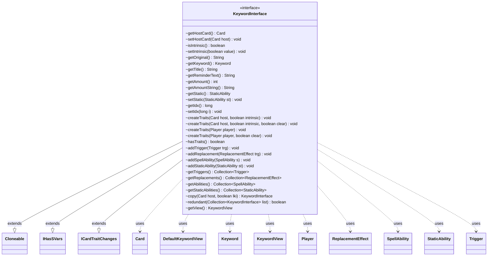

---
aliases:
  - KeywordInterface
tags:
  - java/interface
  - module/forge-game
  - pkg/forge/game/keyword
fqn: forge.game.keyword.KeywordInterface
package: forge.game.keyword
module: forge-game
kind: Interface
---

# KeywordInterface

**Package:** `forge.game.keyword`   **Module:** `forge-game`   **Kind:** Interface



## Relationships
**Extends:**
- [[forge.game.IHasSVars|IHasSVars]]
- [[forge.game.card.ICardTraitChanges|ICardTraitChanges]]
**Uses:**
- [[forge.game.card.Card|Card]]
- [[forge.game.keyword.DefaultKeywordView|DefaultKeywordView]]
- [[forge.game.keyword.Keyword|Keyword]]
- [[forge.game.keyword.KeywordView|KeywordView]]
- [[forge.game.player.Player|Player]]
- [[forge.game.replacement.ReplacementEffect|ReplacementEffect]]
- [[forge.game.spellability.SpellAbility|SpellAbility]]
- [[forge.game.staticability.StaticAbility|StaticAbility]]
- [[forge.game.trigger.Trigger|Trigger]]

## Design Description

KeywordInterface defines the contract for a Magic: The Gathering keyword instance attached to a card, exposing its identity (the parsed `Keyword`, original text, title, reminder text, and numeric amount) and binding it to a host `Card` or `Player`. Its central responsibility is generating and aggregating the rules machinery a keyword grants—`Trigger`s, `ReplacementEffect`s, `SpellAbility`s, and `StaticAbility`s—via the `createTraits` overloads, while tracking whether the keyword is intrinsic and identifying redundant duplicates.

By extending `IHasSVars` and `ICardTraitChanges`, it participates in Forge's shared script-variable and trait-mutation protocols, and `Cloneable` plus the `copy` method support last-known-information snapshots (`lki`). The interface abstracts keyword behavior from concrete implementations, letting callers manipulate triggers and abilities uniformly. The `default getView()` method supplies a ready `DefaultKeywordView`, decoupling the game model from the UI/view layer while allowing implementations to override presentation.

## Source
`forge-game/src/main/java/forge/game/keyword/KeywordInterface.java`

```java
package forge.game.keyword;

import java.util.Collection;

import forge.game.IHasSVars;
import forge.game.card.Card;
import forge.game.card.ICardTraitChanges;
import forge.game.player.Player;
import forge.game.replacement.ReplacementEffect;
import forge.game.spellability.SpellAbility;
import forge.game.staticability.StaticAbility;
import forge.game.trigger.Trigger;

public interface KeywordInterface extends Cloneable, IHasSVars, ICardTraitChanges {

    Card getHostCard();
    void setHostCard(final Card host);
    boolean isIntrinsic();
    void setIntrinsic(final boolean value);

    String getOriginal();

    Keyword getKeyword();

    String getTitle();
    String getReminderText();

    int getAmount();
    String getAmountString();

    StaticAbility getStatic();
    void setStatic(StaticAbility st);

    long getIdx();
    void setIdx(long i);

    void createTraits(final Card host, final boolean intrinsic);
    void createTraits(final Card host, final boolean intrinsic, final boolean clear);

    void createTraits(final Player player);
    void createTraits(final Player player, final boolean clear);

    boolean hasTraits();

    void addTrigger(final Trigger trg);

    void addReplacement(final ReplacementEffect trg);

    void addSpellAbility(final SpellAbility s);
    void addStaticAbility(final StaticAbility st);


    /**
     * @return the triggers
     */
    Collection<Trigger> getTriggers();
    /**
     * @return the replacements
     */
    Collection<ReplacementEffect> getReplacements();
    /**
     * @return the abilities
     */
    Collection<SpellAbility> getAbilities();
    /**
     * @return the staticAbilities
     */
    Collection<StaticAbility> getStaticAbilities();

    KeywordInterface copy(final Card host, final boolean lki);

    boolean redundant(final Collection<KeywordInterface> list);

    default KeywordView getView() {
        return new DefaultKeywordView(getOriginal(), getKeyword(), getTitle(), getReminderText());
    }
}
```

## Python
`forge/game/keyword/KeywordInterface.py`

```python
from typing import Collection

from forge.game.IHasSVars import IHasSVars
from forge.game.card.Card import Card
from forge.game.card.ICardTraitChanges import ICardTraitChanges
from forge.game.player.Player import Player
from forge.game.replacement.ReplacementEffect import ReplacementEffect
from forge.game.spellability.SpellAbility import SpellAbility
from forge.game.staticability.StaticAbility import StaticAbility
from forge.game.trigger.Trigger import Trigger
from forge.game.keyword.Keyword import Keyword
from forge.game.keyword.KeywordView import KeywordView
from forge.game.keyword.DefaultKeywordView import DefaultKeywordView


class KeywordInterface(IHasSVars, ICardTraitChanges):

    def getHostCard(self) -> Card:
        raise NotImplementedError

    def setHostCard(self, host: Card) -> None:
        raise NotImplementedError

    def isIntrinsic(self) -> bool:
        raise NotImplementedError

    def setIntrinsic(self, value: bool) -> None:
        raise NotImplementedError

    def getOriginal(self) -> str:
        raise NotImplementedError

    def getKeyword(self) -> Keyword:
        raise NotImplementedError

    def getTitle(self) -> str:
        raise NotImplementedError

    def getReminderText(self) -> str:
        raise NotImplementedError

    def getAmount(self) -> int:
        raise NotImplementedError

    def getAmountString(self) -> str:
        raise NotImplementedError

    def getStatic(self) -> StaticAbility:
        raise NotImplementedError

    def setStatic(self, st: StaticAbility) -> None:
        raise NotImplementedError

    def getIdx(self) -> int:
        raise NotImplementedError

    def setIdx(self, i: int) -> None:
        raise NotImplementedError

    def createTraits(self, host: Card, intrinsic: bool, clear: bool = None) -> None:
        raise NotImplementedError

    def createTraitsForPlayer(self, player: Player, clear: bool = None) -> None:
        raise NotImplementedError

    def hasTraits(self) -> bool:
        raise NotImplementedError

    def addTrigger(self, trg: Trigger) -> None:
        raise NotImplementedError

    def addReplacement(self, trg: ReplacementEffect) -> None:
        raise NotImplementedError

    def addSpellAbility(self, s: SpellAbility) -> None:
        raise NotImplementedError

    def addStaticAbility(self, st: StaticAbility) -> None:
        raise NotImplementedError

    def getTriggers(self) -> Collection[Trigger]:
        raise NotImplementedError

    def getReplacements(self) -> Collection[ReplacementEffect]:
        raise NotImplementedError

    def getAbilities(self) -> Collection[SpellAbility]:
        raise NotImplementedError

    def getStaticAbilities(self) -> Collection[StaticAbility]:
        raise NotImplementedError

    def copy(self, host: Card, lki: bool) -> "KeywordInterface":
        raise NotImplementedError

    def redundant(self, list: Collection["KeywordInterface"]) -> bool:
        raise NotImplementedError

    def getView(self) -> KeywordView:
        return DefaultKeywordView(self.getOriginal(), self.getKeyword(), self.getTitle(), self.getReminderText())
```
