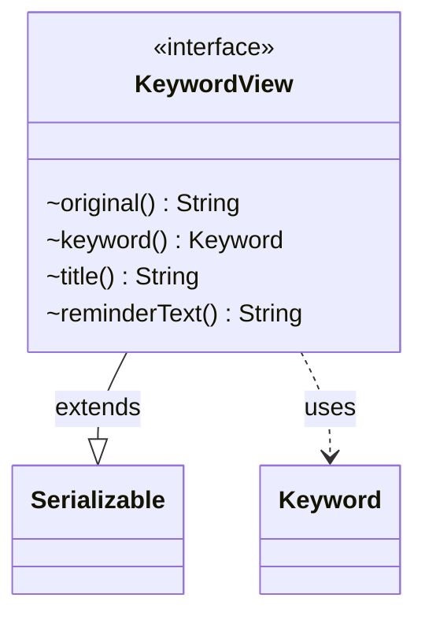

---
aliases:
  - KeywordView
tags:
  - java/interface
  - module/forge-game
  - pkg/forge/game/keyword
fqn: forge.game.keyword.KeywordView
package: forge.game.keyword
module: forge-game
kind: Interface
---

# KeywordView

**Package:** `forge.game.keyword` &nbsp; **Module:** `forge-game` &nbsp; **Kind:** Interface



## Relationships
**Uses:**
- [[forge.game.keyword.Keyword|Keyword]]

## Source
`forge-game/src/main/java/forge/game/keyword/KeywordView.java`

```java
package forge.game.keyword;

import java.io.Serializable;

public interface KeywordView extends Serializable {
    String original();
    Keyword keyword();

    String title();
    String reminderText();
}
```
