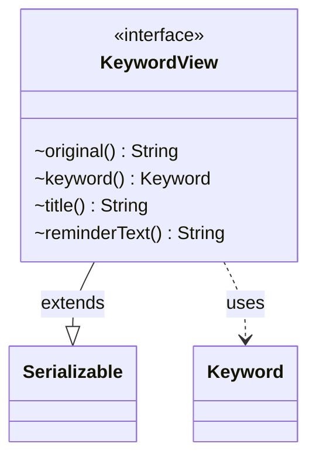

---
aliases:
  - KeywordView
tags:
  - java/interface
  - module/forge-game
  - pkg/forge/game/keyword
fqn: forge.game.keyword.KeywordView
package: forge.game.keyword
module: forge-game
kind: Interface
---

# KeywordView

**Package:** `forge.game.keyword`   **Module:** `forge-game`   **Kind:** Interface



## Relationships
**Uses:**
- [[forge.game.keyword.Keyword|Keyword]]

## Design Description

KeywordView is a small, read-only interface within the keyword subsystem that exposes an immutable, presentation-oriented view of a single Magic keyword. It declares four accessors: `original()` for the raw keyword string, `keyword()` for the resolved Keyword enum value it collaborates with, and `title()` and `reminderText()` for display text. By extending `Serializable`, it signals that keyword views are intended to be persisted or transmitted—for example, in saved games or across network boundaries. The interface deliberately separates the abstract notion of a keyword's displayable data from its concrete implementation, letting callers depend only on these accessors rather than on the underlying Keyword machinery, and keeping the contract minimal and decoupled.

## Source
`forge-game/src/main/java/forge/game/keyword/KeywordView.java`

```java
package forge.game.keyword;

import java.io.Serializable;

public interface KeywordView extends Serializable {
    String original();
    Keyword keyword();

    String title();
    String reminderText();
}
```

## Python
`forge/game/keyword/KeywordView.py`

```python
from forge.game.keyword.Keyword import Keyword


class KeywordView:
    def original(self) -> str:
        raise NotImplementedError

    def keyword(self) -> Keyword:
        raise NotImplementedError

    def title(self) -> str:
        raise NotImplementedError

    def reminderText(self) -> str:
        raise NotImplementedError
```
