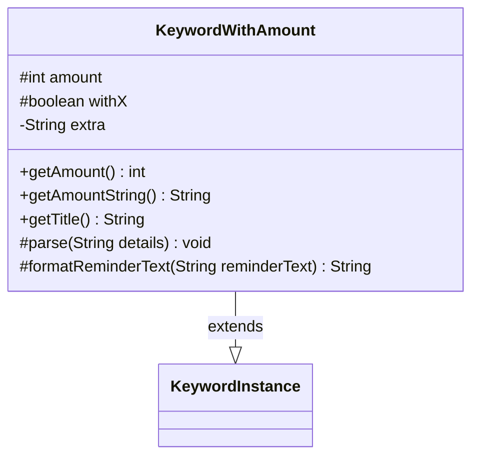

---
aliases:
  - KeywordWithAmount
tags:
  - java/class
  - module/forge-game
  - pkg/forge/game/keyword
fqn: forge.game.keyword.KeywordWithAmount
package: forge.game.keyword
module: forge-game
kind: Class
---

# KeywordWithAmount

**Package:** `forge.game.keyword` &nbsp; **Module:** `forge-game` &nbsp; **Kind:** Class



## Relationships
**Extends:**
- [[forge.game.keyword.KeywordInstance|KeywordInstance]]

## Design Description

KeywordWithAmount is a concrete keyword implementation that models Magic keywords carrying a numeric value (e.g. "Annihilator 2"), including the variant where that value is the dynamic "X" rather than a fixed integer. Extending KeywordInstance with itself as the recursive type parameter, it supplies the amount-aware behavior the base class leaves abstract: parsing a numeric or "X"-prefixed detail string, reporting the amount and its display form, and building a title from the keyword and its amount. Its parse routine also captures an optional colon-delimited "extra" fragment, and formatReminderText overrides the base formatting to splice "X" (rewriting numeric format specifiers to string ones) and the extra text into reminder strings, keeping the X-versus-literal distinction encapsulated so collaborators can treat both uniformly.

## Source
`forge-game/src/main/java/forge/game/keyword/KeywordWithAmount.java`

```java
package forge.game.keyword;

public class KeywordWithAmount extends KeywordInstance<KeywordWithAmount> {
    protected int amount;
    protected boolean withX;
    private String extra = "";

    @Override
    public int getAmount() {
        return amount;
    }
    @Override
    public String getAmountString() {
        return withX ? "X" : String.valueOf(amount);
    }

    public String getTitle() {
        StringBuilder sb = new StringBuilder();
        sb.append(getKeyword()).append(" ").append(getAmountString());
        return sb.toString();
    }

    @Override
    protected void parse(String details) {
        if (details.startsWith("X")) {
            withX = true;
            if (details.contains(":")) {
                extra = details.split(":")[1];
            }
        } else if (!details.isEmpty()) {
            amount = details.contains(":") ? Integer.parseInt(details.split(":")[0]) : Integer.parseInt(details);
        }
    }

    @Override
    protected String formatReminderText(String reminderText) {
        if (withX) {
            StringBuilder result = new StringBuilder(
                String.format(reminderText.replaceAll("\\%(\\d+\\$)?d", "%$1s"), "X")
            );
            if (!extra.isEmpty() && !extra.contains("$")) {
                result.insert(result.length()-1, extra);
            }
            return result.toString();
        } else {
            return String.format(reminderText, amount);
        }
    }
}
```

## Python
`forge/game/keyword/KeywordWithAmount.py`

```python
import re

from forge.game.keyword.KeywordInstance import KeywordInstance


class KeywordWithAmount(KeywordInstance):
    def __init__(self):
        super().__init__()
        self.amount: int = 0
        self.withX: bool = False
        self.extra: str = ""

    def getAmount(self) -> int:
        return self.amount

    def getAmountString(self) -> str:
        return "X" if self.withX else str(self.amount)

    def getTitle(self) -> str:
        sb = []
        sb.append(self.getKeyword())
        sb.append(" ")
        sb.append(self.getAmountString())
        return "".join(sb)

    def parse(self, details: str) -> None:
        if details.startswith("X"):
            self.withX = True
            if ":" in details:
                self.extra = details.split(":")[1]
        elif details:
            self.amount = int(details.split(":")[0]) if ":" in details else int(details)

    def formatReminderText(self, reminderText: str) -> str:
        if self.withX:
            result = list(re.sub(r"\%(\d+\$)?d", r"%\1s", reminderText) % "X")
            if self.extra and "$" not in self.extra:
                result.insert(len(result) - 1, self.extra)
            return "".join(result)
        else:
            return reminderText % self.amount
```
