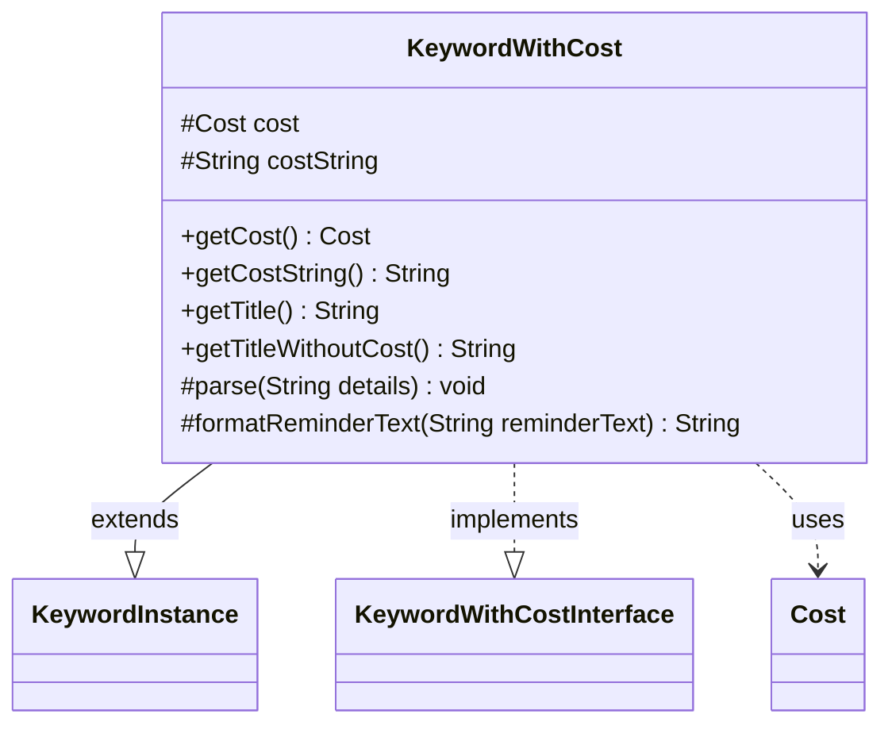

---
aliases:
  - KeywordWithCost
tags:
  - java/class
  - module/forge-game
  - pkg/forge/game/keyword
fqn: forge.game.keyword.KeywordWithCost
package: forge.game.keyword
module: forge-game
kind: Class
---

# KeywordWithCost

**Package:** `forge.game.keyword`   **Module:** `forge-game`   **Kind:** Class



## Relationships
**Extends:**
- [[forge.game.keyword.KeywordInstance|KeywordInstance]]
**Implements:**
- [[forge.game.keyword.KeywordWithCostInterface|KeywordWithCostInterface]]
**Uses:**
- [[forge.game.cost.Cost|Cost]]

## Design Description

KeywordWithCost represents a Magic keyword whose activation or effect carries an associated cost, such as a mana payment or alternative resource expenditure. As a concrete extension of the generic `KeywordInstance` (self-typed via the curiously recurring pattern) and an implementation of `KeywordWithCostInterface`, it specializes keyword behavior by parsing a cost from its detail string and exposing it through `getCost`/`getCostString`. It collaborates closely with `Cost`, deferring to the host card's mana cost when the special `"ManaCost"` marker is present and otherwise building a `Cost` from the parsed string.

The design intent is to weave cost information into the keyword's presentation: `getTitle` formats the keyword name with its cost using an em-dash or space depending on whether only mana is involved, while `formatReminderText` injects the cost into reminder text via placeholder substitution, handling grammatical edge cases for "pays", "Pay", and "Discard" phrasing.

## Source
`forge-game/src/main/java/forge/game/keyword/KeywordWithCost.java`

```java
package forge.game.keyword;

import forge.game.cost.Cost;

public class KeywordWithCost extends KeywordInstance<KeywordWithCost> implements KeywordWithCostInterface
{
    protected Cost cost;
    protected String costString;

    @Override
    public Cost getCost() {
        if ("ManaCost".equals(costString)) {
            return new Cost(this.getHostCard().getManaCost(), false);
        }
        return cost;
    }
    @Override
    public String getCostString() { return costString; }

    public String getTitle() {
        StringBuilder sb = new StringBuilder();
        sb.append(getTitleWithoutCost());
        Cost cost = getCost();
        if (!cost.isOnlyManaCost()) {
            sb.append("—");
        } else {
            sb.append(" ");
        }
        sb.append(cost.toSimpleString());
        return sb.toString();
    }

    @Override
    public String getTitleWithoutCost() {
        return getKeyword().toString();
    }

    @Override
    protected void parse(String details) {
        String[] allDetails = details.split(":");
        costString = allDetails[0].split("\\|", 2)[0].trim();
        if (!"ManaCost".equals(costString)) {
            cost = new Cost(costString, true);
        }
    }

    @Override
    protected String formatReminderText(String reminderText) {
        // some reminder does not contain cost
        if (reminderText.contains("%")) {
            Cost cost = getCost();
            String costString = cost.toSimpleString();
            if (reminderText.contains("pays %")) {
                if (costString.startsWith("Pay ")) {
                    costString = costString.substring(4);
                } else if (costString.startsWith("Discard ")) {
                    reminderText = reminderText.replace("pays", "");
                    costString = costString.replace("Discard", "discards");
                }
            }
            return String.format(reminderText, costString);
        } else {
            return reminderText;
        }
    }
}
```

## Python
`forge/game/keyword/KeywordWithCost.py`

```python
from forge.game.keyword.KeywordInstance import KeywordInstance
from forge.game.keyword.KeywordWithCostInterface import KeywordWithCostInterface
from forge.game.cost.Cost import Cost


class KeywordWithCost(KeywordInstance[KeywordWithCost], KeywordWithCostInterface):
    cost: Cost
    costString: str

    def getCost(self) -> Cost:
        if "ManaCost" == self.costString:
            return Cost(self.getHostCard().getManaCost(), False)
        return self.cost

    def getCostString(self) -> str:
        return self.costString

    def getTitle(self) -> str:
        sb = []
        sb.append(self.getTitleWithoutCost())
        cost = self.getCost()
        if not cost.isOnlyManaCost():
            sb.append("\u2014")
        else:
            sb.append(" ")
        sb.append(cost.toSimpleString())
        return "".join(sb)

    def getTitleWithoutCost(self) -> str:
        return str(self.getKeyword())

    def parse(self, details: str) -> None:
        allDetails = details.split(":")
        self.costString = allDetails[0].split("|", 1)[0].strip()
        if "ManaCost" != self.costString:
            self.cost = Cost(self.costString, True)

    def formatReminderText(self, reminderText: str) -> str:
        # some reminder does not contain cost
        if "%" in reminderText:
            cost = self.getCost()
            costString = cost.toSimpleString()
            if "pays %" in reminderText:
                if costString.startswith("Pay "):
                    costString = costString[4:]
                elif costString.startswith("Discard "):
                    reminderText = reminderText.replace("pays", "")
                    costString = costString.replace("Discard", "discards")
            return reminderText % costString
        else:
            return reminderText
```
