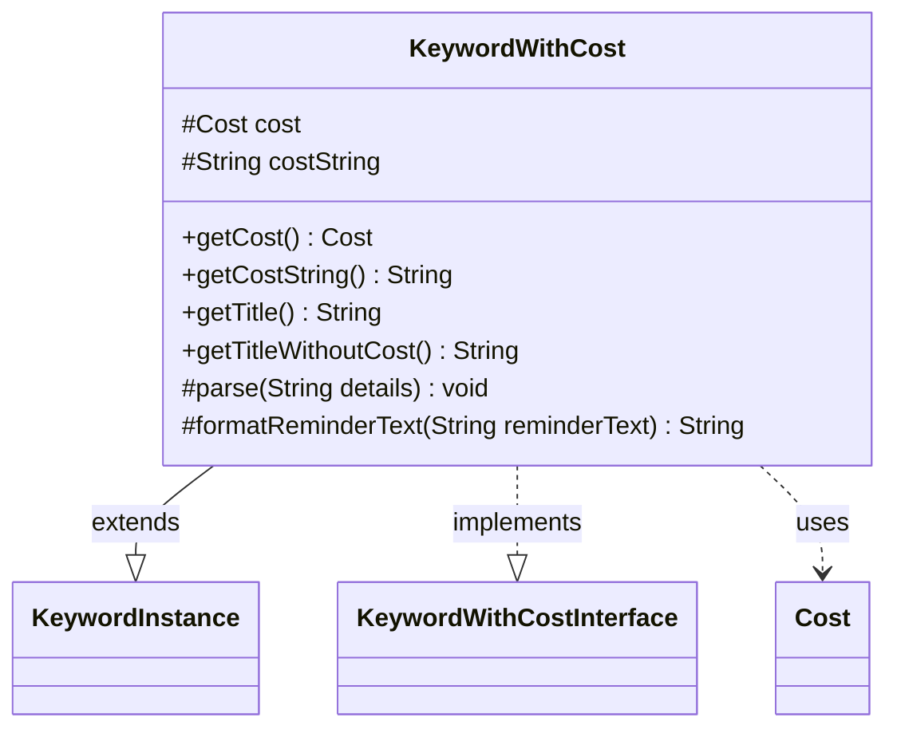

---
aliases:
  - KeywordWithCost
tags:
  - java/class
  - module/forge-game
  - pkg/forge/game/keyword
fqn: forge.game.keyword.KeywordWithCost
package: forge.game.keyword
module: forge-game
kind: Class
---

# KeywordWithCost

**Package:** `forge.game.keyword` &nbsp; **Module:** `forge-game` &nbsp; **Kind:** Class



## Relationships
**Extends:**
- [[forge.game.keyword.KeywordInstance|KeywordInstance]]
**Implements:**
- [[forge.game.keyword.KeywordWithCostInterface|KeywordWithCostInterface]]
**Uses:**
- [[forge.game.cost.Cost|Cost]]

## Source
`forge-game/src/main/java/forge/game/keyword/KeywordWithCost.java`

```java
package forge.game.keyword;

import forge.game.cost.Cost;

public class KeywordWithCost extends KeywordInstance<KeywordWithCost> implements KeywordWithCostInterface
{
    protected Cost cost;
    protected String costString;

    @Override
    public Cost getCost() {
        if ("ManaCost".equals(costString)) {
            return new Cost(this.getHostCard().getManaCost(), false);
        }
        return cost;
    }
    @Override
    public String getCostString() { return costString; }

    public String getTitle() {
        StringBuilder sb = new StringBuilder();
        sb.append(getTitleWithoutCost());
        Cost cost = getCost();
        if (!cost.isOnlyManaCost()) {
            sb.append("—");
        } else {
            sb.append(" ");
        }
        sb.append(cost.toSimpleString());
        return sb.toString();
    }

    @Override
    public String getTitleWithoutCost() {
        return getKeyword().toString();
    }

    @Override
    protected void parse(String details) {
        String[] allDetails = details.split(":");
        costString = allDetails[0].split("\\|", 2)[0].trim();
        if (!"ManaCost".equals(costString)) {
            cost = new Cost(costString, true);
        }
    }

    @Override
    protected String formatReminderText(String reminderText) {
        // some reminder does not contain cost
        if (reminderText.contains("%")) {
            Cost cost = getCost();
            String costString = cost.toSimpleString();
            if (reminderText.contains("pays %")) {
                if (costString.startsWith("Pay ")) {
                    costString = costString.substring(4);
                } else if (costString.startsWith("Discard ")) {
                    reminderText = reminderText.replace("pays", "");
                    costString = costString.replace("Discard", "discards");
                }
            }
            return String.format(reminderText, costString);
        } else {
            return reminderText;
        }
    }
}
```
