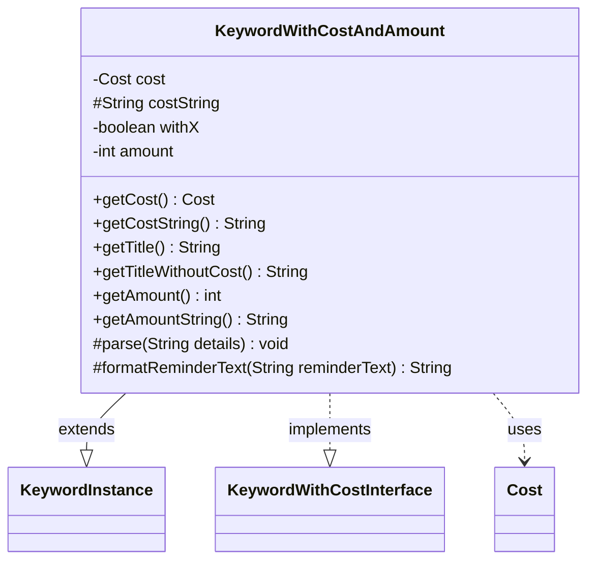

---
aliases:
  - KeywordWithCostAndAmount
tags:
  - java/class
  - module/forge-game
  - pkg/forge/game/keyword
fqn: forge.game.keyword.KeywordWithCostAndAmount
package: forge.game.keyword
module: forge-game
kind: Class
---

# KeywordWithCostAndAmount

**Package:** `forge.game.keyword` &nbsp; **Module:** `forge-game` &nbsp; **Kind:** Class



## Relationships
**Extends:**
- [[forge.game.keyword.KeywordInstance|KeywordInstance]]
**Implements:**
- [[forge.game.keyword.KeywordWithCostInterface|KeywordWithCostInterface]]
**Uses:**
- [[forge.game.cost.Cost|Cost]]

## Source
`forge-game/src/main/java/forge/game/keyword/KeywordWithCostAndAmount.java`

```java
package forge.game.keyword;

import forge.game.cost.Cost;

public class KeywordWithCostAndAmount extends KeywordInstance<KeywordWithCostAndAmount>
    implements KeywordWithCostInterface {
    private Cost cost;
    protected String costString;
    private boolean withX;
    private int amount;

    @Override
    public Cost getCost() { return cost; }
    @Override
    public String getCostString() { return costString; }

    public String getTitle() {
        StringBuilder sb = new StringBuilder();
        sb.append(getTitleWithoutCost());
        sb.append(cost.toSimpleString());
        return sb.toString();
    }

    @Override
    public String getTitleWithoutCost() {
        StringBuilder sb = new StringBuilder();
        sb.append(getKeyword()).append(" ").append(getAmountString()).append("—");
        return sb.toString();
    }

    @Override
    public int getAmount() {
        return amount;
    }

    @Override
    public String getAmountString() {
        return withX ? "X" : String.valueOf(amount);
    }

    @Override
    protected void parse(String details) {
        final String[] k = details.split(":");
        if (k[0].startsWith("X")) {
            withX = true;
        } else {
            amount = Integer.parseInt(k[0]);
        }
        costString = k[1].split("\\|", 2)[0].trim();
        cost = new Cost(costString, false);
    }

    @Override
    protected String formatReminderText(String reminderText) {
        String formatStr = reminderText;
        if (withX) {
            formatStr = reminderText.replaceAll("\\%(\\d+\\$)?d", "%$1s");
        }
        return String.format(formatStr, cost.toSimpleString(), withX ? "X" : amount);
    }
}
```
