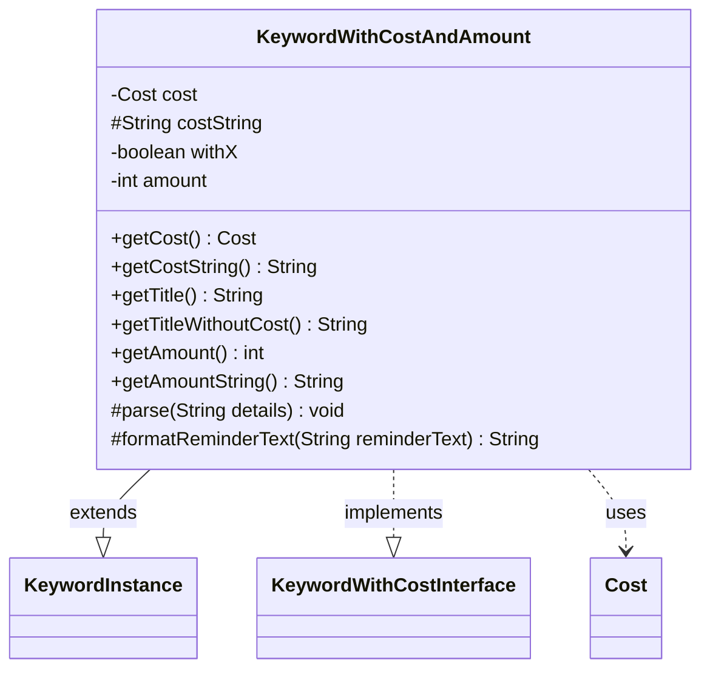

---
aliases:
  - KeywordWithCostAndAmount
tags:
  - java/class
  - module/forge-game
  - pkg/forge/game/keyword
fqn: forge.game.keyword.KeywordWithCostAndAmount
package: forge.game.keyword
module: forge-game
kind: Class
---

# KeywordWithCostAndAmount

**Package:** `forge.game.keyword`   **Module:** `forge-game`   **Kind:** Class



## Relationships
**Extends:**
- [[forge.game.keyword.KeywordInstance|KeywordInstance]]
**Implements:**
- [[forge.game.keyword.KeywordWithCostInterface|KeywordWithCostInterface]]
**Uses:**
- [[forge.game.cost.Cost|Cost]]

## Design Description

`KeywordWithCostAndAmount` models a Magic keyword ability whose definition combines a numeric amount (or the variable `X`) with an activation `Cost`, such as a keyword that reads "Keyword N—[cost]". As a concrete subtype of the self-referential generic `KeywordInstance<KeywordWithCostAndAmount>`, it inherits the engine's keyword-instance lifecycle while satisfying the `KeywordWithCostInterface` contract by exposing the parsed `Cost` and its string form. It collaborates with `forge.game.cost.Cost`, constructing one during parsing and rendering it via `toSimpleString()` for titles and reminder text.

Its design intent shows in `parse`, which splits the detail string into an amount-or-`X` token and a cost token, recording whether the amount is variable. That `withX` flag then drives display: `getAmountString` emits `"X"` instead of a literal, and `formatReminderText` rewrites `%d` format specifiers to `%s` so the `X` placeholder substitutes cleanly into reminder text.

## Source
`forge-game/src/main/java/forge/game/keyword/KeywordWithCostAndAmount.java`

```java
package forge.game.keyword;

import forge.game.cost.Cost;

public class KeywordWithCostAndAmount extends KeywordInstance<KeywordWithCostAndAmount>
    implements KeywordWithCostInterface {
    private Cost cost;
    protected String costString;
    private boolean withX;
    private int amount;

    @Override
    public Cost getCost() { return cost; }
    @Override
    public String getCostString() { return costString; }

    public String getTitle() {
        StringBuilder sb = new StringBuilder();
        sb.append(getTitleWithoutCost());
        sb.append(cost.toSimpleString());
        return sb.toString();
    }

    @Override
    public String getTitleWithoutCost() {
        StringBuilder sb = new StringBuilder();
        sb.append(getKeyword()).append(" ").append(getAmountString()).append("—");
        return sb.toString();
    }

    @Override
    public int getAmount() {
        return amount;
    }

    @Override
    public String getAmountString() {
        return withX ? "X" : String.valueOf(amount);
    }

    @Override
    protected void parse(String details) {
        final String[] k = details.split(":");
        if (k[0].startsWith("X")) {
            withX = true;
        } else {
            amount = Integer.parseInt(k[0]);
        }
        costString = k[1].split("\\|", 2)[0].trim();
        cost = new Cost(costString, false);
    }

    @Override
    protected String formatReminderText(String reminderText) {
        String formatStr = reminderText;
        if (withX) {
            formatStr = reminderText.replaceAll("\\%(\\d+\\$)?d", "%$1s");
        }
        return String.format(formatStr, cost.toSimpleString(), withX ? "X" : amount);
    }
}
```

## Python
`forge/game/keyword/KeywordWithCostAndAmount.py`

```python
from forge.game.keyword.KeywordInstance import KeywordInstance
from forge.game.keyword.KeywordWithCostInterface import KeywordWithCostInterface
from forge.game.cost.Cost import Cost


class KeywordWithCostAndAmount(KeywordInstance, KeywordWithCostInterface):
    def __init__(self):
        self.cost: Cost = None
        self.costString: str = None
        self.withX: bool = False
        self.amount: int = 0

    def getCost(self) -> Cost:
        return self.cost

    def getCostString(self) -> str:
        return self.costString

    def getTitle(self) -> str:
        sb = []
        sb.append(self.getTitleWithoutCost())
        sb.append(self.cost.toSimpleString())
        return "".join(sb)

    def getTitleWithoutCost(self) -> str:
        sb = []
        sb.append(self.getKeyword())
        sb.append(" ")
        sb.append(self.getAmountString())
        sb.append("????????")
        return "".join(sb)

    def getAmount(self) -> int:
        return self.amount

    def getAmountString(self) -> str:
        return "X" if self.withX else str(self.amount)

    def parse(self, details: str) -> None:
        k = details.split(":")
        if k[0].startswith("X"):
            self.withX = True
        else:
            self.amount = int(k[0])
        self.costString = k[1].split("|", 1)[0].strip()
        self.cost = Cost(self.costString, False)

    def formatReminderText(self, reminderText: str) -> str:
        import re
        formatStr = reminderText
        if self.withX:
            formatStr = re.sub(r"%(\d+\$)?d", r"%\1s", reminderText)
        return formatStr % (self.cost.toSimpleString(), "X" if self.withX else self.amount)
```
