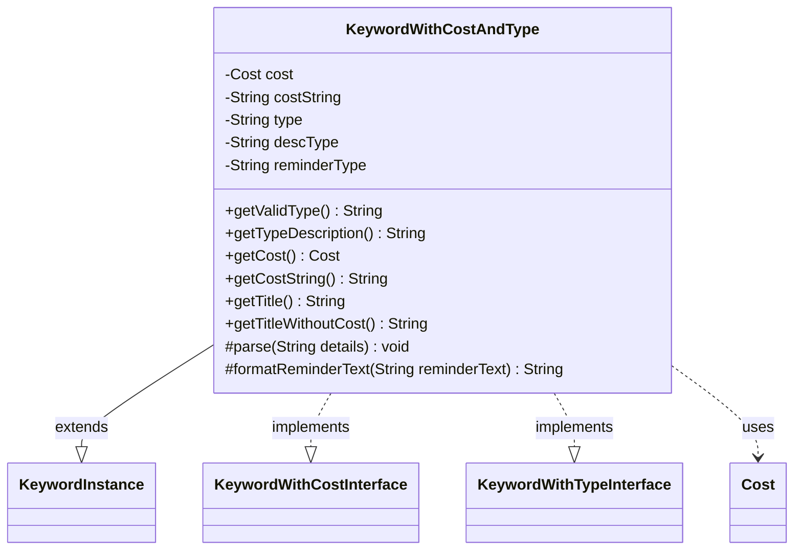

---
aliases:
  - KeywordWithCostAndType
tags:
  - java/class
  - module/forge-game
  - pkg/forge/game/keyword
fqn: forge.game.keyword.KeywordWithCostAndType
package: forge.game.keyword
module: forge-game
kind: Class
---

# KeywordWithCostAndType

**Package:** `forge.game.keyword` &nbsp; **Module:** `forge-game` &nbsp; **Kind:** Class



## Relationships
**Extends:**
- [[forge.game.keyword.KeywordInstance|KeywordInstance]]
**Implements:**
- [[forge.game.keyword.KeywordWithCostInterface|KeywordWithCostInterface]]
- [[forge.game.keyword.KeywordWithTypeInterface|KeywordWithTypeInterface]]
**Uses:**
- [[forge.game.cost.Cost|Cost]]

## Source
`forge-game/src/main/java/forge/game/keyword/KeywordWithCostAndType.java`

```java
package forge.game.keyword;

import java.util.Arrays;

import org.apache.commons.lang3.StringUtils;

import forge.game.cost.Cost;
import forge.util.Lang;

public class KeywordWithCostAndType extends KeywordInstance<KeywordWithCostAndType>
    implements KeywordWithCostInterface, KeywordWithTypeInterface {
    private Cost cost;
    private String costString;
    private String type;
    private String descType = null;
    private String reminderType = null;

    @Override
    public String getValidType() { return "Affinity".equals(type) ? "Card.withAffinity" : type; }
    @Override
    public String getTypeDescription() { return descType; }

    @Override
    public Cost getCost() { return cost; }
    @Override
    public String getCostString() { return costString; }

    public String getTitle() {
        StringBuilder sb = new StringBuilder();
        sb.append(getTitleWithoutCost());
        if (!cost.isOnlyManaCost()) {
            sb.append("—");
        } else {
            sb.append(" ");
        }
        sb.append(cost.toSimpleString());
        return sb.toString();
    }

    @Override
    public String getTitleWithoutCost() {
        if (getKeyword().equals(Keyword.SPLICE)) {
            return "Splice onto " + descType;
        }
        return StringUtils.capitalize(descType) + "cycling";
    }

    @Override
    protected void parse(String details) {
        final String[] k = details.split(":");
        type = k[0];
        costString = k[1];
        cost = new Cost(costString, false);
        if (k.length > 2) {
            reminderType = descType = k[2];
        } else {
            descType = switch (type) {
            case "Basic" -> "basic land";
            default -> Lang.getInstance().buildValidDesc(Arrays.asList(type.split(",")), false);
            };

            reminderType = descType;
            if ("Affinity".equals(type)) {
                reminderType = "card with affinity";
            }
        }
    }

    @Override
    protected String formatReminderText(String reminderText) {
        String str = reminderType;
        if (getKeyword().equals(Keyword.TYPECYCLING)) {
            if ("Affinity".equals(type)) {
                str = "a card with affinity";
            } else {
                str = Lang.nounWithAmount(1, reminderType + " card");
            }
        }
        return String.format(reminderText, cost.toSimpleString(), str);
    }
}
```
