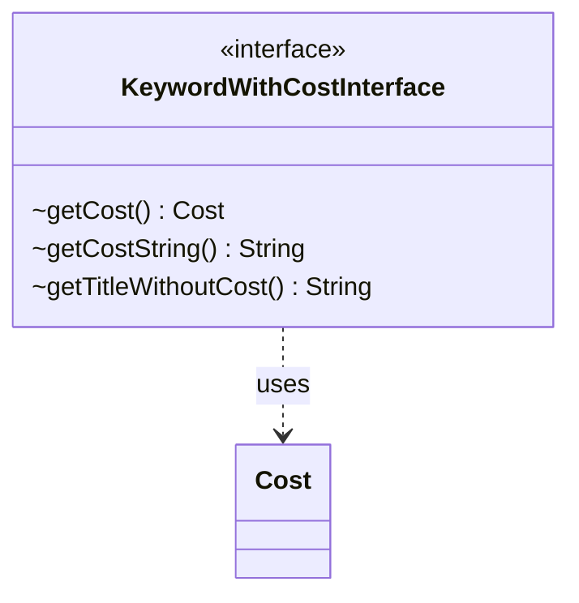

---
aliases:
  - KeywordWithCostInterface
tags:
  - java/interface
  - module/forge-game
  - pkg/forge/game/keyword
fqn: forge.game.keyword.KeywordWithCostInterface
package: forge.game.keyword
module: forge-game
kind: Interface
---

# KeywordWithCostInterface

**Package:** `forge.game.keyword` &nbsp; **Module:** `forge-game` &nbsp; **Kind:** Interface



## Relationships
**Uses:**
- [[forge.game.cost.Cost|Cost]]

## Source
`forge-game/src/main/java/forge/game/keyword/KeywordWithCostInterface.java`

```java
package forge.game.keyword;

import forge.game.cost.Cost;

public interface KeywordWithCostInterface {

    Cost getCost();

    String getCostString();

    String getTitleWithoutCost();

}
```
