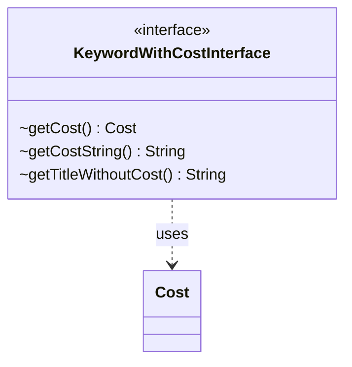

---
aliases:
  - KeywordWithCostInterface
tags:
  - java/interface
  - module/forge-game
  - pkg/forge/game/keyword
fqn: forge.game.keyword.KeywordWithCostInterface
package: forge.game.keyword
module: forge-game
kind: Interface
---

# KeywordWithCostInterface

**Package:** `forge.game.keyword` &nbsp; **Module:** `forge-game` &nbsp; **Kind:** Interface



## Relationships
**Uses:**
- [[forge.game.cost.Cost|Cost]]

## Design Description

KeywordWithCostInterface defines the contract for Magic keyword abilities whose application is gated by a payable cost, exposing three accessors: `getCost()` returns the structured `forge.game.cost.Cost` to be paid, `getCostString()` yields its textual form, and `getTitleWithoutCost()` provides the keyword's name stripped of its cost annotation. As a pure interface it carries no state or behavior, leaving implementation to concrete keyword classes; it depends only on `Cost`, the engine's representation of payment requirements. The deliberate separation of the raw `Cost` object, its display string, and the cost-free title reflects an intent to support both rules processing and UI rendering from a single abstraction, letting callers treat any cost-bearing keyword uniformly without knowing its concrete type.

## Source
`forge-game/src/main/java/forge/game/keyword/KeywordWithCostInterface.java`

```java
package forge.game.keyword;

import forge.game.cost.Cost;

public interface KeywordWithCostInterface {

    Cost getCost();

    String getCostString();

    String getTitleWithoutCost();

}
```

## Python
`forge/game/keyword/KeywordWithCostInterface.py`

```python
from abc import ABC, abstractmethod

from forge.game.cost.Cost import Cost


class KeywordWithCostInterface(ABC):

    @abstractmethod
    def getCost(self) -> Cost:
        ...

    @abstractmethod
    def getCostString(self) -> str:
        ...

    @abstractmethod
    def getTitleWithoutCost(self) -> str:
        ...
```
