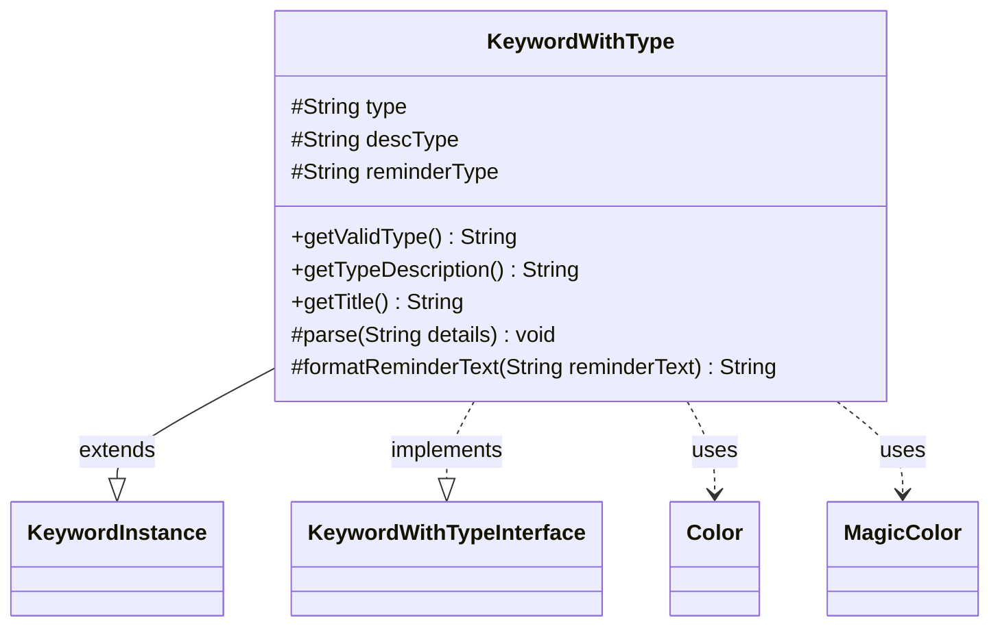

---
aliases:
  - KeywordWithType
tags:
  - java/class
  - module/forge-game
  - pkg/forge/game/keyword
fqn: forge.game.keyword.KeywordWithType
package: forge.game.keyword
module: forge-game
kind: Class
---

# KeywordWithType

**Package:** `forge.game.keyword`   **Module:** `forge-game`   **Kind:** Class



## Relationships
**Extends:**
- [[forge.game.keyword.KeywordInstance|KeywordInstance]]
**Implements:**
- [[forge.game.keyword.KeywordWithTypeInterface|KeywordWithTypeInterface]]
**Uses:**
- [[forge.card.MagicColor|MagicColor]]
- [[forge.card.MagicColor.Color|Color]]

## Design Description

Card. KeywordWithType is a concrete keyword implementation representing keywords parameterized by a card type or color restriction, such as protection or landwalk variants. Extending the generic `KeywordInstance` self-typed base and implementing `KeywordWithTypeInterface`, it adds three protected fields—the machine-readable valid `type`, a human-readable `descType`, and a `reminderType`—and exposes them through the interface's `getValidType`, `getTypeDescription`, and `getTitle` accessors.

Its core design intent lives in `parse`, which interprets a details string three ways: an explicit `type:description` pair, a single color name (resolved via `MagicColor.Color` into a `Card.<Color>` restriction), or a comma-separated type list rendered into prose through `Lang.buildValidDesc`. The overridden `formatReminderText` then injects the derived description into reminder text, letting one class serve many type- and color-based keywords from a compact parsing convention.

## Source
`forge-game/src/main/java/forge/game/keyword/KeywordWithType.java`

```java
package forge.game.keyword;

import java.util.Arrays;

import org.apache.commons.lang3.StringUtils;

import forge.card.MagicColor;
import forge.util.Lang;

public class KeywordWithType extends KeywordInstance<KeywordWithType> implements KeywordWithTypeInterface {
    protected String type = null;
    protected String descType = null;
    protected String reminderType = null;

    @Override
    public String getValidType() { return type; }
    @Override
    public String getTypeDescription() { return descType; }

    @Override
    public String getTitle() {
        StringBuilder sb = new StringBuilder();
        sb.append(this.getKeyword()).append(" ").append(descType);
        return sb.toString();
    }

    @Override
    protected void parse(String details) {
        String k[];
        if (details.contains(":")) {
            k = details.split(":");
            type = k[0];
            descType = k[1];
        } else {
            MagicColor.Color color = MagicColor.Color.fromName(details);
            if (color != null) {
                type = "Card." + StringUtils.capitalize(color.getName());
                descType = color.getName();
            } else {
                type = details;
                descType = Lang.getInstance().buildValidDesc(Arrays.asList(type.split(",")), false);
            }
        }

        reminderType = descType;
    }

    @Override
    protected String formatReminderText(String reminderText) {
        return String.format(reminderText, reminderType);
    }
}
```

## Python
`forge/game/keyword/KeywordWithType.py`

```python
from forge.game.keyword.KeywordInstance import KeywordInstance
from forge.game.keyword.KeywordWithTypeInterface import KeywordWithTypeInterface
from forge.card.MagicColor import MagicColor
from forge.util.Lang import Lang


class KeywordWithType(KeywordInstance, KeywordWithTypeInterface):
    def __init__(self):
        super().__init__()
        self.type = None
        self.descType = None
        self.reminderType = None

    def getValidType(self) -> str:
        return self.type

    def getTypeDescription(self) -> str:
        return self.descType

    def getTitle(self) -> str:
        sb = []
        sb.append(self.getKeyword())
        sb.append(" ")
        sb.append(self.descType)
        return "".join(sb)

    def parse(self, details: str) -> None:
        if ":" in details:
            k = details.split(":")
            self.type = k[0]
            self.descType = k[1]
        else:
            color = MagicColor.Color.fromName(details)
            if color is not None:
                self.type = "Card." + color.getName().capitalize()
                self.descType = color.getName()
            else:
                self.type = details
                self.descType = Lang.getInstance().buildValidDesc(self.type.split(","), False)

        self.reminderType = self.descType

    def formatReminderText(self, reminderText: str) -> str:
        return reminderText % self.reminderType
```
