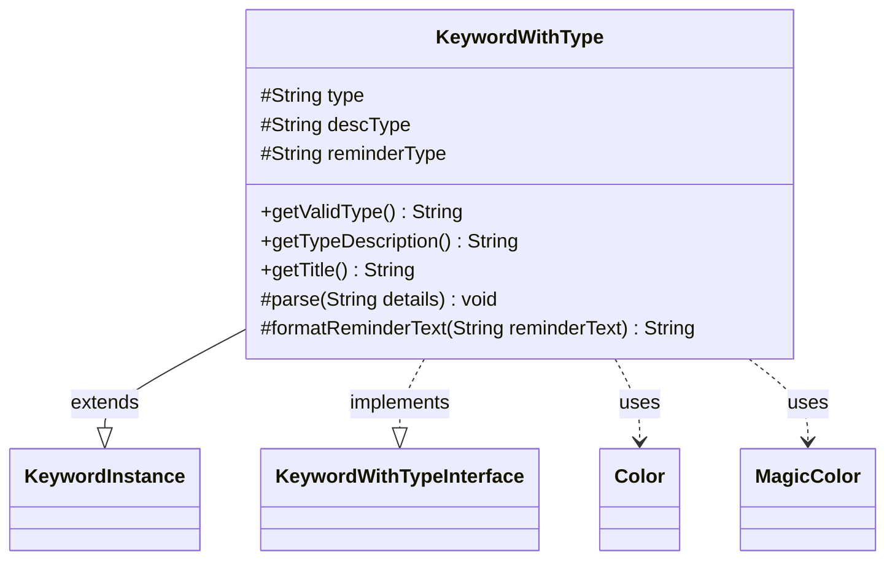

---
aliases:
  - KeywordWithType
tags:
  - java/class
  - module/forge-game
  - pkg/forge/game/keyword
fqn: forge.game.keyword.KeywordWithType
package: forge.game.keyword
module: forge-game
kind: Class
---

# KeywordWithType

**Package:** `forge.game.keyword` &nbsp; **Module:** `forge-game` &nbsp; **Kind:** Class



## Relationships
**Extends:**
- [[forge.game.keyword.KeywordInstance|KeywordInstance]]
**Implements:**
- [[forge.game.keyword.KeywordWithTypeInterface|KeywordWithTypeInterface]]
**Uses:**
- [[forge.card.MagicColor|MagicColor]]
- [[forge.card.MagicColor.Color|Color]]

## Source
`forge-game/src/main/java/forge/game/keyword/KeywordWithType.java`

```java
package forge.game.keyword;

import java.util.Arrays;

import org.apache.commons.lang3.StringUtils;

import forge.card.MagicColor;
import forge.util.Lang;

public class KeywordWithType extends KeywordInstance<KeywordWithType> implements KeywordWithTypeInterface {
    protected String type = null;
    protected String descType = null;
    protected String reminderType = null;

    @Override
    public String getValidType() { return type; }
    @Override
    public String getTypeDescription() { return descType; }

    @Override
    public String getTitle() {
        StringBuilder sb = new StringBuilder();
        sb.append(this.getKeyword()).append(" ").append(descType);
        return sb.toString();
    }

    @Override
    protected void parse(String details) {
        String k[];
        if (details.contains(":")) {
            k = details.split(":");
            type = k[0];
            descType = k[1];
        } else {
            MagicColor.Color color = MagicColor.Color.fromName(details);
            if (color != null) {
                type = "Card." + StringUtils.capitalize(color.getName());
                descType = color.getName();
            } else {
                type = details;
                descType = Lang.getInstance().buildValidDesc(Arrays.asList(type.split(",")), false);
            }
        }

        reminderType = descType;
    }

    @Override
    protected String formatReminderText(String reminderText) {
        return String.format(reminderText, reminderType);
    }
}
```
