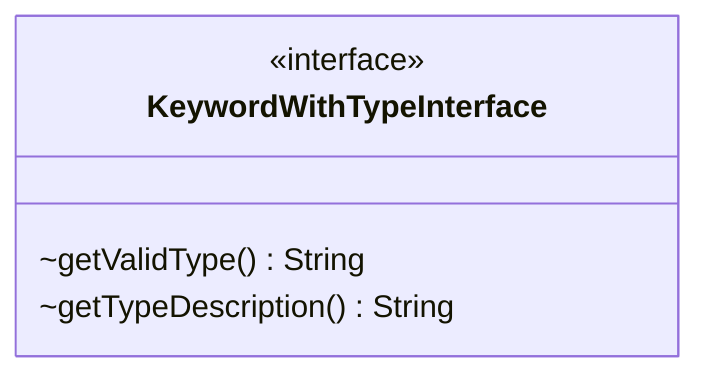

---
aliases:
  - KeywordWithTypeInterface
tags:
  - java/interface
  - module/forge-game
  - pkg/forge/game/keyword
fqn: forge.game.keyword.KeywordWithTypeInterface
package: forge.game.keyword
module: forge-game
kind: Interface
---

# KeywordWithTypeInterface

**Package:** `forge.game.keyword`   **Module:** `forge-game`   **Kind:** Interface



## Design Description

Defines a narrow contract for keywords that carry an associated card-type restriction, exposing two accessors: `getValidType()` for the type the keyword applies to and `getTypeDescription()` for a human-readable form of that type. As an interface in the `forge.game.keyword` package, it lets keyword implementations declare type-scoped behavior uniformly without coupling callers to concrete keyword classes, allowing game logic to query the relevant type and its description polymorphically. The minimal, accessor-only design signals a pure capability marker—mixed into keyword types that need type qualification—keeping type metadata consistent across the keyword system while leaving storage and population entirely to implementors.

## Source
`forge-game/src/main/java/forge/game/keyword/KeywordWithTypeInterface.java`

```java
package forge.game.keyword;

public interface KeywordWithTypeInterface {
    String getValidType();
    String getTypeDescription();
}
```

## Python
`forge/game/keyword/KeywordWithTypeInterface.py`

```python
from forge.game.keyword.KeywordWithTypeInterface import KeywordWithTypeInterface
from abc import ABC, abstractmethod


class KeywordWithTypeInterface(ABC):
    @abstractmethod
    def getValidType(self) -> str:
        ...

    @abstractmethod
    def getTypeDescription(self) -> str:
        ...
```
