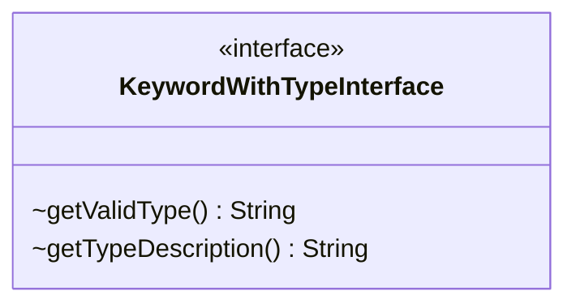

---
aliases:
  - KeywordWithTypeInterface
tags:
  - java/interface
  - module/forge-game
  - pkg/forge/game/keyword
fqn: forge.game.keyword.KeywordWithTypeInterface
package: forge.game.keyword
module: forge-game
kind: Interface
---

# KeywordWithTypeInterface

**Package:** `forge.game.keyword` &nbsp; **Module:** `forge-game` &nbsp; **Kind:** Interface



## Source
`forge-game/src/main/java/forge/game/keyword/KeywordWithTypeInterface.java`

```java
package forge.game.keyword;

public interface KeywordWithTypeInterface {
    String getValidType();
    String getTypeDescription();
}
```
