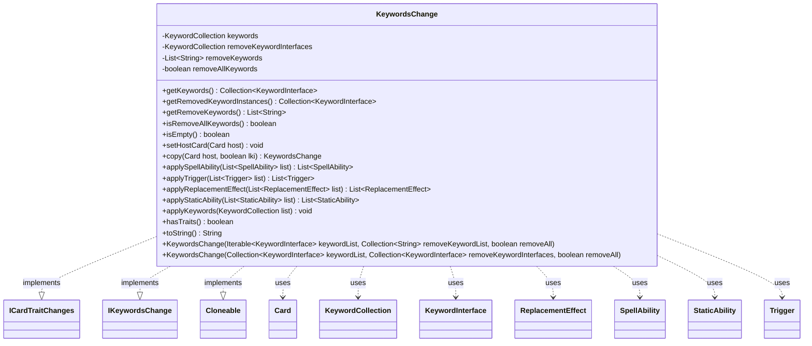

---
aliases:
  - KeywordsChange
tags:
  - java/class
  - module/forge-game
  - pkg/forge/game/keyword
fqn: forge.game.keyword.KeywordsChange
package: forge.game.keyword
module: forge-game
kind: Class
---

# KeywordsChange

**Package:** `forge.game.keyword` &nbsp; **Module:** `forge-game` &nbsp; **Kind:** Class



## Relationships
**Implements:**
- [[forge.game.card.ICardTraitChanges|ICardTraitChanges]]
- [[forge.game.keyword.IKeywordsChange|IKeywordsChange]]
**Uses:**
- [[forge.game.card.Card|Card]]
- [[forge.game.keyword.KeywordCollection|KeywordCollection]]
- [[forge.game.keyword.KeywordInterface|KeywordInterface]]
- [[forge.game.replacement.ReplacementEffect|ReplacementEffect]]
- [[forge.game.spellability.SpellAbility|SpellAbility]]
- [[forge.game.staticability.StaticAbility|StaticAbility]]
- [[forge.game.trigger.Trigger|Trigger]]

## Design Description

Card-level descriptor that bundles a set of keyword modifications to be applied to a card. It holds keywords to grant (as a `KeywordCollection`), keywords to remove either by name (`List<String>`) or by specific `KeywordInterface` instance, and a flag to strip all keywords entirely.

Implementing `ICardTraitChanges`, `IKeywordsChange`, and `Cloneable`, it participates in Forge's layered continuous-effect system: `applyKeywords` mutates a target collection by clearing, removing, then inserting, while `applySpellAbility`, `applyTrigger`, `applyReplacementEffect`, and `applyStaticAbility` delegate to the underlying keywords to surface their granted traits. The `copy` method performs a host-rebound deep clone for last-known-information snapshots, reflecting the engine's need to capture effect state at specific game moments. Helper predicates like `isEmpty` and `hasTraits` let callers skip changes that carry no effect.

## Source
`forge-game/src/main/java/forge/game/keyword/KeywordsChange.java`

```java
/*
 * Forge: Play Magic: the Gathering.
 * Copyright (C) 2011  Forge Team
 *
 * This program is free software: you can redistribute it and/or modify
 * it under the terms of the GNU General Public License as published by
 * the Free Software Foundation, either version 3 of the License, or
 * (at your option) any later version.
 *
 * This program is distributed in the hope that it will be useful,
 * but WITHOUT ANY WARRANTY; without even the implied warranty of
 * MERCHANTABILITY or FITNESS FOR A PARTICULAR PURPOSE.  See the
 * GNU General Public License for more details.
 *
 * You should have received a copy of the GNU General Public License
 * along with this program.  If not, see <http://www.gnu.org/licenses/>.
 */
package forge.game.keyword;

import java.util.Collection;
import java.util.List;

import com.google.common.collect.Lists;

import forge.game.card.Card;
import forge.game.card.ICardTraitChanges;
import forge.game.replacement.ReplacementEffect;
import forge.game.spellability.SpellAbility;
import forge.game.staticability.StaticAbility;
import forge.game.trigger.Trigger;

/**
 * <p>
 * Card_Keywords class.
 * </p>
 *
 * @author Forge
 */
public class KeywordsChange implements ICardTraitChanges, IKeywordsChange, Cloneable {
    private KeywordCollection keywords = new KeywordCollection();
    private KeywordCollection removeKeywordInterfaces = new KeywordCollection();
    private List<String> removeKeywords = Lists.newArrayList();
    private boolean removeAllKeywords;

    /**
     *
     * Construct a new {@link KeywordsChange}.
     *
     * @param keywordList the list of keywords to add.
     * @param removeKeywordList the list of keywords to remove.
     * @param removeAll whether to remove all keywords.
     */
    public KeywordsChange(
            final Iterable<KeywordInterface> keywordList,
            final Collection<String> removeKeywordList,
            final boolean removeAll) {
        if (keywordList != null) {
            this.keywords.insertAll(keywordList);
        }

        if (removeKeywordList != null) {
            this.removeKeywords.addAll(removeKeywordList);
        }

        this.removeAllKeywords = removeAll;
    }
    public KeywordsChange(
            final Collection<KeywordInterface> keywordList,
            final Collection<KeywordInterface> removeKeywordInterfaces,
            final boolean removeAll) {
        if (keywordList != null) {
            this.keywords.insertAll(keywordList);
        }

        if (removeKeywordInterfaces != null) {
            this.removeKeywordInterfaces.insertAll(removeKeywordInterfaces);
        }

        this.removeAllKeywords = removeAll;
    }

    /**
     *
     * getKeywords.
     *
     * @return ArrayList<String>
     */
    public final Collection<KeywordInterface> getKeywords() {
        return this.keywords.getValues();
    }

    public final Collection<KeywordInterface> getRemovedKeywordInstances() {
        return this.removeKeywordInterfaces.getValues();
    }
    /**
     *
     * getRemoveKeywords.
     *
     * @return ArrayList<String>
     */
    public final List<String> getRemoveKeywords() {
        return this.removeKeywords;
    }

    /**
     *
     * isRemoveAllKeywords.
     *
     * @return boolean
     */
    public final boolean isRemoveAllKeywords() {
        return this.removeAllKeywords;
    }

    /**
     * @return whether this KeywordsChange doesn't have any effect.
     */
    public final boolean isEmpty() {
        return !this.removeAllKeywords
                && this.keywords.isEmpty()
                && this.removeKeywords.isEmpty();
    }

    public void setHostCard(final Card host) {
        keywords.setHostCard(host);
        for (KeywordInterface k : removeKeywordInterfaces) {
            k.setHostCard(host);
        }
    }

    public KeywordsChange copy(final Card host, final boolean lki) {
        try {
            KeywordsChange result = (KeywordsChange)super.clone();

            result.keywords = this.keywords.copy(host, lki);
            result.removeKeywords = Lists.newArrayList(removeKeywords);
            result.removeKeywordInterfaces = this.removeKeywordInterfaces.copy(host, lki);

            return result;
        }  catch (final Exception ex) {
            throw new RuntimeException("KeywordsChange : clone() error", ex);
        }
    }

    public List<SpellAbility> applySpellAbility(List<SpellAbility> list) {
        return keywords.applySpellAbility(list);
    }
    public List<Trigger> applyTrigger(List<Trigger> list) {
        return keywords.applyTrigger(list);
    }
    public List<ReplacementEffect> applyReplacementEffect(List<ReplacementEffect> list) {
        return keywords.applyReplacementEffect(list);
    }
    public List<StaticAbility> applyStaticAbility(List<StaticAbility> list) {
        return keywords.applyStaticAbility(list);
    }

    public void applyKeywords(KeywordCollection list) {
        if (isRemoveAllKeywords()) {
            list.clear();
        }
        else if (getRemoveKeywords() != null) {
            list.removeAll(getRemoveKeywords());
        }

        list.removeInstances(getRemovedKeywordInstances());

        if (getKeywords() != null) {
            list.insertAll(getKeywords());
        }
    }

    public boolean hasTraits() {
        for (KeywordInterface k : this.keywords.getValues()) {
            if (k.hasTraits()) {
                return true;
            }
        }
        return false;
    }

    /* (non-Javadoc)
     * @see java.lang.Object#toString()
     */
    @Override
    public String toString() {
        StringBuilder sb = new StringBuilder();
        sb.append("<+");
        sb.append(this.keywords);
        sb.append("|-");
        sb.append(this.removeKeywordInterfaces);
        sb.append("|-");
        sb.append(this.removeKeywords);
        sb.append(">");
        return sb.toString();
    }
}
```

## Python
`forge/game/keyword/KeywordsChange.py`

```python
from forge.game.card.Card import Card
from forge.game.card.ICardTraitChanges import ICardTraitChanges
from forge.game.keyword.IKeywordsChange import IKeywordsChange
from forge.game.keyword.KeywordCollection import KeywordCollection
from forge.game.keyword.KeywordInterface import KeywordInterface
from forge.game.replacement.ReplacementEffect import ReplacementEffect
from forge.game.spellability.SpellAbility import SpellAbility
from forge.game.staticability.StaticAbility import StaticAbility
from forge.game.trigger.Trigger import Trigger


class KeywordsChange(ICardTraitChanges, IKeywordsChange):
    def __init__(self, keywordList, removeKeywordListOrInterfaces, removeAll):
        self.keywords = KeywordCollection()
        self.removeKeywordInterfaces = KeywordCollection()
        self.removeKeywords = []
        self.removeAllKeywords = False

        # The Java class provides two overloaded constructors:
        #   1) (Iterable<KeywordInterface>, Collection<String>, boolean)
        #   2) (Collection<KeywordInterface>, Collection<KeywordInterface>, boolean)
        # Disambiguate by inspecting the contents of the second argument: a
        # collection of strings populates removeKeywords, while a collection of
        # KeywordInterface instances populates removeKeywordInterfaces.
        if keywordList is not None:
            self.keywords.insertAll(keywordList)

        if removeKeywordListOrInterfaces is not None:
            if all(isinstance(k, str) for k in removeKeywordListOrInterfaces):
                self.removeKeywords.extend(removeKeywordListOrInterfaces)
            else:
                self.removeKeywordInterfaces.insertAll(removeKeywordListOrInterfaces)

        self.removeAllKeywords = removeAll

    def getKeywords(self) -> "Collection[KeywordInterface]":
        return self.keywords.getValues()

    def getRemovedKeywordInstances(self) -> "Collection[KeywordInterface]":
        return self.removeKeywordInterfaces.getValues()

    def getRemoveKeywords(self) -> list[str]:
        return self.removeKeywords

    def isRemoveAllKeywords(self) -> bool:
        return self.removeAllKeywords

    def isEmpty(self) -> bool:
        return (not self.removeAllKeywords
                and self.keywords.isEmpty()
                and len(self.removeKeywords) == 0)

    def setHostCard(self, host: Card) -> None:
        self.keywords.setHostCard(host)
        for k in self.removeKeywordInterfaces:
            k.setHostCard(host)

    def copy(self, host: Card, lki: bool) -> "KeywordsChange":
        try:
            result = KeywordsChange.__new__(KeywordsChange)
            result.__dict__.update(self.__dict__)

            result.keywords = self.keywords.copy(host, lki)
            result.removeKeywords = list(self.removeKeywords)
            result.removeKeywordInterfaces = self.removeKeywordInterfaces.copy(host, lki)

            return result
        except Exception as ex:
            raise RuntimeError("KeywordsChange : clone() error", ex)

    def applySpellAbility(self, list: list[SpellAbility]) -> list[SpellAbility]:
        return self.keywords.applySpellAbility(list)

    def applyTrigger(self, list: list[Trigger]) -> list[Trigger]:
        return self.keywords.applyTrigger(list)

    def applyReplacementEffect(self, list: list[ReplacementEffect]) -> list[ReplacementEffect]:
        return self.keywords.applyReplacementEffect(list)

    def applyStaticAbility(self, list: list[StaticAbility]) -> list[StaticAbility]:
        return self.keywords.applyStaticAbility(list)

    def applyKeywords(self, list: KeywordCollection) -> None:
        if self.isRemoveAllKeywords():
            list.clear()
        elif self.getRemoveKeywords() is not None:
            list.removeAll(self.getRemoveKeywords())

        list.removeInstances(self.getRemovedKeywordInstances())

        if self.getKeywords() is not None:
            list.insertAll(self.getKeywords())

    def hasTraits(self) -> bool:
        for k in self.keywords.getValues():
            if k.hasTraits():
                return True
        return False

    def toString(self) -> str:
        sb = []
        sb.append("<+")
        sb.append(str(self.keywords))
        sb.append("|-")
        sb.append(str(self.removeKeywordInterfaces))
        sb.append("|-")
        sb.append(str(self.removeKeywords))
        sb.append(">")
        return "".join(sb)

    def __str__(self) -> str:
        return self.toString()
```
