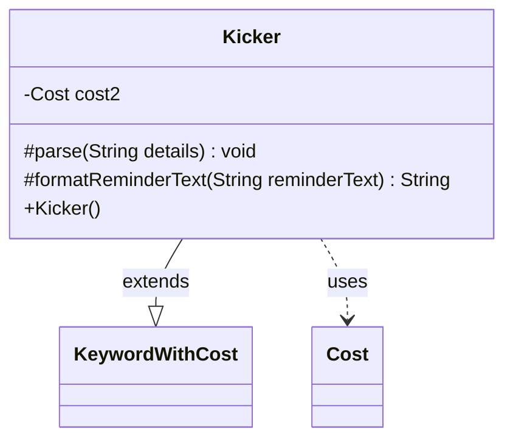

---
aliases:
  - Kicker
tags:
  - java/class
  - module/forge-game
  - pkg/forge/game/keyword
fqn: forge.game.keyword.Kicker
package: forge.game.keyword
module: forge-game
kind: Class
---

# Kicker

**Package:** `forge.game.keyword` &nbsp; **Module:** `forge-game` &nbsp; **Kind:** Class



## Relationships
**Extends:**
- [[forge.game.keyword.KeywordWithCost|KeywordWithCost]]
**Uses:**
- [[forge.game.cost.Cost|Cost]]

## Design Description

Kicker implements Magic: The Gathering's Kicker keyword ability, an optional additional cost a player may pay when casting a spell to gain extra effects. It extends `KeywordWithCost`, inheriting the base cost-parsing and reminder-text machinery, and overriding only the behavior unique to kicker.

The class collaborates with `Cost` to model an optional second kicker cost (`cost2`), supporting the "double kicker" case where a spell offers two independent kicker costs. Its overridden `parse` splits the detail string on a colon, delegating the first segment to the superclass and constructing a second `Cost` only when present. Correspondingly, `formatReminderText` falls back to the superclass for the single-cost case and otherwise composes custom "and/or" reminder text. This delegate-and-extend design keeps single-kicker handling in the parent while localizing the double-kicker special case here.

## Source
`forge-game/src/main/java/forge/game/keyword/Kicker.java`

```java
package forge.game.keyword;

import java.util.List;

import com.google.common.collect.Lists;

import forge.game.cost.Cost;
import forge.util.TextUtil;

public class Kicker extends KeywordWithCost {
    private Cost cost2 = null;

    public Kicker() {
    }

    @Override
    protected void parse(String details) {
        List<String> l = Lists.newArrayList(TextUtil.split(details, ':'));
        super.parse(l.get(0));
        if (l.size() > 1)
            cost2 = new Cost(l.get(1), false);
    }

    @Override
    protected String formatReminderText(String reminderText) {
        if (cost2 == null) {
            return super.formatReminderText(reminderText);
        }
        //handle special case of double kicker
        return TextUtil.concatWithSpace("You may pay an additional", cost.toSimpleString(),"and/or", cost2.toSimpleString(),"as you cast this spell.");
    }
}
```

## Python
`forge/game/keyword/Kicker.py`

```python
package: forge.game.keyword

from forge.game.keyword.KeywordWithCost import KeywordWithCost
from forge.game.cost.Cost import Cost
from forge.util.TextUtil import TextUtil


class Kicker(KeywordWithCost):
    def __init__(self):
        super().__init__()
        self.cost2 = None

    def parse(self, details):
        l = list(TextUtil.split(details, ':'))
        super().parse(l[0])
        if len(l) > 1:
            self.cost2 = Cost(l[1], False)

    def formatReminderText(self, reminderText):
        if self.cost2 is None:
            return super().formatReminderText(reminderText)
        # handle special case of double kicker
        return TextUtil.concatWithSpace("You may pay an additional", self.cost.toSimpleString(), "and/or", self.cost2.toSimpleString(), "as you cast this spell.")
```
