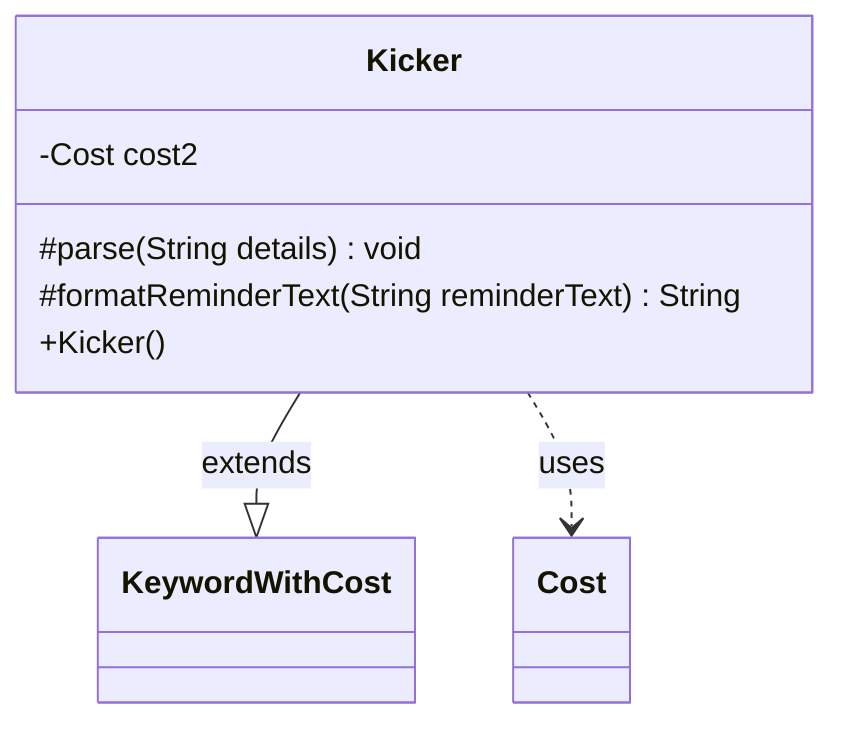

---
aliases:
  - Kicker
tags:
  - java/class
  - module/forge-game
  - pkg/forge/game/keyword
fqn: forge.game.keyword.Kicker
package: forge.game.keyword
module: forge-game
kind: Class
---

# Kicker

**Package:** `forge.game.keyword` &nbsp; **Module:** `forge-game` &nbsp; **Kind:** Class



## Relationships
**Extends:**
- [[forge.game.keyword.KeywordWithCost|KeywordWithCost]]
**Uses:**
- [[forge.game.cost.Cost|Cost]]

## Source
`forge-game/src/main/java/forge/game/keyword/Kicker.java`

```java
package forge.game.keyword;

import java.util.List;

import com.google.common.collect.Lists;

import forge.game.cost.Cost;
import forge.util.TextUtil;

public class Kicker extends KeywordWithCost {
    private Cost cost2 = null;

    public Kicker() {
    }

    @Override
    protected void parse(String details) {
        List<String> l = Lists.newArrayList(TextUtil.split(details, ':'));
        super.parse(l.get(0));
        if (l.size() > 1)
            cost2 = new Cost(l.get(1), false);
    }

    @Override
    protected String formatReminderText(String reminderText) {
        if (cost2 == null) {
            return super.formatReminderText(reminderText);
        }
        //handle special case of double kicker
        return TextUtil.concatWithSpace("You may pay an additional", cost.toSimpleString(),"and/or", cost2.toSimpleString(),"as you cast this spell.");
    }
}
```
