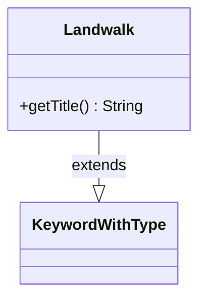

---
aliases:
  - Landwalk
tags:
  - java/class
  - module/forge-game
  - pkg/forge/game/keyword
fqn: forge.game.keyword.Landwalk
package: forge.game.keyword
module: forge-game
kind: Class
---

# Landwalk

**Package:** `forge.game.keyword` &nbsp; **Module:** `forge-game` &nbsp; **Kind:** Class



## Relationships
**Extends:**
- [[forge.game.keyword.KeywordWithType|KeywordWithType]]

## Design Description

Landwalk is a concrete keyword class in Forge's `forge.game.keyword` package, modeling the MTG evasion ability family (Forestwalk, Islandwalk, etc.) that lets a creature become unblockable when the defending player controls a land of a given type. By extending `KeywordWithType`, it inherits the parsing and storage of an associated land type, contributing only the presentation logic specific to landwalk variants. Its sole responsibility is overriding `getTitle()` to compose the human-readable keyword name by appending `"walk"` to the inherited type description (yielding strings like "Forest" + "walk"). This minimal override reflects a deliberate template-method design: the supertype centralizes type handling across all typed keywords, while each subclass like Landwalk supplies just its naming convention, keeping the evasion variants uniform and free of duplicated type-management code.

## Source
`forge-game/src/main/java/forge/game/keyword/Landwalk.java`

```java
package forge.game.keyword;

public class Landwalk extends KeywordWithType {
    @Override
    public String getTitle() {
        return getTypeDescription() + "walk";
    }
}
```

## Python
`forge/game/keyword/Landwalk.py`

```python
from forge.game.keyword.KeywordWithType import KeywordWithType


class Landwalk(KeywordWithType):
    def getTitle(self) -> str:
        return self.getTypeDescription() + "walk"
```
