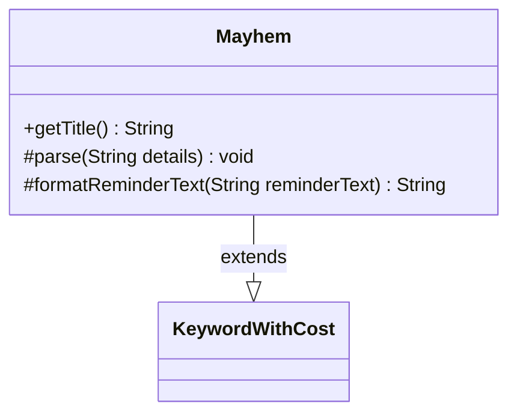

---
aliases:
  - Mayhem
tags:
  - java/class
  - module/forge-game
  - pkg/forge/game/keyword
fqn: forge.game.keyword.Mayhem
package: forge.game.keyword
module: forge-game
kind: Class
---

# Mayhem

**Package:** `forge.game.keyword` &nbsp; **Module:** `forge-game` &nbsp; **Kind:** Class



## Relationships
**Extends:**
- [[forge.game.keyword.KeywordWithCost|KeywordWithCost]]

## Source
`forge-game/src/main/java/forge/game/keyword/Mayhem.java`

```java
package forge.game.keyword;

public class Mayhem extends KeywordWithCost {

    @Override
    public String getTitle() {
        if (cost == null) {
            return getTitleWithoutCost();
        }
        return super.getTitle();
    }

    @Override
    protected void parse(String details) {
        if (!details.isEmpty()) {
            super.parse(details);
        } else {
            this.cost = null;
        }
    }

    @Override
    protected String formatReminderText(String reminderText) {
        if (cost == null) {
            return "You may play this card from your graveyard if you discarded it this turn. Timing rules still apply.";
        }
        return super.formatReminderText(reminderText);
    }
}
```
