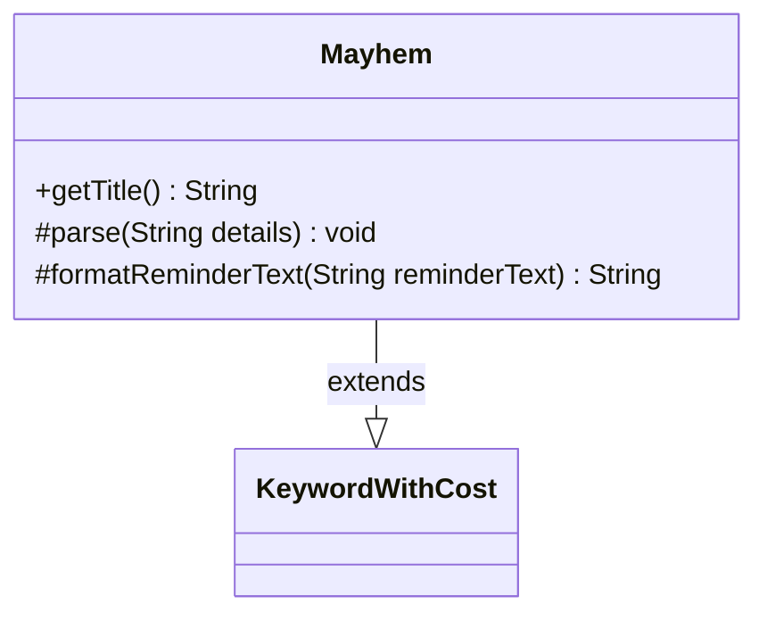

---
aliases:
  - Mayhem
tags:
  - java/class
  - module/forge-game
  - pkg/forge/game/keyword
fqn: forge.game.keyword.Mayhem
package: forge.game.keyword
module: forge-game
kind: Class
---

# Mayhem

**Package:** `forge.game.keyword` &nbsp; **Module:** `forge-game` &nbsp; **Kind:** Class



## Relationships
**Extends:**
- [[forge.game.keyword.KeywordWithCost|KeywordWithCost]]

## Design Description

Mayhem models the Magic: The Gathering "Mayhem" keyword ability as a concrete subclass of KeywordWithCost, from which it inherits cost storage, parsing, and title/reminder-text formatting. Its design intent is to handle Mayhem's optional alternative cost: when the parsed details are empty it nulls out the inherited `cost` field, and the three overrides each branch on that null state. With no cost, `getTitle()` falls back to the bare title, `parse()` skips cost parsing, and `formatReminderText()` returns hardcoded reminder text describing the graveyard-play permission; otherwise each override delegates to the KeywordWithCost superclass implementation. This keeps the costless and cost-bearing variants of the keyword unified in a single small, focused class.

## Source
`forge-game/src/main/java/forge/game/keyword/Mayhem.java`

```java
package forge.game.keyword;

public class Mayhem extends KeywordWithCost {

    @Override
    public String getTitle() {
        if (cost == null) {
            return getTitleWithoutCost();
        }
        return super.getTitle();
    }

    @Override
    protected void parse(String details) {
        if (!details.isEmpty()) {
            super.parse(details);
        } else {
            this.cost = null;
        }
    }

    @Override
    protected String formatReminderText(String reminderText) {
        if (cost == null) {
            return "You may play this card from your graveyard if you discarded it this turn. Timing rules still apply.";
        }
        return super.formatReminderText(reminderText);
    }
}
```

## Python
`forge/game/keyword/Mayhem.py`

```python
from forge.game.keyword.KeywordWithCost import KeywordWithCost


class Mayhem(KeywordWithCost):

    def getTitle(self) -> str:
        if self.cost is None:
            return self.getTitleWithoutCost()
        return super().getTitle()

    def parse(self, details: str) -> None:
        if details:
            super().parse(details)
        else:
            self.cost = None

    def formatReminderText(self, reminderText: str) -> str:
        if self.cost is None:
            return "You may play this card from your graveyard if you discarded it this turn. Timing rules still apply."
        return super().formatReminderText(reminderText)
```
