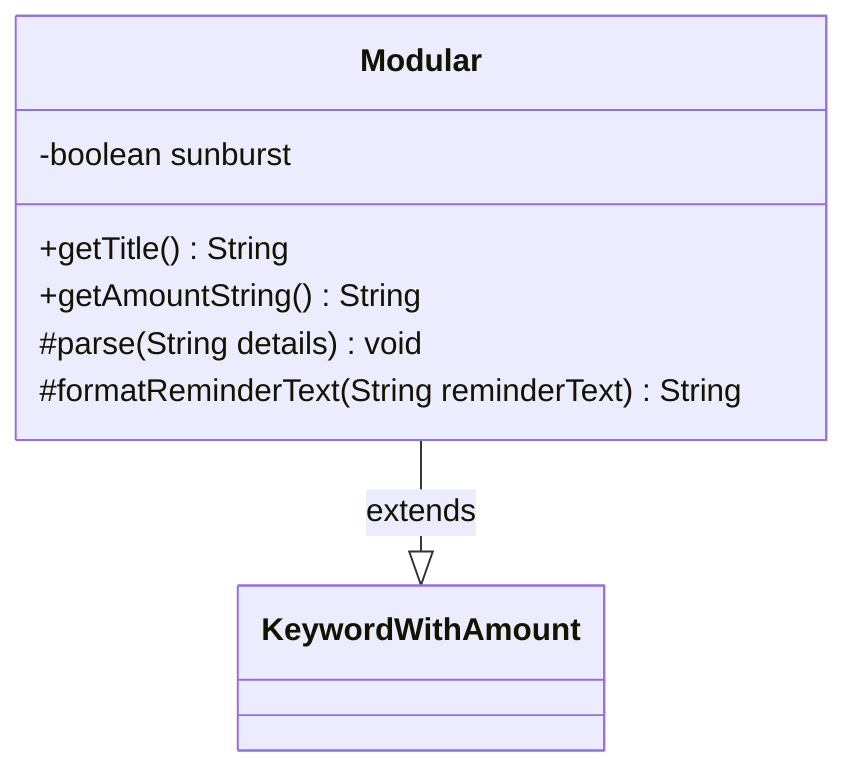

---
aliases:
  - Modular
tags:
  - java/class
  - module/forge-game
  - pkg/forge/game/keyword
fqn: forge.game.keyword.Modular
package: forge.game.keyword
module: forge-game
kind: Class
---

# Modular

**Package:** `forge.game.keyword`   **Module:** `forge-game`   **Kind:** Class



## Relationships
**Extends:**
- [[forge.game.keyword.KeywordWithAmount|KeywordWithAmount]]

## Design Description

Modular is a concrete keyword implementation in Forge's MTG engine, modeling the Magic mechanic of the same name. Extending KeywordWithAmount, it inherits standard amount-based keyword parsing and presentation while specializing behavior for the "Sunburst" variant via a private boolean flag.

The class overrides four hook methods to branch on that flag: `parse` detects the "Sunburst" detail token (delegating to the superclass otherwise), while `getTitle`, `getAmountString`, and `formatReminderText` substitute Sunburst-specific text rather than the numeric amount. This template-method design keeps the variant logic localized—the superclass drives the overall keyword lifecycle, and Modular only supplies the differences—so the special case is handled without duplicating the base amount-keyword machinery.

## Source
`forge-game/src/main/java/forge/game/keyword/Modular.java`

```java
package forge.game.keyword;

public class Modular extends KeywordWithAmount {
    private boolean sunburst = false;

    @Override
    public String getTitle() {
        if (sunburst) {
            return "Modular—Sunburst";
        }
        return super.getTitle();
    }

    public String getAmountString() {
        if (sunburst) {
            return "Sunburst";
        }
        return super.getAmountString();
    }

    @Override
    protected void parse(String details) {
        if ("Sunburst".equals(details)) {
            sunburst = true;
        } else {
            super.parse(details);
        }
    }

    @Override
    protected String formatReminderText(String reminderText) {
        if (sunburst) {
            return "This enters with a +1/+1 counter on it for each color of mana spent to cast it. When it dies, you may put its +1/+1 counters on target artifact creature.";
        } else {
            return super.formatReminderText(reminderText);
        }
    }
}
```

## Python
`forge/game/keyword/Modular.py`

```python
from forge.game.keyword.KeywordWithAmount import KeywordWithAmount


class Modular(KeywordWithAmount):
    def __init__(self):
        super().__init__()
        self.sunburst = False

    def getTitle(self) -> str:
        if self.sunburst:
            return "Modular????????Sunburst"
        return super().getTitle()

    def getAmountString(self) -> str:
        if self.sunburst:
            return "Sunburst"
        return super().getAmountString()

    def parse(self, details: str) -> None:
        if "Sunburst" == details:
            self.sunburst = True
        else:
            super().parse(details)

    def formatReminderText(self, reminderText: str) -> str:
        if self.sunburst:
            return "This enters with a +1/+1 counter on it for each color of mana spent to cast it. When it dies, you may put its +1/+1 counters on target artifact creature."
        else:
            return super().formatReminderText(reminderText)
```
