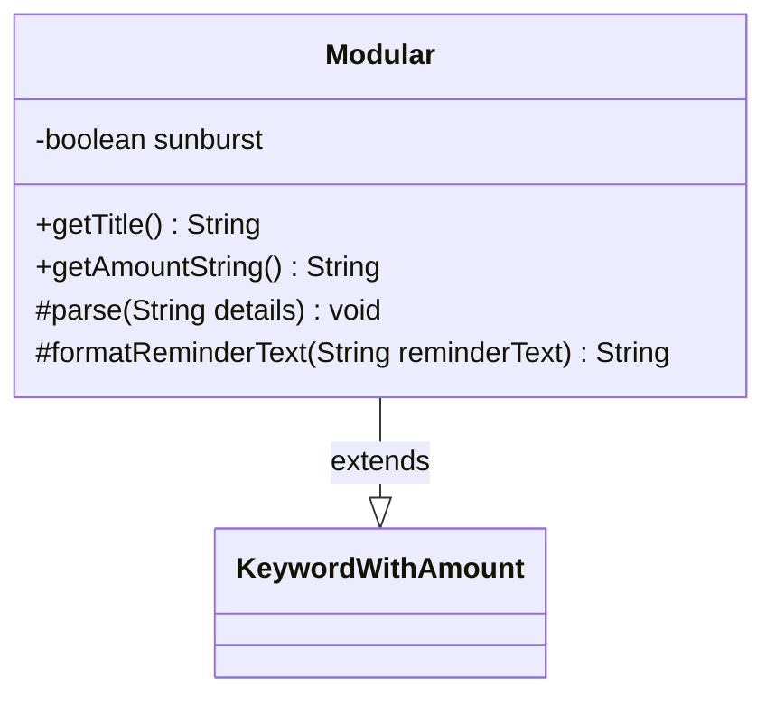

---
aliases:
  - Modular
tags:
  - java/class
  - module/forge-game
  - pkg/forge/game/keyword
fqn: forge.game.keyword.Modular
package: forge.game.keyword
module: forge-game
kind: Class
---

# Modular

**Package:** `forge.game.keyword` &nbsp; **Module:** `forge-game` &nbsp; **Kind:** Class



## Relationships
**Extends:**
- [[forge.game.keyword.KeywordWithAmount|KeywordWithAmount]]

## Source
`forge-game/src/main/java/forge/game/keyword/Modular.java`

```java
package forge.game.keyword;

public class Modular extends KeywordWithAmount {
    private boolean sunburst = false;

    @Override
    public String getTitle() {
        if (sunburst) {
            return "Modular—Sunburst";
        }
        return super.getTitle();
    }

    public String getAmountString() {
        if (sunburst) {
            return "Sunburst";
        }
        return super.getAmountString();
    }

    @Override
    protected void parse(String details) {
        if ("Sunburst".equals(details)) {
            sunburst = true;
        } else {
            super.parse(details);
        }
    }

    @Override
    protected String formatReminderText(String reminderText) {
        if (sunburst) {
            return "This enters with a +1/+1 counter on it for each color of mana spent to cast it. When it dies, you may put its +1/+1 counters on target artifact creature.";
        } else {
            return super.formatReminderText(reminderText);
        }
    }
}
```
