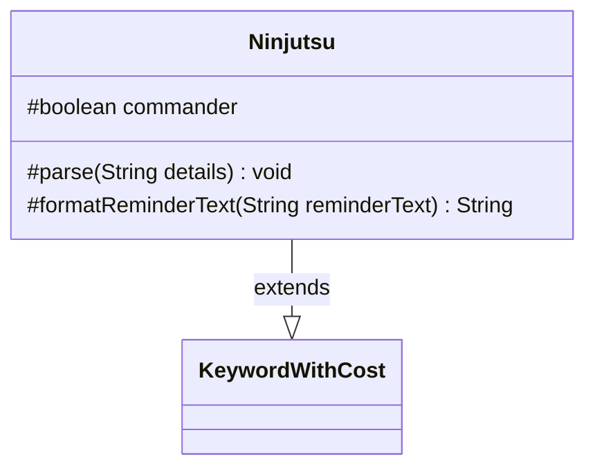

---
aliases:
  - Ninjutsu
tags:
  - java/class
  - module/forge-game
  - pkg/forge/game/keyword
fqn: forge.game.keyword.Ninjutsu
package: forge.game.keyword
module: forge-game
kind: Class
---

# Ninjutsu

**Package:** `forge.game.keyword` &nbsp; **Module:** `forge-game` &nbsp; **Kind:** Class



## Relationships
**Extends:**
- [[forge.game.keyword.KeywordWithCost|KeywordWithCost]]

## Source
`forge-game/src/main/java/forge/game/keyword/Ninjutsu.java`

```java
package forge.game.keyword;

public class Ninjutsu extends KeywordWithCost {

    protected boolean commander = false;

    /* (non-Javadoc)
     * @see forge.game.keyword.KeywordWithCost#parse(java.lang.String)
     */
    @Override
    protected void parse(String details) {
        if (details.contains(":")) {
            String[] k = details.split(":");
            details = k[0];
            if (k[1].equals("Commander")) {
                commander = true;
            }
        }
        super.parse(details);
    }

    /* (non-Javadoc)
     * @see forge.game.keyword.KeywordWithCost#formatReminderText(java.lang.String)
     */
    @Override
    protected String formatReminderText(String reminderText) {
        String zone = commander ? "hand or the command zone" : "hand";
        return String.format(reminderText, cost.toSimpleString(), zone);
    }

}
```
