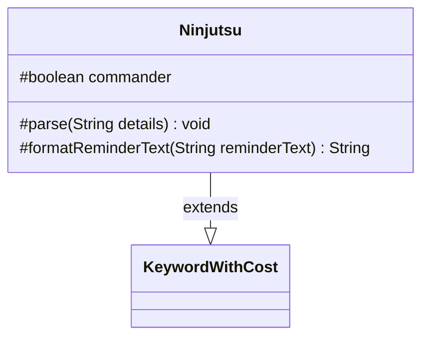

---
aliases:
  - Ninjutsu
tags:
  - java/class
  - module/forge-game
  - pkg/forge/game/keyword
fqn: forge.game.keyword.Ninjutsu
package: forge.game.keyword
module: forge-game
kind: Class
---

# Ninjutsu

**Package:** `forge.game.keyword`   **Module:** `forge-game`   **Kind:** Class



## Relationships
**Extends:**
- [[forge.game.keyword.KeywordWithCost|KeywordWithCost]]

## Design Description

Ninjutsu models the Magic: The Gathering "Ninjutsu" keyword ability, extending KeywordWithCost to inherit the cost-bearing keyword machinery while specializing two protected hooks. Its `parse` method overrides the base parser to detect an optional `:Commander` suffix in the keyword details, setting the `commander` flag before delegating the remaining cost string to `super.parse`. Its `formatReminderText` override injects the activation cost and the appropriate origin zone—"hand" normally, or "hand or the command zone" for the commander variant—into the reminder text template. The design keeps Ninjutsu a thin, declarative subclass: it reuses the superclass's cost storage and formatting contract, encoding only the variant-specific behavior that distinguishes standard Ninjutsu from its commander form.

## Source
`forge-game/src/main/java/forge/game/keyword/Ninjutsu.java`

```java
package forge.game.keyword;

public class Ninjutsu extends KeywordWithCost {

    protected boolean commander = false;

    /* (non-Javadoc)
     * @see forge.game.keyword.KeywordWithCost#parse(java.lang.String)
     */
    @Override
    protected void parse(String details) {
        if (details.contains(":")) {
            String[] k = details.split(":");
            details = k[0];
            if (k[1].equals("Commander")) {
                commander = true;
            }
        }
        super.parse(details);
    }

    /* (non-Javadoc)
     * @see forge.game.keyword.KeywordWithCost#formatReminderText(java.lang.String)
     */
    @Override
    protected String formatReminderText(String reminderText) {
        String zone = commander ? "hand or the command zone" : "hand";
        return String.format(reminderText, cost.toSimpleString(), zone);
    }

}
```

## Python
`forge/game/keyword/Ninjutsu.py`

```python
from forge.game.keyword.KeywordWithCost import KeywordWithCost


class Ninjutsu(KeywordWithCost):

    def __init__(self):
        super().__init__()
        self.commander = False

    # (non-Javadoc)
    # @see forge.game.keyword.KeywordWithCost#parse(java.lang.String)
    def parse(self, details: str) -> None:
        if ":" in details:
            k = details.split(":")
            details = k[0]
            if k[1] == "Commander":
                self.commander = True
        super().parse(details)

    # (non-Javadoc)
    # @see forge.game.keyword.KeywordWithCost#formatReminderText(java.lang.String)
    def formatReminderText(self, reminderText: str) -> str:
        zone = "hand or the command zone" if self.commander else "hand"
        return reminderText % (self.cost.toSimpleString(), zone)
```
