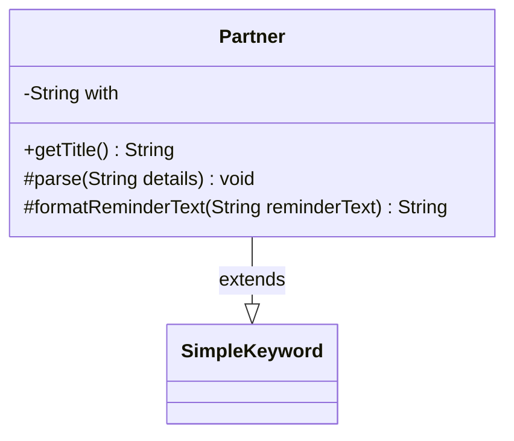

---
aliases:
  - Partner
tags:
  - java/class
  - module/forge-game
  - pkg/forge/game/keyword
fqn: forge.game.keyword.Partner
package: forge.game.keyword
module: forge-game
kind: Class
---

# Partner

**Package:** `forge.game.keyword`   **Module:** `forge-game`   **Kind:** Class



## Relationships
**Extends:**
- [[forge.game.keyword.SimpleKeyword|SimpleKeyword]]

## Design Description

Partner is a concrete keyword implementation in Forge's MTG game engine that models Magic's "Partner" and "Partner with" commander abilities. Extending SimpleKeyword, it overrides the framework's parsing and presentation hooks rather than introducing new public API: parse captures an optional partner name into the `with` field, getTitle appends that name to the displayed title when present, and formatReminderText substitutes the "Partner with"–specific reminder text. The design leans on the SimpleKeyword template, distinguishing the two ability variants purely by whether `with` is null, so a single class cleanly serves both the bare "Partner" keyword and the named "Partner with" pairing while delegating shared behavior to its supertype.

## Source
`forge-game/src/main/java/forge/game/keyword/Partner.java`

```java
package forge.game.keyword;

public class Partner extends SimpleKeyword {

    private String with = null;

    @Override
    public String getTitle() {
        if (with != null) {
            return "Partner — " + with;
        }
        return super.getTitle();
    }

    @Override
    protected void parse(String details) {
        with = details.isEmpty() ? null : details;
    }

    @Override
    protected String formatReminderText(String reminderText) {
        if (with == null) {
            return reminderText;
        } else {
            return "You can have two commanders if both have this ability.";
        }
    }
}
```

## Python
`forge/game/keyword/Partner.py`

```python
from forge.game.keyword.SimpleKeyword import SimpleKeyword


class Partner(SimpleKeyword):

    def __init__(self):
        super().__init__()
        self.with_ = None

    def getTitle(self) -> str:
        if self.with_ is not None:
            return "Partner ???????? " + self.with_
        return super().getTitle()

    def parse(self, details: str) -> None:
        self.with_ = None if details == "" else details

    def formatReminderText(self, reminderText: str) -> str:
        if self.with_ is None:
            return reminderText
        else:
            return "You can have two commanders if both have this ability."
```
