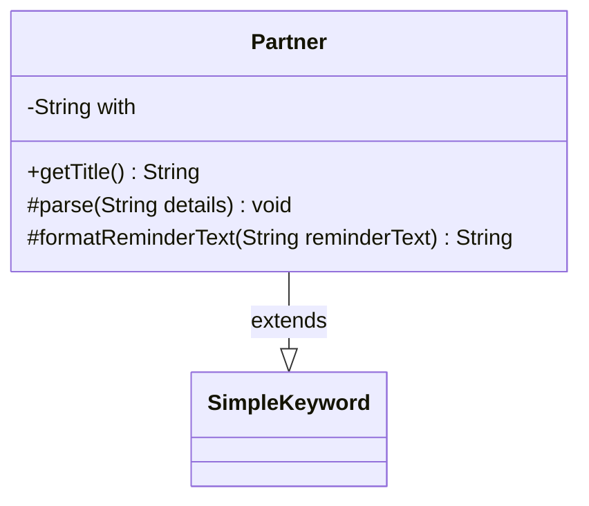

---
aliases:
  - Partner
tags:
  - java/class
  - module/forge-game
  - pkg/forge/game/keyword
fqn: forge.game.keyword.Partner
package: forge.game.keyword
module: forge-game
kind: Class
---

# Partner

**Package:** `forge.game.keyword` &nbsp; **Module:** `forge-game` &nbsp; **Kind:** Class



## Relationships
**Extends:**
- [[forge.game.keyword.SimpleKeyword|SimpleKeyword]]

## Source
`forge-game/src/main/java/forge/game/keyword/Partner.java`

```java
package forge.game.keyword;

public class Partner extends SimpleKeyword {

    private String with = null;

    @Override
    public String getTitle() {
        if (with != null) {
            return "Partner — " + with;
        }
        return super.getTitle();
    }

    @Override
    protected void parse(String details) {
        with = details.isEmpty() ? null : details;
    }

    @Override
    protected String formatReminderText(String reminderText) {
        if (with == null) {
            return reminderText;
        } else {
            return "You can have two commanders if both have this ability.";
        }
    }
}
```
