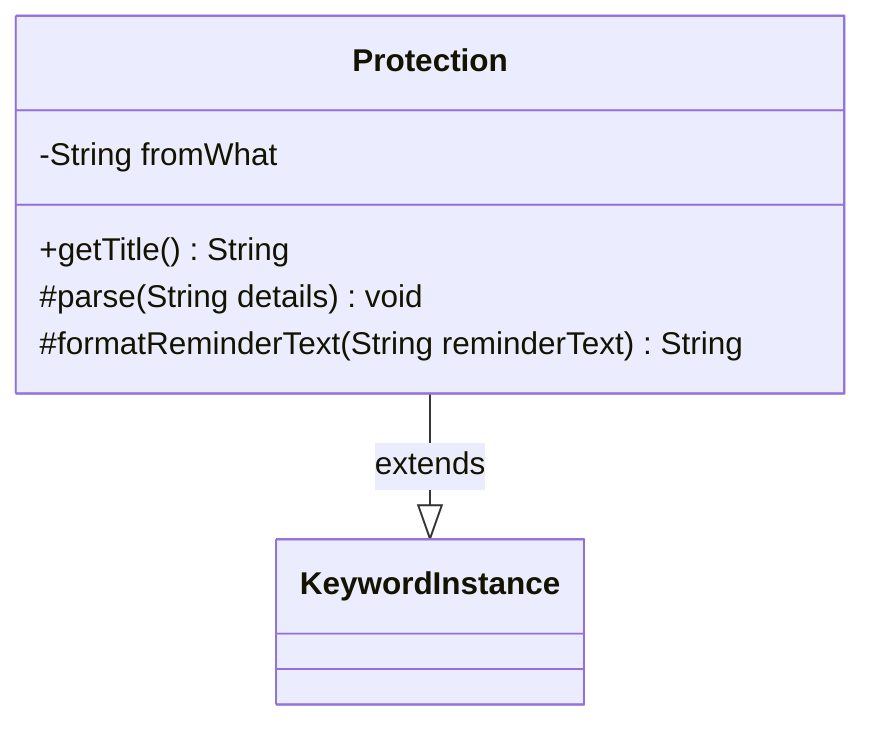

---
aliases:
  - Protection
tags:
  - java/class
  - module/forge-game
  - pkg/forge/game/keyword
fqn: forge.game.keyword.Protection
package: forge.game.keyword
module: forge-game
kind: Class
---

# Protection

**Package:** `forge.game.keyword` &nbsp; **Module:** `forge-game` &nbsp; **Kind:** Class



## Relationships
**Extends:**
- [[forge.game.keyword.KeywordInstance|KeywordInstance]]

## Design Description

Protection is a concrete keyword implementation representing Magic: The Gathering's "Protection from [quality]" ability. It extends the generic `KeywordInstance<Protection>` base, binding the recursive type parameter to itself so inherited operations remain type-safe. Its sole state is the `fromWhat` string describing the protected-against quality, which it interpolates into both the display title (via `getTitle`) and the formatted reminder text (via `formatReminderText`). By overriding the protected `parse` and `formatReminderText` hooks, it plugs into the supertype's keyword-parsing framework while supplying behavior specific to protection. The empty `parse` implementation signals that detail population is handled elsewhere, keeping this class a focused, lightweight specialization of the keyword hierarchy.

## Source
`forge-game/src/main/java/forge/game/keyword/Protection.java`

```java
package forge.game.keyword;

public class Protection extends KeywordInstance<Protection> {
    private String fromWhat = "";

    @Override
    public String getTitle() {
        return "Protection from " + fromWhat;
    }

    @Override
    protected void parse(String details) {
    }

    @Override
    protected String formatReminderText(String reminderText) {
        return String.format(reminderText, fromWhat);
    }
}
```

## Python
`forge/game/keyword/Protection.py`

```python
package = "forge.game.keyword"

from forge.game.keyword.KeywordInstance import KeywordInstance


class Protection(KeywordInstance):
    def __init__(self):
        super().__init__()
        self.fromWhat: str = ""

    def getTitle(self) -> str:
        return "Protection from " + self.fromWhat

    def parse(self, details: str) -> None:
        pass

    def formatReminderText(self, reminderText: str) -> str:
        return reminderText % self.fromWhat
```
